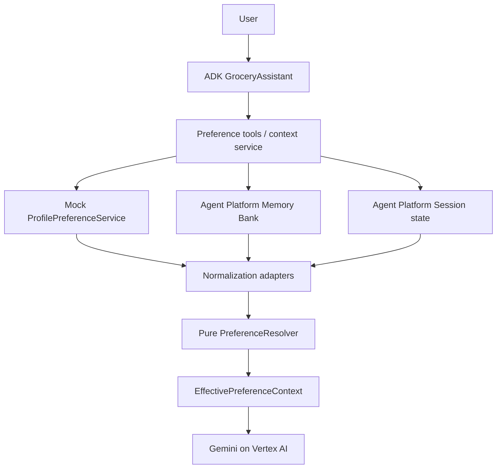

# Shared Preference POC for Google ADK

A production-structured proof of concept for deterministic, hierarchical grocery preferences
with Google Agent Development Kit (ADK), Gemini on Vertex AI, Gemini Enterprise Agent Platform
Sessions, and Agent Platform Memory Bank.

Documentation and SDK surfaces were re-checked against official Google documentation on
2026-08-11. The API resource type still appears as `reasoningEngines` for backward compatibility,
while the current product names are **Gemini Enterprise Agent Platform** and **Agent Runtime**.

## What is deterministic

`PreferenceResolver` is pure Python. It does no I/O and never invokes Gemini:

```text
SESSION_OVERRIDE > EXPLICIT_PROFILE > LONG_TERM_MEMORY > DEFAULT
```

Resolution happens independently per key. Expired and wrong-domain records are ignored;
long-term inferred records can be filtered by confidence. Only the resulting
`EffectivePreferenceContext` reaches Gemini.

## Architecture



Independent profile and Memory Bank reads run concurrently. Source failures are logged and become
context warnings. The resolver remains usable if a remote source is unavailable.

## Design documentation

- [Agent memory setup and preference flows](docs/agent-memory-setup.md) — Confluence-ready design,
  setup, operations, troubleshooting, and flow descriptions.
- [Editable draw.io diagrams](docs/agent-memory-flows.drawio) — four pages covering read/resolve,
  session override, long-term promotion/recall, and failure/isolation flows.

## Project map

```text
app/
  agent.py                         ADK Agent + App
  config.py                        environment configuration
  logging_config.py                JSON stdout logging
  preferences/
    models.py                      normalized domain objects
    resolver.py                    pure precedence logic
    profile_service.py             abstract interface + mock
    session_preferences.py         ADK session-state adapter
    memory_service.py              real Memory Bank adapter
    memory_adapter.py              fact-to-Preference transformation
    candidate_extractor.py         controlled POC extraction
  services/preference_context_service.py
  tools/preference_tools.py
scripts/
  run_local.py                     one-turn local runner
  seed_memory.py                   real Memory Bank seed
  inspect_state.py                 managed session-state inspection
  inspect_memory.py                exact-scope memory inspection
  deploy.py                        AdkApp SDK deployment
tests/
  test_preference_resolver.py
  test_preference_context.py
  test_candidate_extractor.py
  integration/test_agent_platform.py
```

## Service boundary

| Source | POC implementation | Production replacement |
|---|---|---|
| Explicit profile | Hard-coded `MockProfilePreferenceService` | REST, Spanner, Firestore |
| Session override | ADK structured session state | Agent Platform Sessions |
| Long-term preference | Real Memory Bank client | Same, with governance pipeline |
| Grocery catalog/order | Recommendations only | Authorized commerce APIs |

The mock profile is behind an abstract interface. Tests use stubs, but the runnable cloud path does
not label an in-memory store as Memory Bank.

## Local setup

Run the project from Ubuntu/WSL. Python 3.11+ is required. A Windows virtual environment is not
portable to WSL. From the directory containing the checkout, enter the repository root first.
All subsequent commands assume the repository root is the current directory:

```bash
cd geap-memory
python3 -m venv .venv
source .venv/bin/activate
python -m pip install --upgrade pip
python -m pip install -e '.[dev]'
cp -n .env.example .env
gcloud auth application-default login
gcloud config set project YOUR_PROJECT_ID
```

Set `GOOGLE_CLOUD_PROJECT`, `GOOGLE_CLOUD_LOCATION`, and
`GOOGLE_GENAI_USE_VERTEXAI=true`. For Gemini Enterprise mode this project also sets
`GOOGLE_GENAI_USE_ENTERPRISE=true`, matching the current Memory Bank ADK quickstart.

For an in-memory development session (Memory Bank gracefully unavailable):

```bash
adk web
python scripts/run_local.py "Suggest dinner ingredients."
```

ADK Web uses user ID `user` by default. The mock profile maps both `user` and `user-123`
to the grocery demo profile, so either identity shows `diet=vegetarian` from Explicit Profile.
To exercise the same identity used by the scripts explicitly, open
`http://localhost:8000?userId=user-123`.

The deployed configuration uses Google Cloud project `e2eml-222003`, region `us-central1`, and
Agent Runtime/managed Sessions/Memory Bank resource `5362284673558904832`. The IDs are already in
`.env`. Start ADK Web with the managed services like this:

```bash
source .venv/bin/activate
set -a
source .env
set +a
adk web \
  --session_service_uri=agentengine://5362284673558904832 \
  --memory_service_uri=agentengine://5362284673558904832
```

Then open `http://localhost:8000?userId=user-123` and ask:
`What preferences are you currently using?`

ADK Web is development/debug tooling, not a production server. The one-turn script constructs
`VertexAiSessionService` directly when the cloud IDs are present.

## Seed and prove the scenarios

Seed a real long-term preference:

```bash
python scripts/seed_memory.py --user-id user-123 --key organic --value true
```

The seed is stored with exact scope:

```json
{"user_id":"user-123","app_name":"grocery_shared_preferences","domain":"customer.grocery"}
```

Memory Bank exact-scope matching is intentional. A `customer.pharmacy` request cannot retrieve a
`customer.grocery` memory without an explicit cross-domain policy.

Try these in the same session:

1. `Suggest dinner ingredients.` Profile `diet=vegetarian` is used.
2. `For today's order, substitutions are okay.` The tool writes
   `preferences:customer.grocery.allow_substitutions=true` into current session state only.
3. `What preferences are you currently using?` The response labels every resolved source.
4. `I always prefer organic produce.` The controlled extractor creates a user-scoped candidate and
   writes it to Memory Bank; a new session can retrieve it.
5. `I always prefer oat milk.` Profile `preferred_milk=whole milk` still wins until the explicit
   profile changes.

Inspect without exposing values in application logs:

```bash
# Discover the numeric IDs of sessions that actually exist for this user.
python scripts/inspect_state.py --user-id user-123 --list

# Inspect one of the numeric IDs returned above.
python scripts/inspect_state.py --user-id user-123 --session-id SESSION_ID
python scripts/inspect_memory.py
```

An existing managed session can legitimately have an empty `{}` state. Identity is taken from the
managed session metadata, so `preference_user_id` and `preference_session_id` do not need to be
duplicated in session state.

Memory facts are JSON in the `shared-preference/v1` envelope. The adapter also demonstrates a small
unstructured-fact fallback, separate from resolution.

## Tests

```powershell
python -m pytest
python -m ruff check app scripts tests
```

The unit suite proves precedence, merge behavior, expiration, confidence filtering, provenance,
domain isolation, candidate scope, and fail-safe degradation. Cloud integration is opt-in:

```powershell
$env:RUN_GCP_INTEGRATION_TESTS="1"
python -m pytest tests/integration/test_agent_platform.py -v
```

This test requires ADC, project/location, and `AGENT_PLATFORM_MEMORY_BANK_ID`. It only retrieves;
use the seed script for an intentional write.

## Agent Platform provisioning and deployment

### APIs and identity

Enable at minimum:

```powershell
gcloud services enable aiplatform.googleapis.com storage.googleapis.com cloudbuild.googleapis.com artifactregistry.googleapis.com
```

The deploying principal needs `roles/aiplatform.user`. The SDK quickstart also calls for Storage
Admin while creating the staging bucket; production should narrow that to bucket-level permissions.
For new deployments, prefer **agent identity**, whose default roles limit context access to the
agent's own sessions and memories. The legacy/default Reasoning Engine service agent already has
standard Memory Bank access. A custom service account needs the relevant Agent Platform permissions
and the deployer needs `roles/iam.serviceAccountUser` on it.

Use a supported Memory Bank region and keep Sessions/Memory Bank co-located where possible. Create a
staging bucket if using the included object deployment script:

```powershell
gcloud storage buckets create gs://YOUR_UNIQUE_BUCKET --location=us-central1
python scripts/deploy.py
```

The script uses the current `vertexai.Client`, `vertexai.agent_engines.AdkApp`, and
`client.agent_engines.create(agent_engine=..., config=...)` surface. A new runtime instance includes
managed Sessions and an empty Memory Bank.

For the newer production workflow, install Agents CLI, preserve this manifest, and run:

```powershell
agents-cli login -i
agents-cli install
agents-cli playground
agents-cli deploy --project YOUR_PROJECT_ID --region us-central1
agents-cli deploy --status
```

`agents-cli` builds the Agent Runtime container from its Dockerfile. If it asks to enhance the
existing prototype first, run `agents-cli scaffold enhance -d agent_runtime` and review the
generated Docker/Terraform changes before deployment.

### Test a deployed agent

Using the SDK object returned by deployment:

```python
session = await deployed.async_create_session(
    user_id="user-123",
    state={
        "preference_user_id": "user-123",
        "preference_session_id": "session-456",
    },
)
async for event in deployed.async_stream_query(
    user_id="user-123",
    session_id=session["id"],
    message="What preferences are you currently using?",
):
    print(event)
```

The deployed `AdkApp` selects managed Sessions and `VertexAiMemoryBankService` by default. This POC's
central resolver still uses its explicit Memory Bank adapter so it receives normalized preferences,
not raw model-loaded memories.

## Cleanup

Record resource names before deletion. Then delete only the exact resources created for the POC:

```python
client.agent_engines.delete(name="projects/.../locations/.../reasoningEngines/...", force=True)
```

Delete the staging bucket only if it is dedicated to this POC:

```powershell
gcloud storage rm --recursive gs://YOUR_UNIQUE_POC_BUCKET
```

Also remove custom IAM bindings/service accounts, Artifact Registry images, Cloud Build artifacts,
and log sinks created specifically for the deployment. Memory deletion/right-to-forget should use
Memory Bank delete or purge by exact user scope after authorization and audit capture.

## Preview status and limitations

- Memory Bank is documented as Preview/Pre-GA; behavior, regions, quotas, and APIs can change.
- `reasoningEngines` remains in resource names for compatibility even though the current product is
  Agent Platform/Agent Runtime.
- The regex extractor is deliberately narrow. A production Gemini extractor should use structured
  output with a closed JSON schema, key allowlist, confidence calibration, injection defenses, and
  human/policy approval before persistence.
- Direct `CreateMemory` gives deterministic fact upload but does not consolidate duplicates. For
  production promotion, prefer governed `GenerateMemories` with direct memories and configured
  topics/metadata, or explicitly deduplicate before `CreateMemory`.
- A session write becomes durable in managed session state through ADK event state deltas; it is
  never automatically promoted.
- This POC recommends grocery items and does not implement a transactional order API.

## Enterprise hardening checkpoints

- **Isolation and authorization:** opaque tenant-scoped user IDs; agent identity; IAM conditions on
  memory scope; deny cross-domain reads by default.
- **Schema and audit:** versioned key registry, typed values, provenance, immutable promotion audit,
  revision inspection, optimistic concurrency, and idempotency keys.
- **Consent and lifecycle:** explicit opt-in for inferred memory, configurable TTL, retention policy,
  deletion/right-to-forget workflow, legal holds, and revocation propagation.
- **Security:** treat memories as untrusted input; Model Armor/red-team testing; PII classification,
  encryption controls, log redaction, and no raw values in default telemetry.
- **Reliability:** deadlines, retries with jitter for safe reads, circuit breakers, bounded cache keyed
  by tenant/user/domain/schema version, stale-data labeling, SLOs, and source-specific fallbacks.
- **Promotion governance:** validate candidates after extraction, require minimum confidence and
  evidence, optionally request user/approver confirmation, then write through an auditable queue.
- **Observability:** this POC emits JSON fields for IDs, source counts, resolver outcome, and lookup
  durations. Export stdout to Cloud Logging and add OpenTelemetry/Cloud Trace spans in production.

## Official references

- [Agent Platform Sessions overview](https://docs.cloud.google.com/gemini-enterprise-agent-platform/scale/sessions)
- [Manage Sessions with ADK](https://docs.cloud.google.com/gemini-enterprise-agent-platform/scale/sessions/manage-with-adk)
- [Memory Bank ADK quickstart](https://docs.cloud.google.com/gemini-enterprise-agent-platform/scale/memory-bank/adk-quickstart)
- [Memory Bank API quickstart](https://docs.cloud.google.com/gemini-enterprise-agent-platform/scale/memory-bank/api-quickstart)
- [Agent Runtime ADK quickstart](https://docs.cloud.google.com/gemini-enterprise-agent-platform/build/runtime/quickstart-adk)
- [Agents CLI deployment](https://google.github.io/agents-cli/guide/deployment/)
