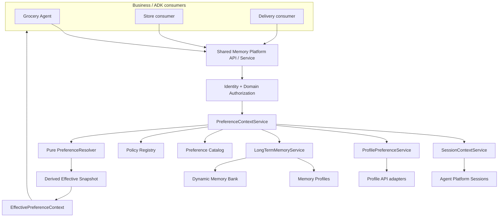
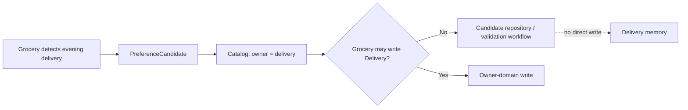
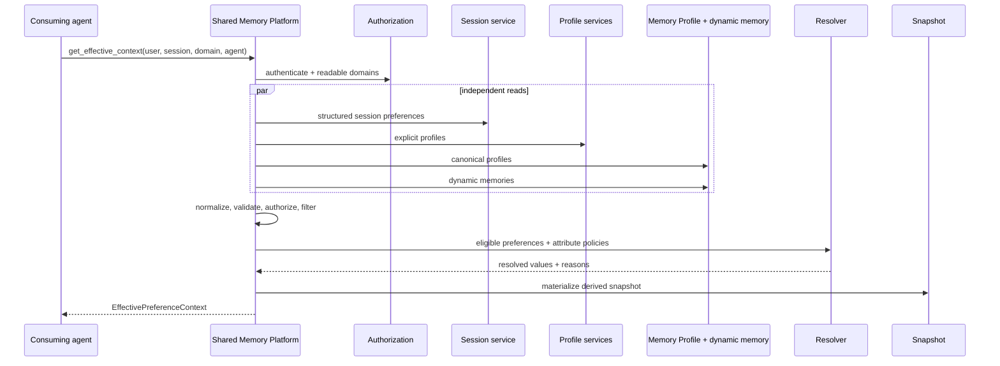

# Shared Memory Platform Service for Google ADK

This repository is a production-structured proof of concept for sharing authorized, resolved
preferences across multiple business-domain agents. Grocery is the first ADK reference consumer;
Store and Delivery are minimal consumers of the same service facade.

> The platform owns how memory is stored, secured, shared, resolved, governed, and scaled. The
> business domain owns what its memories mean.

The implementation uses Google ADK, Gemini on Vertex AI, Gemini Enterprise Agent Platform
Sessions, Agent Platform Memory Bank, and the current `agentplatform.Client` memory APIs.

The current reference flow supports temporary session overrides, governed long-term writes,
structured Memory Profile generation, deterministic resolution, provenance inspection, and
cross-domain candidate routing. The Grocery demo includes `grocery.preferred_snack`; the Customer
domain includes `customer.fruit` and demonstrates that a Grocery agent may read an authorized
Customer preference but may not directly update it.

## Platform objective

Business agents receive one `EffectivePreferenceContext`. They do not query Session state,
profiles, Memory Profiles, or dynamic Memory Bank records directly and do not implement conflict
resolution or authorization logic.



## Responsibility boundary

### Platform owns

- Agent Platform Sessions and Memory Bank adapters
- Memory Profile retrieval and schema provisioning
- Shared Memory API and stable service facade
- normalization and provenance
- deterministic resolver engine
- catalog and policy-registry frameworks
- domain read/write enforcement
- dynamic preference persistence
- cross-domain candidate routing
- effective snapshots
- failure degradation, structured logging, and governance extension points

### Line-of-business and agent teams own

- domain preference definitions and meaning
- canonical schemas and owner domain
- configured readers and writers
- attribute-level resolution policies
- confidence and confirmation requirements
- domain-specific extraction semantics
- how the agent uses the final effective context

## Package structure

```text
.
├── apps/
│   ├── reference-agent/                 independent ADK consumer; HTTP API client only
│   │   ├── app/reference_agent/         agent, Session snapshot tools, settings, client
│   │   ├── tests/
│   │   ├── Dockerfile
│   │   └── pyproject.toml
│   ├── memory-api/                      independent FastAPI deployment entry point
│   │   ├── app/memory_api/
│   │   │   ├── domain/                  platform-owned control-plane types
│   │   │   ├── persistence/             SQLAlchemy models, database, repositories
│   │   │   └── services/                YAML contract bootstrap service
│   │   ├── migrations/                  Alembic control-plane schema revisions
│   │   ├── scripts/                     database bootstrap operations
│   │   ├── tests/
│   │   ├── Dockerfile
│   │   └── pyproject.toml
│   └── admin-console/                   React control-plane application
│       ├── src/
│       ├── Dockerfile
│       └── package.json
├── packages/
│   ├── contracts/                       destination for shared API/YAML contracts
│   └── test-fixtures/                   destination for cross-app acceptance data
├── app/
│   │                                     compatibility package retained during migration
│   ├── agent.py                         ADK discovery entry point
│   ├── api.py                           FastAPI application entry point
│   ├── config.py                        environment-backed runtime settings
│   ├── logging_config.py                application logging setup
│   ├── agents/
│   │   ├── grocery_agent.py             Grocery ADK reference consumer
│   │   ├── grocery_extraction.py        Grocery-owned extraction rules
│   │   └── reference_consumers.py       Store and Delivery examples
│   ├── tools/preference_tools.py        thin ADK-to-platform tool bridge
│   └── shared_memory/
│       ├── adapters/                     Sessions, Memory Bank, Memory Profile,
│       │                                 and explicit-profile adapters
│       ├── api/routes.py                 shared-memory REST endpoints
│       ├── auth/
│       │   ├── authorization_service.py  domain and key authorization
│       │   └── consumer_registry.py      registered-agent capability checks
│       ├── catalog/
│       │   ├── catalog.json              generated canonical catalog
│       │   └── preference_catalog.py     catalog loading and validation
│       ├── contracts/
│       │   ├── compiler.py               YAML-to-runtime artifact compiler
│       │   ├── loader.py                 contract discovery and parsing
│       │   ├── models.py                 Pydantic contract models
│       │   └── consumers.json            generated consumer registrations
│       ├── models/preference.py          normalized runtime contracts
│       ├── observability/logging.py      redacted structured events
│       ├── policies/
│       │   ├── domain_policy.json        generated domain allowlists
│       │   ├── resolution_policy.json    generated resolver policies
│       │   └── policy_registry.py        policy loading interface
│       ├── profiles/memory_profiles.json generated schemas and owner-field registry
│       ├── resolver/preference_resolver.py
│       │                                 pure deterministic resolver
│       ├── services/                      orchestration, source retrieval, persistence,
│       │                                 resolution, and snapshot services
│       ├── bootstrap.py                  dependency wiring
│       └── demo.py                       deterministic acceptance scenario
├── config/
│   ├── contracts/<domain>/               source-of-truth onboarding YAML bundles
│   │   └── {domain,preferences,resolution-policies,memory-profiles,consumers}.yaml
│   ├── schemas/                          JSON Schemas for every YAML contract kind
│   ├── templates/domain-onboarding/      copyable new-domain templates
│   └── generated/profile_manifest.json   compiled profile ownership and field map
├── scripts/
│   ├── validate_memory_contract.py       validate YAML without writing files
│   ├── compile_memory_contract.py        generate or check runtime artifacts
│   ├── demo_memory_contract.py           exercise the sample contract bundle
│   ├── run_local.py                      run the in-memory Grocery demo
│   ├── start_adk_web.sh                  start ADK Web with managed services
│   ├── deploy.py                         deploy runtime and profile schemas
│   ├── generate_profile.py               submit a profile-generation event
│   ├── seed_memory.py                    submit a governed long-term preference
│   ├── inspect_state.py                  inspect managed Session state
│   ├── inspect_memory.py                 inspect normalized long-term memory
│   └── validate_platform.py              run the end-to-end acceptance scenario
├── tests/
│   ├── integration/test_agent_platform.py managed-service integration test
│   └── test_*.py                         unit and contract regression tests
├── docs/                                architecture, operations, onboarding,
│                                        Confluence Markdown, and draw.io diagrams
├── .github/workflows/memory-contracts.yml contract-validation CI workflow
├── agents-cli-manifest.yaml              Agent Platform deployment manifest
├── .env.example                          cloud and runtime configuration template
├── docker-compose.yml                    PostgreSQL, Memory API, and Admin Console
├── pyproject.toml                         package, dependency, and tool configuration
└── requirements.txt                      compatible pip requirements
```

The repository is in an incremental separation period. `apps/reference-agent` already communicates
through HTTP and has no Memory Bank SDK dependency. `apps/memory-api` currently reuses the tested
legacy platform core under `app/shared_memory`; those modules move behind the API in later slices.
The compatibility package remains until equivalent target tests pass. See
[`docs/existing-architecture-analysis.md`](docs/existing-architecture-analysis.md) and
[`docs/migration-plan.md`](docs/migration-plan.md).

## Contract-driven configuration

Business-domain teams declare memory behavior in YAML under `config/contracts/<domain>/`. The
platform compiler validates ownership and references, then generates the JSON artifacts used at
runtime. Do not hand-edit generated files.

| Contract file | Declares |
|---|---|
| `domain.yaml` | domain identity, owners, data classification, and isolation mode |
| `preferences.yaml` | canonical keys, types, scopes, readers, writers, aliases, and sensitivity |
| `resolution-policies.yaml` | strategy, source priority, domain priority, confirmation, and confidence |
| `memory-profiles.yaml` | Google Memory Profile schemas, fields, scope keys, and generation rules |
| `consumers.yaml` | agent registration and capabilities such as resolve, submit, and provenance inspection |

Validate and compile after any contract change:

```bash
python scripts/validate_memory_contract.py
python scripts/compile_memory_contract.py
python scripts/compile_memory_contract.py --check
```

The compiler produces the catalog, domain and resolution policies, consumer registrations,
structured Memory Profile configuration, and a profile registry that maps each schema field to
its canonical owner-domain key. CI should run both validation and `--check` so stale generated
artifacts cannot be merged.

## Memory source types

| Source | Purpose | Example | Authority |
|---|---|---|---|
| Session override | Temporary structured state for one session | substitutions allowed today | Highest for that key |
| Explicit profile | Authoritative external/profile API data | confirmed vegetarian diet | Above learned memory |
| Memory Profile | Structured schema-backed Memory Bank profile | preferred store | Canonical, low-latency |
| Domain memory | Canonical preference stored in domain-scoped Memory Bank | organic preference | Policy controlled |
| Dynamic memory | Open-ended runtime preference | banana ripeness | Does not require catalog expansion |
| Inferred memory | Non-confirmed learned preference | likely preferred firmness | Confidence filtered |
| Default | Safe application fallback | substitutions disabled | Lowest |

## Canonical and dynamic preferences

Canonical preferences are defined in
[`app/shared_memory/catalog/catalog.json`](app/shared_memory/catalog/catalog.json). Each entry can
specify type, owner, description, scopes, sensitivity, TTL, schema version, readers, writers, and a
resolution-policy reference.

Examples:

```text
customer.preferred_store
customer.diet
customer.fruit
grocery.preferred_brand
grocery.allow_substitutions
grocery.preferred_snack
delivery.preferred_window
```

The checked-in example currently contains:

| Owner domain | Canonical preferences |
|---|---|
| Customer | `diet`, `fruit`, `preferred_store` |
| Grocery | `allow_substitutions`, `organic_preference`, `preferred_brand`, `preferred_milk`, `preferred_product_type`, `preferred_snack` |
| Store | `preferred_product_type` |
| Delivery | `preferred_window` |
| Pharmacy | no shared preferences; strict-isolation example |

Unknown but valid domain-owned keys remain dynamic:

```text
grocery.banana_ripeness = slightly_green
grocery.tomato_firmness = firm
grocery.cereal_purchase_rule = only_when_discounted
```

Dynamic values are validated as JSON scalars and stored as domain-scoped Memory Bank facts. They
do not require an immediate Memory Profile schema change.

## Domain ownership and authorization

Domain policies are explicit allowlists in
[`app/shared_memory/policies/domain_policy.json`](app/shared_memory/policies/domain_policy.json).
Unknown domains default to self-only strict isolation.

| Consumer | Read | Write |
|---|---|---|
| Grocery | grocery, customer, store, delivery | grocery |
| Store | store, customer, grocery | store |
| Delivery | delivery, customer, grocery | delivery |
| Pharmacy | pharmacy only | pharmacy only |

Catalog-level readers and writers must also allow the action. The platform enforces both levels;
agent instructions are not a security boundary.

## Cross-domain candidate flow



For this POC the candidate repository is in memory. It demonstrates routing without introducing a
workflow engine. Production should use an auditable queue and owner-domain approval process.

## Conflict resolution

The resolver performs no I/O and never calls Gemini. Policies are loaded from
[`resolution_policy.json`](app/shared_memory/policies/resolution_policy.json) and compose:

1. source priority;
2. domain priority;
3. explicit-over-inferred;
4. most recent;
5. highest confidence.

The default source ordering is:

```text
SESSION_OVERRIDE
> EXPLICIT_PROFILE
> MEMORY_PROFILE
> DOMAIN_MEMORY
> DYNAMIC_MEMORY
> INFERRED_MEMORY
> DEFAULT
```

Domain priority is attribute-specific. For example:

```text
preferred_product_type: grocery > customer > store > delivery
preferred_store:        customer > store > grocery
preferred_window:       delivery > customer > grocery
```

Every selected value includes `resolution_reason`, `policy_id`, owner domain, confidence,
timestamps, and provenance so the platform can answer “Why was this value selected?”

## Resolve flow



The snapshot is a cache keyed by user, consumer domain, context hash, catalog version, and policy
version. It is invalidated after writes and is never a source of truth.

## Preference submission flow

1. A domain-owned extractor creates a structured `PreferenceCandidate`.
2. The catalog resolves canonical key and owner domain; unknown keys remain dynamic.
3. Strict value and scope validation runs.
4. Domain and catalog write policy is enforced.
5. Session scope becomes an ADK state delta and is not written to Memory Bank.
6. Authorized long-term scope becomes domain-scoped Memory Bank memory and returns
   `STORED_IN_DYNAMIC_MEMORY`. It does not automatically regenerate a structured Memory Profile.
7. Unauthorized cross-domain writes become `CROSS_DOMAIN_CANDIDATE` events; they do not update the
   owner domain.
8. Snapshots for the user are invalidated.

The extractor can propose; it cannot bypass authorization, select storage, or choose a conflict
winner.

## Shared Memory Platform API

The Phase 4 Memory API exposes:

```text
POST /api/v1/runtime/preferences/resolve
POST /api/v1/runtime/preferences/refresh
POST /api/v1/runtime/profiles
POST /api/v1/runtime/memory/events
PUT  /api/v1/runtime/preferences/{canonical_attribute}
```

Run locally:

```bash
source .venv/bin/activate
PYTHONPATH=apps/memory-api/app uvicorn memory_api.main:app --reload --port 8080
```

Example resolve request:

```bash
curl -X POST http://localhost:8080/api/v1/runtime/preferences/resolve \
  -H 'content-type: application/json' \
  -H 'X-Agent-ID: grocery-agent' \
  -d '{
    "scope": {"userId": "U123", "appName": "grocery-app", "domain": "grocery"},
    "sessionId": "S456",
    "agentId": "grocery-agent",
    "includeProvenance": true
  }'
```

## Local setup

From the directory containing the checkout:

```bash
cd geap-memory
python3 -m venv .venv
source .venv/bin/activate
python -m pip install --upgrade pip
python -m pip install -e '.[dev]'
cp -n .env.example .env
gcloud auth application-default login
```

Required cloud settings are documented in `.env.example`. Keep Sessions, Memory Bank, and Agent
Runtime in a supported common location.

### Run the separated local applications

Start PostgreSQL, the Memory API, and the Admin Console:

```bash
docker compose up --build
```

Then open the Admin Console at `http://localhost:3000`; the Memory API is available at
`http://localhost:8080` and reports health at `/healthz`. Runtime identity, grants, schemas, scopes,
field mappings, and policy versions are read from PostgreSQL. Startup runs Alembic and idempotently
imports the validated YAML contracts before Uvicorn starts. PostgreSQL stays internal to the Compose
network as `postgres:5432`, avoiding collisions with a host installation.

Run the new Reference Agent separately:

```bash
cd apps/reference-agent
python -m pip install -e '.[dev]'
export MEMORY_API_URL=http://localhost:8080
adk web app
```

The original root ADK entry point remains available while behavior is migrated and compared.

## Run the Grocery reference agent

In-memory ADK runner:

```bash
python scripts/run_local.py "What preferences are you currently using?"
```

ADK Web with managed state:

```bash
set -a
source .env
set +a
adk web \
  --session_service_uri="agentengine://${AGENT_PLATFORM_SESSIONS_ID:-$GOOGLE_CLOUD_AGENT_ENGINE_ID}" \
  --memory_service_uri="agentengine://${AGENT_PLATFORM_MEMORY_BANK_ID:-$GOOGLE_CLOUD_AGENT_ENGINE_ID}"
```

The Grocery agent calls only the platform facade through thin ADK tools. Store and Delivery
consumer examples are in `app/agents/reference_consumers.py`.

For a repeatable ADK Web walkthrough of session overrides, explicit profiles, dynamic memory,
cross-domain authorization, and persistence, see `docs/adk-web-demo.md`. The managed-service
launcher is:

```bash
./scripts/start_adk_web.sh
```

### Quick Snack UI check

Start a new ADK Web session with a synthetic user that is not also used for profile-generation
tests, then submit:

```text
I always prefer mango chips as my snack.
```

The Grocery extractor should emit `grocery.preferred_snack=mango_chips`, owner `grocery`, scope
`LONG_TERM`; the platform should return `STORED_IN_DYNAMIC_MEMORY`. Verify it from another terminal:

```bash
python scripts/inspect_memory.py --user-id ui-demo-user --domains grocery
```

For a temporary override, submit `For today, use pretzels as my snack.` The result should be
`STORED_IN_SESSION`, and `inspect_state.py` should show the session value:

```bash
python scripts/inspect_state.py --user-id ui-demo-user --list
python scripts/inspect_state.py --user-id ui-demo-user --session-id SESSION_ID
```

The deterministic Grocery extractor is deliberately narrow. A new canonical key in YAML is not
automatically understood by the UI: add and test domain extraction semantics as part of onboarding.

## GCP deployment and Memory Profiles

```bash
set -a
source .env
set +a
python scripts/deploy.py
```

The deployment uses agent identity, uploads the local `app` package, and creates or updates Agent
Runtime. When `ENABLE_MEMORY_PROFILES=true`, the deployment supplies the supported
`context_spec.memory_bank_config.structured_memory_configs` schema. The runtime adapter retrieves
profiles with `client.agent_engines.memories.retrieve_profiles(...)`.

Natural-language/dynamic preferences use exact-scope Memory Bank retrieval and creation through
`agentplatform.Client`. Existing POC memories in the legacy `customer.grocery` scope are read during
migration; new writes use individual domains such as `grocery`.

### Create or update a structured Memory Profile

After the contracts are compiled and profile schemas are deployed, submit an explicit event for a
separate demo user:

```bash
python scripts/generate_profile.py \
  --user-id profile-demo-user \
  --domain grocery \
  --text "I always prefer mango chips as my snack."

python scripts/inspect_memory.py \
  --user-id profile-demo-user \
  --domains grocery
```

Run `generate_profile.py` again with a new explicit statement to ask Memory Bank to update the
profile. Generation is provider-managed and may not be immediately visible; inspect until the
normalized `grocery.preferred_snack` record shows `source: MEMORY_PROFILE` and provenance schema
`grocery-preferences-v1`.

Use different users for the UI-write demo and profile-generation demo. A Memory Profile has higher
source priority than `DOMAIN_MEMORY`, so an older profile value can remain effective even after a
UI long-term write succeeds.

### Memory Profile owner isolation

The read adapter accepts a profile field only when all of these agree:

1. the schema is registered;
2. the schema owner matches the requested domain;
3. the profile field maps to a known canonical key;
4. the catalog owner matches the schema owner.

Rejected fields produce a redacted `memory_profile_value_rejected` event. For example, a Grocery
inspection admits values from `grocery-preferences-v1` and filters Customer and Store schema values,
even if Google returns those records for the same scope.

There is a remaining provider-side limitation: the example schemas use the same scope-key signature
`user_id`, `app_name`, `domain`, and the installed generation API does not accept a schema ID.
Memory Bank may therefore generate foreign-schema records in the underlying bank. The adapter
prevents those records from entering resolution but does not remove them. Strong write-side domain
isolation requires separate Memory Bank resources per domain or independently selectable
domain-specific scope signatures.

## Failure behavior

| Failure | Continued behavior |
|---|---|
| Dynamic Memory Bank unavailable | session + explicit profile + Memory Profile + defaults |
| Memory Profile unavailable/unconfigured | session + explicit profile + dynamic memory + defaults |
| Explicit profile unavailable | session + available memory + defaults |
| Session retrieval unavailable | profile + available memory + defaults; warning included |
| Session write unavailable | explicit failure; no claim of persistence |

Source failures are recorded as warnings. The platform never invents replacement preference values.

## Observability and governance

Structured events include consumer domain, agent ID, redacted user ID, session ID, queried sources,
counts, filtered count, policy version, outcome, latency, cache result, and authorization decision.
Raw preference values are not logged by default.

Extension points exist for verified authentication, Google Cloud IAM/agent identity, tenant and LoB
isolation, sensitive-data handling, consent, TTL, retention, audit history, deletion,
right-to-forget, and profile-owner approval.

## Validation and tests

Run all local checks:

```bash
python scripts/validate_memory_contract.py
python scripts/compile_memory_contract.py --check
python -m ruff check app scripts tests
python -m pytest -q
```

Run the required final scenario:

```bash
python scripts/validate_platform.py
```

It validates one Grocery context containing:

```text
preferred_store       = Store-084       owner=customer
preferred_product_type= organic         owner=grocery
preferred_window      = 6PM-8PM         owner=delivery
banana_ripeness       = slightly_green  owner=grocery, dynamic memory
allow_substitutions   = true            source=session override
```

The Grocery consumer receives this single context and has no knowledge of the backend queries that
produced it.

Cloud integration test:

```bash
set -a
source .env
set +a
RUN_GCP_INTEGRATION_TESTS=1 \
  python -m pytest -q tests/integration/test_agent_platform.py
```

## Operations

Inspect managed session state:

```bash
python scripts/inspect_state.py --user-id user-123 --list
python scripts/inspect_state.py --user-id user-123 --session-id SESSION_ID
```

Inspect normalized Memory Profiles and dynamic memory:

```bash
python scripts/inspect_memory.py --user-id user-123 --domains grocery,customer
```

Generate or update a configured structured profile from an explicit event:

```bash
python scripts/generate_profile.py \
  --user-id user-123 \
  --domain grocery \
  --text "I always prefer mango chips as my snack."
```

Submit a validated long-term preference:

```bash
python scripts/seed_memory.py \
  --user-id user-123 \
  --consumer-domain grocery \
  --domain grocery \
  --key banana_ripeness \
  --value slightly_green
```

## Current mocks and limitations

- The explicit Profile API is represented by `MockProfileAdapter`.
- Cross-domain candidates use an in-memory repository rather than a durable workflow.
- There is no candidate review UI; queued candidates are lost when the process restarts.
- The effective snapshot uses an in-process TTL cache.
- Grocery extraction uses transparent deterministic rules. Production Gemini extraction should use
  structured output and the same catalog validation boundary.
- UI long-term writes persist domain memory, not structured Memory Profiles. Canonical profile
  updates need an authoritative profile adapter or approved profile-generation workflow.
- Shared Memory Profile scope signatures can cause provider-side cross-schema generation. Runtime
  schema-owner filtering protects resolution, but full write isolation needs separate resources or
  selectable domain-specific scope signatures.
- Authentication validates required identities but does not yet verify external tokens.
- Memory Profiles require deploying the configured schema and generating/ingesting profile events.

## Enterprise hardening recommendations

- Enforce IAM Conditions for Memory Bank scopes and use agent identity.
- Replace mock authentication with verified end-user and agent claims.
- Make candidate and audit stores durable, immutable, and tenant scoped.
- Add consent and sensitive-preference policy decisions before persistence.
- Add idempotency, optimistic concurrency, revisions, and duplicate consolidation.
- Encrypt and classify sensitive fields and implement retention/deletion workflows.
- Export structured logs and traces to Cloud Logging, Cloud Monitoring, and Cloud Trace.
- Add contract, load, fault-injection, red-team, and policy-regression tests.

## Detailed documentation and diagrams

- [Shared Memory Platform design](docs/shared-memory-platform.md)
- [Agent memory setup and end-to-end flows](docs/agent-memory-setup.md)
- [ADK Web demo, profile generation, and inspection](docs/adk-web-demo.md)
- [Platform-admin domain onboarding](docs/domain-onboarding.md)
- [Confluence: platform developer architecture](docs/confluence-platform-developer-architecture.md)
- [Confluence: DevOps resource lifecycle](docs/confluence-devops-resource-lifecycle.md)
- [Confluence: new-domain demo](docs/confluence-domain-onboarding-demo.md)
- [Complete Grocery contract example](config/contracts/grocery)
- [Copyable domain contract templates](config/templates/domain-onboarding)
- [Editable platform architecture diagram](docs/shared-memory-platform.drawio)
- [Detailed preference-flow diagrams](docs/agent-memory-flows.drawio)

## Official references

- [Gemini Enterprise Agent Platform](https://docs.cloud.google.com/gemini-enterprise-agent-platform/agents)
- [Agent Platform Sessions](https://docs.cloud.google.com/gemini-enterprise-agent-platform/scale/sessions)
- [Memory Bank](https://docs.cloud.google.com/gemini-enterprise-agent-platform/scale/memory-bank)
- [Memory Profiles](https://docs.cloud.google.com/gemini-enterprise-agent-platform/scale/memory-bank/profiles)
- [Fetch memories](https://cloud.google.com/vertex-ai/generative-ai/docs/agent-engine/memory-bank/fetch-memories)
- [Agent Runtime with ADK](https://docs.cloud.google.com/gemini-enterprise-agent-platform/scale/runtime/use-an-adk-agent)
