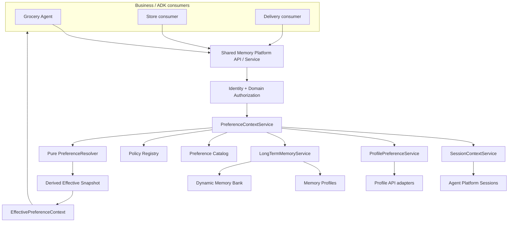
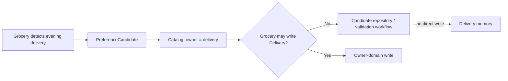
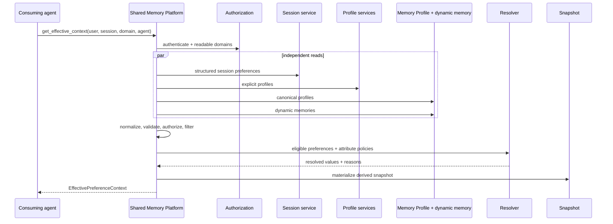

# Shared Memory Platform Service for Google ADK

This repository is a production-structured proof of concept for sharing authorized, resolved
preferences across multiple business-domain agents. Grocery is the first ADK reference consumer;
Store and Delivery are minimal consumers of the same service facade.

> The platform owns how memory is stored, secured, shared, resolved, governed, and scaled. The
> business domain owns what its memories mean.

The implementation uses Google ADK, Gemini on Vertex AI, Gemini Enterprise Agent Platform
Sessions, Agent Platform Memory Bank, and the current `agentplatform.Client` memory APIs.

## Platform objective

Business agents receive one `EffectivePreferenceContext`. They do not query Session state,
profiles, Memory Profiles, or dynamic Memory Bank records directly and do not implement conflict
resolution or authorization logic.



## Responsibility boundary

### Platform owns

- Agent Platform Sessions and Memory Bank adapters
- Memory Profile retrieval and schema provisioning
- Shared Memory API and stable service facade
- normalization and provenance
- deterministic resolver engine
- catalog and policy-registry frameworks
- domain read/write enforcement
- dynamic preference persistence
- cross-domain candidate routing
- effective snapshots
- failure degradation, structured logging, and governance extension points

### Line-of-business and agent teams own

- domain preference definitions and meaning
- canonical schemas and owner domain
- configured readers and writers
- attribute-level resolution policies
- confidence and confirmation requirements
- domain-specific extraction semantics
- how the agent uses the final effective context

## Package structure

```text
app/
  agents/
    grocery_agent.py                 ADK reference consumer
    grocery_extraction.py            Grocery-owned extraction semantics
    reference_consumers.py           Store and Delivery examples
  shared_memory/
    api/routes.py                     FastAPI endpoints
    models/preference.py              normalized contracts
    catalog/
      catalog.json                    canonical preference definitions
      preference_catalog.py           catalog interface and validation
    policies/
      domain_policy.json              explicit domain read/write allowlists
      resolution_policy.json          attribute-level resolver policies
      policy_registry.py              policy interface
    auth/authorization_service.py     enforcement point
    adapters/
      agent_platform_session_adapter.py
      mock_profile_adapter.py
      memory_profile_adapter.py
      memory_bank_adapter.py
    services/
      session_context_service.py
      profile_preference_service.py
      long_term_memory_service.py
      preference_context_service.py
      snapshot_service.py
      shared_memory_service.py
    resolver/preference_resolver.py   pure deterministic resolver
    observability/logging.py          redacted structured logging
    bootstrap.py                      dependency wiring
  tools/preference_tools.py           thin ADK-to-platform bridge
  agent.py                             ADK discovery compatibility entry point
scripts/
  deploy.py
  run_local.py
  seed_memory.py
  inspect_state.py
  inspect_memory.py
  validate_platform.py
```

## Memory source types

| Source | Purpose | Example | Authority |
|---|---|---|---|
| Session override | Temporary structured state for one session | substitutions allowed today | Highest for that key |
| Explicit profile | Authoritative external/profile API data | confirmed vegetarian diet | Above learned memory |
| Memory Profile | Structured schema-backed Memory Bank profile | preferred store | Canonical, low-latency |
| Domain memory | Canonical preference stored in domain-scoped Memory Bank | organic preference | Policy controlled |
| Dynamic memory | Open-ended runtime preference | banana ripeness | Does not require catalog expansion |
| Inferred memory | Non-confirmed learned preference | likely preferred firmness | Confidence filtered |
| Default | Safe application fallback | substitutions disabled | Lowest |

## Canonical and dynamic preferences

Canonical preferences are defined in
[`app/shared_memory/catalog/catalog.json`](app/shared_memory/catalog/catalog.json). Each entry can
specify type, owner, description, scopes, sensitivity, TTL, schema version, readers, writers, and a
resolution-policy reference.

Examples:

```text
customer.preferred_store
customer.diet
grocery.preferred_brand
grocery.allow_substitutions
delivery.preferred_window
```

Unknown but valid domain-owned keys remain dynamic:

```text
grocery.banana_ripeness = slightly_green
grocery.tomato_firmness = firm
grocery.cereal_purchase_rule = only_when_discounted
```

Dynamic values are validated as JSON scalars and stored as domain-scoped Memory Bank facts. They
do not require an immediate Memory Profile schema change.

## Domain ownership and authorization

Domain policies are explicit allowlists in
[`app/shared_memory/policies/domain_policy.json`](app/shared_memory/policies/domain_policy.json).
Unknown domains default to self-only strict isolation.

| Consumer | Read | Write |
|---|---|---|
| Grocery | grocery, customer, store, delivery | grocery |
| Store | store, customer, grocery | store |
| Delivery | delivery, customer, grocery | delivery |
| Pharmacy | pharmacy only | pharmacy only |

Catalog-level readers and writers must also allow the action. The platform enforces both levels;
agent instructions are not a security boundary.

## Cross-domain candidate flow



For this POC the candidate repository is in memory. It demonstrates routing without introducing a
workflow engine. Production should use an auditable queue and owner-domain approval process.

## Conflict resolution

The resolver performs no I/O and never calls Gemini. Policies are loaded from
[`resolution_policy.json`](app/shared_memory/policies/resolution_policy.json) and compose:

1. source priority;
2. domain priority;
3. explicit-over-inferred;
4. most recent;
5. highest confidence.

The default source ordering is:

```text
SESSION_OVERRIDE
> EXPLICIT_PROFILE
> MEMORY_PROFILE
> DOMAIN_MEMORY
> DYNAMIC_MEMORY
> INFERRED_MEMORY
> DEFAULT
```

Domain priority is attribute-specific. For example:

```text
preferred_product_type: grocery > customer > store > delivery
preferred_store:        customer > store > grocery
preferred_window:       delivery > customer > grocery
```

Every selected value includes `resolution_reason`, `policy_id`, owner domain, confidence,
timestamps, and provenance so the platform can answer “Why was this value selected?”

## Resolve flow



The snapshot is a cache keyed by user, consumer domain, context hash, catalog version, and policy
version. It is invalidated after writes and is never a source of truth.

## Preference submission flow

1. A domain-owned extractor creates a structured `PreferenceCandidate`.
2. The catalog resolves canonical key and owner domain; unknown keys remain dynamic.
3. Strict value and scope validation runs.
4. Domain and catalog write policy is enforced.
5. Session scope becomes an ADK state delta and is not written to Memory Bank.
6. Authorized long-term scope becomes domain-scoped Memory Bank memory.
7. Unauthorized cross-domain writes become candidate events.
8. Snapshots for the user are invalidated.

The extractor can propose; it cannot bypass authorization, select storage, or choose a conflict
winner.

## Shared Memory Platform API

The lightweight FastAPI layer exposes:

```text
POST /v1/memory/context/resolve
POST /v1/memory/preferences
GET  /v1/memory/users/{userId}/effective-context
```

Run locally:

```bash
source .venv/bin/activate
uvicorn app.api:api --reload --port 8080
```

Example resolve request:

```bash
curl -X POST http://localhost:8080/v1/memory/context/resolve \
  -H 'content-type: application/json' \
  -d '{
    "userId": "U123",
    "sessionId": "S456",
    "consumerDomain": "grocery",
    "agentId": "grocery-agent",
    "context": {"storeId": "084", "task": "shopping"}
  }'
```

## Local setup

From the directory containing the checkout:

```bash
cd geap-memory
python3 -m venv .venv
source .venv/bin/activate
python -m pip install --upgrade pip
python -m pip install -e '.[dev]'
cp -n .env.example .env
gcloud auth application-default login
```

Required cloud settings are documented in `.env.example`. Keep Sessions, Memory Bank, and Agent
Runtime in a supported common location.

## Run the Grocery reference agent

In-memory ADK runner:

```bash
python scripts/run_local.py "What preferences are you currently using?"
```

ADK Web with managed state:

```bash
set -a
source .env
set +a
adk web \
  --session_service_uri="agentengine://${AGENT_PLATFORM_SESSIONS_ID:-$GOOGLE_CLOUD_AGENT_ENGINE_ID}" \
  --memory_service_uri="agentengine://${AGENT_PLATFORM_MEMORY_BANK_ID:-$GOOGLE_CLOUD_AGENT_ENGINE_ID}"
```

The Grocery agent calls only the platform facade through thin ADK tools. Store and Delivery
consumer examples are in `app/agents/reference_consumers.py`.

For a repeatable ADK Web walkthrough of session overrides, explicit profiles, dynamic memory,
cross-domain authorization, and persistence, see `docs/adk-web-demo.md`. The managed-service
launcher is:

```bash
./scripts/start_adk_web.sh
```

## GCP deployment and Memory Profiles

```bash
set -a
source .env
set +a
python scripts/deploy.py
```

The deployment uses agent identity, uploads the local `app` package, and creates or updates Agent
Runtime. When `ENABLE_MEMORY_PROFILES=true`, the deployment supplies the supported
`context_spec.memory_bank_config.structured_memory_configs` schema. The runtime adapter retrieves
profiles with `client.agent_engines.memories.retrieve_profiles(...)`.

Natural-language/dynamic preferences use exact-scope Memory Bank retrieval and creation through
`agentplatform.Client`. Existing POC memories in the legacy `customer.grocery` scope are read during
migration; new writes use individual domains such as `grocery`.

## Failure behavior

| Failure | Continued behavior |
|---|---|
| Dynamic Memory Bank unavailable | session + explicit profile + Memory Profile + defaults |
| Memory Profile unavailable/unconfigured | session + explicit profile + dynamic memory + defaults |
| Explicit profile unavailable | session + available memory + defaults |
| Session retrieval unavailable | profile + available memory + defaults; warning included |
| Session write unavailable | explicit failure; no claim of persistence |

Source failures are recorded as warnings. The platform never invents replacement preference values.

## Observability and governance

Structured events include consumer domain, agent ID, redacted user ID, session ID, queried sources,
counts, filtered count, policy version, outcome, latency, cache result, and authorization decision.
Raw preference values are not logged by default.

Extension points exist for verified authentication, Google Cloud IAM/agent identity, tenant and LoB
isolation, sensitive-data handling, consent, TTL, retention, audit history, deletion,
right-to-forget, and profile-owner approval.

## Validation and tests

Run all local checks:

```bash
python -m ruff check app scripts tests
python -m pytest -q
```

Run the required final scenario:

```bash
python scripts/validate_platform.py
```

It validates one Grocery context containing:

```text
preferred_store       = Store-084       owner=customer
preferred_product_type= organic         owner=grocery
preferred_window      = 6PM-8PM         owner=delivery
banana_ripeness       = slightly_green  owner=grocery, dynamic memory
allow_substitutions   = true            source=session override
```

The Grocery consumer receives this single context and has no knowledge of the backend queries that
produced it.

Cloud integration test:

```bash
set -a
source .env
set +a
RUN_GCP_INTEGRATION_TESTS=1 \
  python -m pytest -q tests/integration/test_agent_platform.py
```

## Operations

Inspect managed session state:

```bash
python scripts/inspect_state.py --user-id user-123 --list
python scripts/inspect_state.py --user-id user-123 --session-id SESSION_ID
```

Inspect normalized Memory Profiles and dynamic memory:

```bash
python scripts/inspect_memory.py --user-id user-123 --domains grocery,customer
```

Submit a validated long-term preference:

```bash
python scripts/seed_memory.py \
  --user-id user-123 \
  --consumer-domain grocery \
  --domain grocery \
  --key banana_ripeness \
  --value slightly_green
```

## Current mocks and limitations

- The explicit Profile API is represented by `MockProfileAdapter`.
- Cross-domain candidates use an in-memory repository rather than a durable workflow.
- The effective snapshot uses an in-process TTL cache.
- Grocery extraction uses transparent deterministic rules. Production Gemini extraction should use
  structured output and the same catalog validation boundary.
- Canonical profile writes need an authoritative profile adapter/workflow; the POC preserves the
  existing direct, governed Memory Bank write path.
- Authentication validates required identities but does not yet verify external tokens.
- Memory Profiles require deploying the configured schema and generating/ingesting profile events.

## Enterprise hardening recommendations

- Enforce IAM Conditions for Memory Bank scopes and use agent identity.
- Replace mock authentication with verified end-user and agent claims.
- Make candidate and audit stores durable, immutable, and tenant scoped.
- Add consent and sensitive-preference policy decisions before persistence.
- Add idempotency, optimistic concurrency, revisions, and duplicate consolidation.
- Encrypt and classify sensitive fields and implement retention/deletion workflows.
- Export structured logs and traces to Cloud Logging, Cloud Monitoring, and Cloud Trace.
- Add contract, load, fault-injection, red-team, and policy-regression tests.

## Detailed documentation and diagrams

- [Shared Memory Platform design](docs/shared-memory-platform.md)
- [Platform-admin domain onboarding](docs/domain-onboarding.md)
- [Complete Grocery contract example](config/contracts/grocery)
- [Copyable domain contract templates](config/templates/domain-onboarding)
- [Editable platform architecture diagram](docs/shared-memory-platform.drawio)
- [Detailed preference-flow diagrams](docs/agent-memory-flows.drawio)

## Official references

- [Gemini Enterprise Agent Platform](https://docs.cloud.google.com/gemini-enterprise-agent-platform/agents)
- [Agent Platform Sessions](https://docs.cloud.google.com/gemini-enterprise-agent-platform/scale/sessions)
- [Memory Bank](https://docs.cloud.google.com/gemini-enterprise-agent-platform/scale/memory-bank)
- [Memory Profiles](https://docs.cloud.google.com/gemini-enterprise-agent-platform/scale/memory-bank/profiles)
- [Fetch memories](https://cloud.google.com/vertex-ai/generative-ai/docs/agent-engine/memory-bank/fetch-memories)
- [Agent Runtime with ADK](https://docs.cloud.google.com/gemini-enterprise-agent-platform/scale/runtime/use-an-adk-agent)
