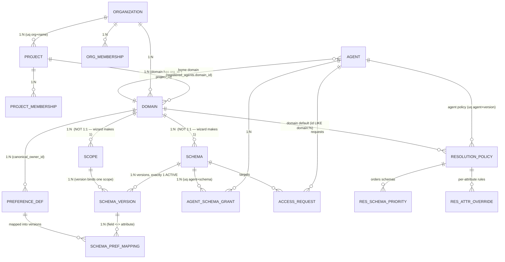

# GEAP Admin Console — Data Model Validation and UX Redesign

**Status:** Draft for review
**Method:** Verified against code at working tree on branch `codex/org-project-governance` (HEAD `58b8521` + uncommitted changes). Every model claim cites a file. Google/Vertex behaviour is read from the actual `context_spec` our provisioner emits.
**Scope:** Three redesigns you asked for — Create Memory Setup landing, Organization Approvals at scale, and the Project → Domain detail experience — grounded in a validated relationship model.

> **Repository is mid-flight.** Since the last analysis the backend was renamed `apps/memory-api` → `apps/control-plane-api` (package `memory_api` → `control_plane_api`), and new tables/endpoints for settings, health, and runtime bindings were added. Another session is committing. Line numbers here are approximate; the relationships are current.

---

## 1. Your understanding, validated

You asked me to check your assumptions rather than assume they're correct. Here is the verdict on each, with the evidence.

| Your assumption | Verdict | Evidence |
|---|---|---|
| A Domain has **one** Scope | **Not enforced — it's a 1:N relationship modeled as 1:1 by convention** | `scope_definitions.owner_domain_id` is a plain FK with **no unique constraint** (`persistence/models.py`). A domain can own many scopes. The *guided wizard* creates exactly one (`{domain}:profile-scope` in `guided_setup.py`), which is why it looks 1:1. |
| A Domain effectively supports **one** Schema | **False — multiple schemas per domain are fully supported**, by our model *and* by Google | `profile_schemas.domain_id` has **no unique constraint**. The resolver ranks *across* schemas (`resolution_policy_schema_priorities`). Google's `context_spec` groups a **list** of `schema_configs` per scope (`vertex_provisioning.py`). The single-schema appearance is again the wizard (`{domain}-preferences-v1`). |
| Resolution Policy is associated with the Domain | **Partly — it's agent-first, with a domain-level default fallback. Never schema-level.** | `get_resolution_config(agent_id, domain_id)` selects `WHERE agent_id = X OR id LIKE '{domain}:%'`, agent policy winning (`runtime_repository.py`). A policy *orders multiple schemas*; it is not owned by a schema. |
| Same-project agents inherently have access | **Not implemented today — all access is an explicit grant** | `list_schema_grants` returns only rows in `agent_schema_grants` (`runtime_repository.py`). There is no project-inheritance code path. The README calls implicit same-project grants a "subsequent governance slice." |
| We can show which agents *actually accessed* a schema | **Not available — no read telemetry exists** | No `last_access` / read-event table anywhere in the model. `audit_events` records admin mutations only; runtime reads produce in-process counters and structured logs, nothing queryable. |

**The one thing Google actually constrains:** exactly **one ACTIVE version per schema**. `build_vertex_context_spec` raises `"multiple active versions found for schema"` and the runtime always picks the latest ACTIVE version. Everything else — multiple scopes per domain, multiple schemas per domain/scope — is permitted by both layers.

---

## 2. The relationship map (verified cardinalities)

**Read this as:** the hierarchy is Organization → Project → Domain, and a Domain is the hub that owns Scopes, Schemas, and canonical Preferences. Agents attach to schemas through **grants**, and resolution behaviour attaches to **agents** (or a domain default), spanning whatever schemas that agent can read.

### The single most important correction for the UI

A **Domain is a container of potentially many Schemas**, and a **Schema is the unit that carries a Scope, a version, preference fields, grants, and participates in resolution**. Your instinct to make the Domain page the hub is right — but *Schema* must be a first-class selectable object inside it, because Scope, Preference Catalog, and Agent Access are all **schema-level**, not domain-level. That is exactly why your proposed "select a schema, then show its preference fields" interaction is the correct model.

---

## 3. Redesign 1 — Create Memory Setup, with a Memory Management landing page

**Current state:** the `Create Memory Setup` nav item mounts `MemorySetupWizard` directly on step 1 ("Use Case"). There is no framing page. `PlatformOverview` (the current Dashboard) is platform-wide, not memory-specific. The memory-focused dashboard you remember was removed in commit `d450e7b` ("redesign organization and project navigation"); its copy still exists in history:

> *"Governed memory, ready for every shopping journey — Organize agents by line of business and project, reuse approved preference domains, and keep cross-project sharing read-only."* (`d450e7b^`)

> *"Governed memory control plane — Create domain contracts, approve least-privilege access, and inspect every control-plane change from one console."* (`45bb2ff`)

**Recommendation:** insert a **Memory Setup overview page as step 0 of the wizard**, not as the global dashboard. Reason: the global dashboard is now correctly platform-wide (memory is one of several capabilities); regressing it to memory-only would fight the platform direction. But the *Create Memory Setup* flow should absolutely open with orientation.

Proposed step-0 content (reusing the recovered copy and the real model):
- **What you're about to configure**, in the user's words: a preference **Domain**, its **Scope** (`organization_id + user_id`), one or more **Schemas** of typed preference fields, the **Agents** that may read or write them, and the **sharing** rules for other projects.
- **A live "what exists already" strip** — counts of domains/schemas/agents in the selected org/project, so the user sees whether to reuse or create. Data is already available from `organizationHierarchy()`.
- **The lazy-profile promise**: "Activation registers schemas; it never creates a profile for every user. Profiles are created on first authorized write." (verbatim from the current architecture — sets correct expectations.)
- **A single primary action** — "Start setup" → the existing Use Case step. Keep the wizard exactly as-is after that.

This is additive: one new step in `wizardSteps()` and a presentational component. No backend change.

---

## 4. Redesign 2 — Organization Approvals as a data table

**Current state:** `OrganizationApprovalsPanel` already splits **Incoming / Outgoing / Decision history**, but each renders through `AccessActions`, which maps every request to a **card**. The global `Approvals` section does the same with `ResourceChangeActions` + `AccessActions`. There is a generic `ResourceTable`, but approvals don't use it. **No pagination, sort, or filter exists on any list** — `list_resources` returns every row ordered by ID. This is the scale problem you flagged, and it's real: at 100+ requests the card stack is unusable.

**Recommendation — a proper table, but be honest about the two request types.** Approvals are a **union of two different tables**: `access_requests` (agent → schema grants) and `resource_change_requests` (domain config changes). They share status/requester/date but differ in target. Present one table with a **Type** column rather than two stacks.

Proposed columns:

| Column | Source | Sortable | Filterable |
|---|---|---|---|
| Type | union tag (`ACCESS` / `CHANGE`) | — | ✓ (chip) |
| Status | `status` | ✓ | ✓ (PENDING/APPROVED/REJECTED/REVOKED/EXPIRED) |
| Requester | `requested_by` / `requesting_team` | ✓ | ✓ (search) |
| Project / Domain | join schema→domain→project | ✓ | ✓ |
| Target | schema id / resource | — | search |
| Permission | `requested_permission` (access only) | — | ✓ |
| Requested | `requested_at` | ✓ (default desc) | date range |
| Actions | Approve / Reject / Revoke / Expire, role-gated | — | — |

Design notes grounded in the data:
- **Direction matters and is already computed** — keep the Incoming / Outgoing / History segmentation as a top-level filter tab, because outgoing requests are read-only to this org (`OrganizationApprovalsPanel` already enforces this). A flat table that loses direction would let a user try to approve their own outgoing request.
- **Row-level actions, plus bulk approve/reject** for same-type PENDING rows — the decision endpoints already exist per-request (`/access-requests/{id}/approve|reject|revoke|expire`).
- **Status as a chip with semantic color** (PENDING amber, APPROVED green, REJECTED/REVOKED/EXPIRED grey/red), not just text — so a reviewer scans the queue by state.
- **Project/Domain is not on the request row today** — see §7; it needs a backend join or the request must carry denormalized `project_id`/`domain_id`.

**Scale honesty:** a client-side sortable/filterable table fixes 100s of rows. Beyond ~1–2k, you need **server-side pagination + filtering**, which does not exist yet (§7). Build the table now; add server paging when a real queue approaches four digits.

---

## 5. Redesign 3 — Project → Domain detail

**Current state:** there is **no domain-detail page**. Under a project's "Domains" tab, domains are listed; the advanced "Govern & manage" sections (`domains`, `scopes`, `schemas`, `preference-catalog`, `agents`, `resolution-policies`) are **flat, org-wide lists with JSON editors**. Clicking a domain does not open a consolidated view. This is the core gap.

**Your proposed tab structure is close to right, with three corrections from the model.**

### Recommended structure

Opening a Domain shows a header (name, org/project, status, owner) and a **schema selector**, because most detail is schema-scoped. Then tabs:

| Tab | Contents | Scoped to | Notes / correction |
|---|---|---|---|
| **Overview** | Name, description, org/project, **owner**, **status**, contract version, **the domain's scope(s)**, schema count, agent count | Domain | Show scope**s** (plural) — the model allows many even though today there's one. Don't hard-code 1:1. |
| **Schemas** | List of schemas in the domain; select one to drive the schema-scoped tabs | Domain → selects Schema | Make Schema a **first-class selection**, not an afterthought. This is the pivot your other tabs depend on. |
| **Preference Catalog** | Fields/attributes of the **selected schema's active version**, with data type, sensitivity, allowed values, field↔attribute mapping | **Schema version** | Already available via `GET /schemas/{id}` → `versions[].mappings`. Preferences are per-version, not per-domain. |
| **Agent Access** | Agents with a grant on the selected schema; permission; **home-project vs cross-project grant**; request provenance | **Schema** | Needs a new inverse endpoint (§7). Distinguish "belongs to this project" from "cross-project approved grant" using `registered_agents.project_id` vs the schema's project. |
| **Resolution** | The resolution policy that governs this domain/agent: schema **precedence order**, per-attribute overrides, strategy | **Agent or domain default** | *Do not* place this under a single schema — a policy spans schemas. Show the **domain-default policy** plus any **agent-specific** policies for agents that read this domain. See §6. |
| **Sharing / Access** | Cross-project grants and **pending access requests** targeting this domain's schemas | Domain | Reuse the approvals table (§4), filtered to this domain. |
| **Audit / History** | Admin mutations for this domain and its children | Domain | `audit_events` exists; filter by `target_type`/`target_id`. Runtime *reads* are **not** here — say so, don't imply it. |

### Two structural warnings

1. **Preference Catalog, Agent Access, and Scope are Schema-scoped, not Domain-scoped.** If a domain has two schemas, "the preference catalog" is ambiguous until a schema is chosen. The Schemas tab must drive the others. Your intuition ("when a schema is selected, show its fields") already anticipates this — bake it into the navigation, not just one tab.

2. **Resolution is Agent-scoped (or domain-default), spanning schemas.** So the question "if a domain has multiple schemas, do they share resolution?" resolves to: **they share whatever policy the reading agent uses.** Two agents reading the same two schemas can resolve conflicts differently. Model the Resolution tab around *policies* (with their schema precedence), not around a single schema's behaviour.

### Reuse what exists

`ContextTabs<T>` (already in `App.tsx`) is a generic tab component — use it for the domain tabs, matching the existing org/project tab pattern. `agentSchemaAccess(agentId)` already returns the per-agent matrix; the domain page needs the **inverse** (per-schema agent list), which is a small addition.

---

## 6. Where Resolution Policy belongs — the definitive answer

You asked whether resolution is Domain, Schema, Agent, or a combination. From `runtime_repository.get_resolution_config` and `preference_resolver.py`:

- **Storage:** a `resolution_policies` row is keyed by **agent** (`uq agent_id + version`) *or* is a **domain default** (`agent_id` NULL, `id` prefixed `{domain}:`). There is **no schema-keyed policy.**
- **Selection at runtime:** for a reading agent in a domain, pick the **agent-specific policy if present, else the domain default.**
- **What the policy does:** it holds a **schema precedence order** (`resolution_policy_schema_priorities`) and **per-attribute overrides** (`resolution_attribute_overrides`). So one policy arbitrates conflicts *across all schemas the agent reads.*
- **Runtime application:** the resolver groups candidate preferences by **logical attribute key** and applies the policy's strategy chain (source priority → domain priority → explicit-over-inferred → recency → confidence).

**Therefore:** Resolution belongs to the **Agent**, with a **Domain-level default** as the fallback, and it operates **across schemas** via precedence. It is **not** a schema property, and multiple schemas in a domain do **not** automatically share resolution — they share it only insofar as the same agent (or the domain default) reads them. Put the Resolution UI at the domain level (listing the default + agent policies), never inside a single schema.

---

## 7. Backend / API changes required for the proposed UI

| # | Need | Exists? | Change |
|---|---|---|---|
| 1 | **Domain aggregate** — one call returning a domain with its scopes, schemas (+active version + mappings), grant/agent summary, resolution policies, pending requests, recent audit | No | New `GET /domains/{id}/detail` that assembles these. Avoids ~6 client round-trips and the org-wide-list-then-filter pattern in use today. |
| 2 | **Agents-with-access to a schema** (inverse of `agent_schema_access`) | No (only per-agent exists) | New `GET /schemas/{id}/agents` returning agents + permission + **home-project vs cross-project** flag (`agent.project_id == schema.project_id`) + request provenance. |
| 3 | **Project/Domain on approval rows** | Partially — join needed | Denormalize `project_id`/`domain_id` onto `access_requests`, or have the approvals endpoint resolve schema→domain→project so the table can show and filter by them. |
| 4 | **Server-side pagination + filter + sort** on lists and approvals | No — every list returns all rows | Add `limit`/`offset`/`status`/`sort` params. Needed before any queue realistically exceeds ~1–2k. Client-side table is fine until then. |
| 5 | **Read telemetry** — "which agents actually accessed vs. can access", "last accessed" | No | Persist per-`(agent, schema)` runtime access events (a new table written by `runtime_service`), or integrate Cloud Logging reads. Without this, the Agent Access tab can show **permission only**, honestly labelled. |
| 6 | **Resolution-for-domain** view | Assemble from parts | Endpoint (or extend #1) returning the domain-default policy + agent policies for agents reading the domain, each with schema precedence resolved to schema names. |
| 7 | **Multiple schemas per domain in the wizard** | Wizard forces one | Only if you want the wizard to add a schema to an existing domain. The model already supports it; the wizard intentionally rejects appending to an active schema (needs a reviewed new version). A separate "Add schema to domain" flow is the cleaner path than changing the wizard. |

**None of the read paths for the Domain page require schema changes** except #5 (telemetry) and the #3 denormalization. #1, #2, #6 are aggregation endpoints over existing tables — low risk, high UI leverage.

---

## 8. Open questions before implementation

1. **Do we commit to multiple schemas per domain in the UX now, or keep the 1:1 wizard convention and only *display* multi-schema where it exists?** The model supports many; the wizard makes one. The Domain page should handle N schemas regardless, but whether we add a "second schema" creation flow is a product call.
2. **Is same-project implicit access going to be implemented?** The Agent Access tab's "belongs to this project → inherent access" column is only meaningful if the runtime actually grants it. Today it doesn't. Either implement implicit grants (a governance decision) or the tab shows *explicit grants only* and labels same-project agents as "eligible, not yet granted."
3. **Read telemetry — build it or defer it?** "Actually accessed vs permitted" needs a new write path in the runtime. Worth it for governance, but it's a runtime change with a hot-path cost. Decide before promising it in the UI.
4. **Approvals scale target.** If realistic volume stays in the low hundreds, a client-side table ships now. If we expect thousands (many agents × many schemas × cross-project), prioritize server-side paging (#4) first.
5. **Resolution authoring in the UI.** Today policies are edited as JSON (`resolution-policies` templates). Do we want a structured precedence/override editor on the Domain → Resolution tab, or keep authoring in the advanced section and make the domain tab read-only?
6. **Dashboard direction.** Confirm the intent: keep the platform-wide `PlatformOverview` as the global Dashboard and put memory orientation *inside* the Create Memory Setup flow (my recommendation), rather than reverting the global dashboard to memory-only.

---

## 9. Recommended sequencing

1. **Create Memory Setup step-0 page** — pure frontend, reuses recovered copy. Ships immediately, no backend.
2. **Approvals data table** — frontend table over the existing `organizationApprovals()` union; add the schema→domain→project resolution (#3) so filtering works.
3. **Domain detail page** — build the tab shell with `ContextTabs`, wire Overview/Schemas/Preference Catalog from existing endpoints, then add the aggregate (#1) and inverse-access (#2) endpoints for Agent Access and Resolution.
4. **Backend aggregation endpoints** (#1, #2, #6) in parallel with step 3.
5. **Server-side paging** (#4) when a queue approaches four digits.
6. **Read telemetry** (#5) as a separate, decision-gated slice.

Each step is additive and independently shippable; none requires a rewrite, and every new view reuses an existing seam (`ContextTabs`, `ResourceTable`, `agent_schema_access`, the approvals union).
