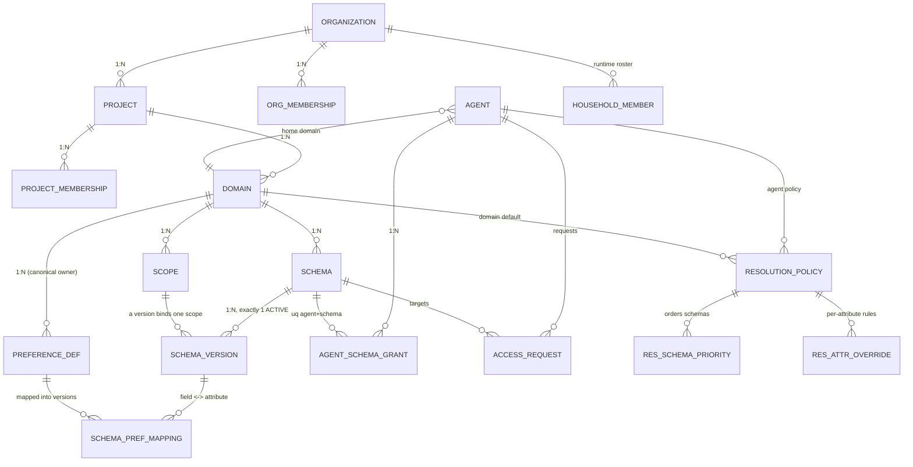

# GEAP Admin Console — Data Model Validation and UX Redesign

**Status:** Implemented. Re-checked against `feature/dynamic-household-members` on 2026-09-23.
**Scope:** The data-model validation behind three console redesigns — the Create Memory Setup landing
page, Organization Approvals at scale, and the Project → Domain detail view — and what shipped for each.

---

## 1. Data-model assumptions, validated

| Assumption | Verdict | Evidence |
|---|---|---|
| A domain has **one** scope | **No — 1:N, one by convention.** | `scope_definitions.owner_domain_id` has no unique constraint. The wizard creates one scope (`{domain}:profile-scope`), or two for **Household + members** (`{domain}:household-scope`, `{domain}:household-member-scope`). |
| A domain has **one** schema | **No — many schemas per domain** are supported by the model and by Google. | `profile_schemas.domain_id` has no unique constraint; Google's `context_spec` groups a list of schema configs per scope. The Household + members wizard option creates two schemas in one domain. |
| Resolution policy belongs to the domain | **Partly — agent-first, with a domain default. Never schema-level.** | `get_resolution_config(agent_id, domain_id)` picks the agent's policy, else the domain default (`id LIKE '{domain}:%'`). |
| Same-project agents have access automatically | **No — explicit grants only.** | `list_schema_grants` reads only `agent_schema_grants`. The console labels same-project agents without a grant "eligible, not granted". |
| We can show which agents *actually read* a schema | **No — no read telemetry.** | No read-event table; `audit_events` records admin mutations; runtime reads produce logs only. |

**What Google constrains:** exactly one ACTIVE version per schema. Approving a new version deprecates
the previous one, and the runtime always uses the ACTIVE version.

---

## 2. The relationship map

The hierarchy is Organization → Project → Domain; a domain owns scopes, schemas, and canonical
preferences. Agents attach to schemas through grants; resolution attaches to agents (or a domain
default) and spans the schemas an agent reads. Household members belong to an organization and a
household and are created at runtime, not configured per domain.

**Key UI consequence:** a **schema** is the unit that carries a scope, a version, preference fields,
and grants, so it must be selectable inside a domain.

---

## 3. Redesign 1 — Create Memory Setup overview — ✅ shipped

**Create Memory Setup** now opens on an overview page (step 0): what a setup configures (domain,
scope, schemas, preferences, agents, sharing), a live inventory of existing organizations, projects,
schemas, and agents, the lazy-profile promise ("activation registers schemas; it never creates a profile
for every user"), and **Start setup**. The global dashboard stays platform-wide.

---

## 4. Redesign 2 — Organization Approvals as a data table — ✅ shipped

`OrganizationApprovalsPanel` renders one table of access requests with direction
(Incoming / Outgoing / History), a search box (requester, domain, schema), sortable columns, and row
actions (approve, reject, revoke) gated by role and direction. **Govern & manage → Approvals** also lists
resource-change requests (schema versions, domain edits) for approval.

Still open:

- **Server-side pagination and filtering** — every list endpoint returns all rows; fine for hundreds of
  requests, not for thousands.
- **Action error handling** — approve/reject/revoke calls have no error handling, so a server-side denial
  (for example a purpose mismatch) is not shown to the operator.

---

## 5. Redesign 3 — Project → Domain detail — ✅ shipped

Opening a domain under a project shows a read-only detail view backed by `GET /domains/{id}/detail`:

| Tab | Contents | Scope |
|---|---|---|
| **Overview** | Name, owner, status, scopes, schema and agent counts | Domain |
| **Schemas** | The domain's schemas; selecting one drives the schema-scoped tabs | Domain → schema |
| **Preference Catalog** | Fields of the selected schema's active version | Schema version |
| **Agent Access** | Agents with owning-project grants, cross-project grants, pending requests, or eligible-not-granted (`GET /schemas/{id}/agents`) | Schema |
| **Resolution** | Domain-default and agent policies with schema precedence | Agent / domain default |
| **Sharing** | Cross-project grants and pending requests for this domain's schemas | Domain |
| **Audit** | Admin mutations for the domain and its children | Domain |

Editing (including **Create new version**) happens in **Govern & manage → Schemas** with an
organization selected, not in this view. Agent Access shows configured permission only; runtime reads
are not tracked.

---

## 6. Where resolution policy belongs

- **Storage:** a policy is keyed by agent (`agent_id` + version) or is a domain default. No schema-keyed
  policy exists.
- **Selection:** the agent's policy if present, else the domain default.
- **Content:** default rules (source priority, strategies, minimum confidence), a schema-priority list,
  and per-attribute overrides.
- **Runtime:** the resolver groups candidates by logical key and applies the strategy chain. **Known
  defect:** the schema-priority list is stored but not loaded at runtime; per-attribute overrides are.

Resolution therefore belongs to the **agent**, with a domain default, across schemas — shown at the domain
level, never inside one schema.

---

## 7. Backend / API changes

| # | Need | Status |
|---|---|---|
| 1 | Domain aggregate endpoint | ✅ `GET /domains/{id}/detail` |
| 2 | Agents with access to a schema | ✅ `GET /schemas/{id}/agents` (plus `GET /agents/{id}/schema-access`) |
| 3 | Project/domain on approval rows | ✅ `GET /organizations/{id}/approvals` resolves schema → domain → organization |
| 4 | Server-side pagination, filter, sort | ❌ Not built |
| 5 | Read telemetry | ❌ Not built; Agent Access is labelled as configured permission |
| 6 | Resolution for a domain | ✅ Included in the domain aggregate |
| 7 | More than one schema per domain from the wizard | ✅ For Household + members (two schemas); adding fields to a live schema uses **Create new version** |

---

## 8. Decisions taken

1. **Multiple schemas per domain:** supported in the UI and created by the wizard for households.
2. **Same-project implicit access:** not implemented; same-project agents are shown as eligible until
   granted.
3. **Read telemetry:** deferred.
4. **Approvals scale:** client-side table now; server paging when queues approach thousands.
5. **Resolution authoring:** the domain view is read-only; policies are edited in **Govern & manage →
   Resolution Policies**.
6. **Dashboard:** platform-wide; memory orientation lives in the Create Memory Setup overview.

## 9. Remaining work

1. Error handling on approval actions.
2. Server-side paging when queue sizes require it.
3. Load schema priorities in the runtime resolver so the Resolution tab reflects real behavior.
4. Read telemetry, if "actually accessed" becomes a governance requirement.
