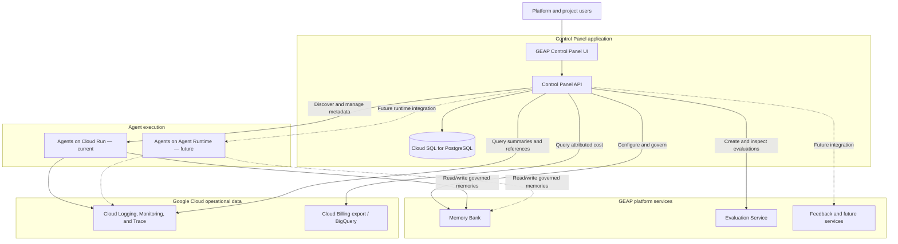

# GEAP Control Panel — Product Vision, Architecture, and Roadmap

**Document status:** Draft for review; implementation status updated 2026-09-23 (see §1a)  
**Target audience:** Product owners, platform engineering, architecture, security, FinOps, and agent development teams  
**Platform:** Google Cloud / Gemini Enterprise Agent Platform (GEAP)

## 1. Executive summary

The GEAP Control Panel will provide a single pane of glass for discovering, governing, operating, and improving enterprise AI agents deployed across Google Cloud. It will give platform teams and authorized business users a consolidated view of:

- Registered and deployed agents, including ownership, project, environment, runtime, version, and lifecycle status.
- Agent cost and usage, with allocation by organization, project, agent, model, and environment where source data permits.
- End-to-end traceability across agent requests, model calls, tools, memory interactions, errors, latency, and evaluation results.
- Governance controls such as organization and project boundaries, role-based access, approvals, audit history, and policy visibility.
- Foundational platform services, initially Memory Bank and later evaluation, feedback, and related agent quality services.

The Control Panel is not intended to replace native Google Cloud operational services. It will aggregate their metadata and expose curated workflows through a consistent enterprise experience. Google Cloud remains the system of record for runtime telemetry and billing exports, while the Control Panel PostgreSQL database stores governance configuration, application metadata, mappings, workflow state, and audit records.

## 1a. Implementation status (2026-09-23)

Measured against the code on `feature/dynamic-household-members`:

| Phase | Status | What exists / what's missing |
|---|---|---|
| 0 — Foundation | 🟡 Partial | Product naming ("Control Plane API") is done; API-layer authorization, error envelope, audit, and correlation IDs exist. Not done: capability modules, runtime-neutral agent/version/deployment identities, pagination and idempotency standards, labeling standard. |
| 1 — Memory Bank Control Panel MVP | ✅ Largely done | Console shell with Entra sign-in and role-aware views; organization/project context and memberships; guided setup for domains, scopes, schemas, catalog; schema versioning with approval; resolver configuration; access requests, approvals, and audit; households, consent ledger, purpose limitation, retention sweep. Gaps: field-level grants (grants are whole-schema), membership filtering on admin list reads, operational metrics dashboard. |
| 2 — Cloud Run inventory and traceability | 🟡 Started | Agents are registered with a runtime binding (Google Agent Runtime, Cloud Run, local ADK) and project health snapshots (Cloud Monitoring for Agent Runtime). No discovery, version/revision model, trace linking, or `run_id` propagation. |
| 3 — Evaluation | ❌ Not started | |
| 4 — FinOps | 🟡 Started | Organization budget settings persisted as `PENDING_SYNC`; no reconciler, billing export, or allocation. |
| 5 — Agent Runtime integration | 🟡 Started | Runtime bindings and health for Agent Runtime; no lifecycle operations. |
| 6 — Enterprise governance | ❌ Not started | Cross-project sharing with explicit approval exists as part of Phase 1. |

The architecture baseline behind this table is in
[Platform Reference Architecture](GEAP_Platform_Reference_Architecture.md).

## 2. Vision

Create a trusted enterprise control surface through which teams can answer five questions:

1. **What agents do we have, and who owns them?**
2. **Where and in which version are they running?**
3. **How much do they cost and how are they performing?**
4. **What did an agent do for a specific request, and why?**
5. **Which governed platform services and data can the agent access?**

## 3. Product goals

### 3.1 Single pane of glass

Provide one searchable inventory spanning agents deployed initially on Cloud Run and, in a later phase, on GEAP Agent Runtime. Normalize runtime-specific details into a common agent deployment model without hiding the underlying execution target.

### 3.2 Governance by design

Represent organization, project, agent, environment, owner, and platform-service relationships in a consistent authorization and audit model. Governance checks must be enforced in the API layer; the UI only presents the actions the caller is authorized to initiate.

### 3.3 Cost transparency

Associate Google Cloud billing and usage data with registered agents. The initial implementation should require reliable labels or resource-to-agent mappings. Cost values should clearly identify whether they are actual, estimated, or unallocated.

### 3.4 Traceability and operational insight

Correlate agent executions with Cloud Trace, Cloud Logging, Cloud Monitoring, model usage, tool calls, memory activity, feedback, and evaluation results. The Control Panel should retain references and summarized indexes rather than duplicate all raw telemetry in PostgreSQL.

### 3.5 Foundational platform services

Offer governed, reusable capabilities through a common workflow:

- Memory Bank administration, schemas/profiles, preference catalog, scopes, access requests, grants, and resolution configuration.
- Online and offline agent evaluation, datasets, evaluation runs, metrics, thresholds, and release evidence.
- Future services such as feedback, example stores, policy management, and governed agent/tool relationships.

## 4. Scope

### In scope

- Agent registry and deployment inventory.
- Organization, project, environment, ownership, and membership metadata.
- Cloud Run agent discovery/registration and operational status.
- Future Agent Runtime discovery/registration and operational status.
- Cost allocation and dashboards.
- Trace, log, metric, and evaluation deep links plus curated summaries.
- Memory Bank administration and API orchestration.
- Evaluation service administration and result visibility.
- Approval workflows, authorization enforcement, and immutable audit events.
- Backend API support for every Control Panel operation.

### Out of scope for the initial release

- Replacing Cloud Logging, Cloud Monitoring, Cloud Trace, or Cloud Billing.
- Storing complete raw traces or billing exports in the application database.
- A universal deployment pipeline for every agent framework.
- Automatic cost attribution when agents and cloud resources have no trustworthy labels or mappings.
- Full lifecycle management of Agent Runtime before its integration phase.

## 5. High-level application architecture

### Architecture interpretation

- **Control Panel UI:** Presents dashboards, guided workflows, inventory, governance, memory, evaluation, cost, and traceability views. It must not directly call Google Cloud administrative APIs.
- **Control Panel API:** The authoritative application and policy-enforcement layer. It validates identity and authorization, orchestrates Google Cloud service calls, applies business rules, records audit events, and returns a stable contract to the UI.
- **Cloud SQL for PostgreSQL:** Stores organizations, projects, memberships, agents, deployments, runtime mappings, Memory Bank configuration, access grants, evaluation metadata, cost-allocation mappings, workflow state, and audit records. It does not become a duplicate telemetry warehouse or a replacement for Memory Bank.
- **Memory Bank:** Stores and retrieves governed long-term memories and preferences. The API maintains control metadata and invokes Memory Bank APIs; actual memories remain in the managed service.
- **Evaluation Service:** Runs or coordinates agent/model evaluations. The Control Panel stores definitions, ownership, run references, release thresholds, and summarized results needed for governance.
- **Cloud Run:** Initial agent execution environment supported by the inventory and governance model.
- **Agent Runtime:** Future managed execution target. It should be integrated through a runtime adapter so the domain model and UI do not become tied to Cloud Run.
- **Observability:** Cloud Logging, Cloud Monitoring, and Cloud Trace remain the authoritative operational systems. The Control Panel correlates and summarizes data using a shared agent/deployment/run identity.
- **Cost:** Billing export to BigQuery is the recommended source for detailed allocation. Labels and an application-maintained resource mapping connect spend to organizations, projects, and agents.

## 6. Logical application capabilities

| Capability | Initial focus | Target state |
| --- | --- | --- |
| Dashboard | Agent counts, health, recent activity, memory configuration | Cross-runtime portfolio, risks, quality, spend, and compliance posture |
| Agent inventory | Registered Cloud Run agents and metadata | Cloud Run and Agent Runtime with versions, dependencies, and relationships |
| Governance | Organization/project access, ownership, audit history | Policy-based approvals, segregation of duties, release evidence, exception workflow |
| Memory Bank | Domains, scopes, profiles/schemas, preferences, resolver rules | Cross-project field-level grants, lifecycle controls, usage and quality reporting |
| Evaluation | Service integration design and basic run metadata | Online/offline evaluations, datasets, thresholds, scorecards, release gates |
| Traceability | Links to logs/traces and correlation identifiers | Request timeline joining agent, model, tool, memory, feedback, and evaluation events |
| FinOps | Resource mappings and basic cost ingestion | Cost by org/project/agent/model/environment, budgets, anomalies, trends |
| Runtime operations | Cloud Run registration and status | Common operations across Cloud Run and Agent Runtime through adapters |

## 7. Recommended domain model

The Control Panel should use a runtime-neutral hierarchy:

**Organization → Project → Agent → Agent Version → Deployment → Execution Run**

Supporting entities include:

- Environment and Google Cloud project mapping.
- Runtime type (`CLOUD_RUN`, `AGENT_RUNTIME`, and future values).
- Service account and IAM reference.
- Memory domain, scope, profile/schema, preference field, resolver, access request, and grant.
- Evaluation definition, dataset, run, metric, threshold, and result summary.
- Cloud resource mapping, billing label, cost record/reference, trace reference, and audit event.

An agent is the stable logical product identity. A deployment is a runtime-specific instance of an agent version in an environment. This distinction is essential for comparing cost, quality, and reliability across releases and runtimes.

## 8. API responsibilities

The backend API will expand beyond its current memory-focused capabilities and provide all business operations required by the UI:

- Authenticate callers and enforce organization-, project-, agent-, and action-level authorization.
- Manage application metadata and relationships in PostgreSQL.
- Discover or register Cloud Run agents and later Agent Runtime agents.
- Invoke Memory Bank operations and enforce platform-defined memory governance.
- Create evaluation definitions/runs and retrieve summarized results.
- Query observability and cost data through approved service integrations.
- Execute approval and access-request workflows.
- Generate immutable audit events for administrative and policy-relevant actions.
- Return consistent, versioned API contracts independent of runtime implementation.

Recommended internal modules are `identity`, `organizations`, `projects`, `agents`, `deployments`, `memory`, `evaluations`, `observability`, `finops`, `approvals`, and `audit`. Runtime-specific implementations should sit behind `CloudRunRuntimeAdapter` and `AgentRuntimeAdapter` interfaces.

## 9. Roadmap

The phases below are capability-based. Dates should be assigned after validating team capacity, Google Cloud dependencies, data availability, and security review lead times.

### Phase 0 — Foundation and architecture alignment

**Objective:** Establish the contracts and controls needed to grow the current memory application into an enterprise Control Panel.

Key outcomes:

- Confirm product terminology, personas, and organization/project ownership model.
- Define the runtime-neutral agent, version, deployment, and execution identities.
- Document the source of truth for configuration, telemetry, memories, evaluations, and cost.
- Establish API-layer authorization, error, pagination, audit, and idempotency standards.
- Define mandatory resource labels and correlation identifiers.
- Produce a Cloud Run and Agent Runtime integration-spike plan.
- Establish baseline security controls: least-privilege service accounts, Secret Manager, private connectivity where required, CMEK/VPC Service Controls assessment, and audit retention.

Exit criteria:

- Approved target architecture and data ownership matrix.
- Versioned API specification and initial database migration strategy.
- Agreed agent onboarding contract and labeling standard.

### Phase 1 — Memory Bank Control Panel MVP

**Objective:** Productize the existing control plane APIs and provide a guided governance experience.

Key outcomes:

- Control Panel shell, authentication, navigation, and role-aware views.
- Organization and project context.
- Guided setup for memory domains, scopes, profiles/schemas, and preference catalog.
- Preference resolver configuration and validation.
- Memory access requests, field-level grants, approvals, and audit history.
- API orchestration of Memory Bank while PostgreSQL stores configuration and governance metadata.
- Operational dashboard for memory configuration and API success/failure metrics.

Exit criteria:

- A project administrator can configure and govern memory through the UI without direct database or cloud-console changes.
- All state-changing actions are authorized and audited by the API.

### Phase 2 — Cloud Run agent inventory and traceability

**Objective:** Deliver the first true single-pane-of-glass experience for currently deployed agents.

Key outcomes:

- Register/discover Cloud Run agents using an approved onboarding contract.
- Display owner, project, environment, service, region, version/revision, status, and platform-service usage.
- Define and propagate `agent_id`, `agent_version`, `deployment_id`, and `run_id` across logs, traces, and application events.
- Link agent runs to Cloud Trace and Cloud Logging.
- Provide health, latency, request-volume, error-rate, and recent-deployment views.
- Show agent-to-memory configuration and usage relationships.

Exit criteria:

- Every onboarded Cloud Run agent has an accountable owner and deployment mapping.
- An authorized user can navigate from an agent to its deployment health and a specific request trace.

### Phase 3 — Evaluation service and quality governance

**Objective:** Make measurable quality part of the agent lifecycle.

Key outcomes:

- Register evaluation datasets and evaluation definitions with ownership and access controls.
- Trigger offline evaluation runs and display metric summaries.
- Add online evaluation/monitoring where appropriate and cost-safe.
- Associate evaluation results with agent versions and deployments.
- Support configurable quality thresholds and release evidence.
- Incorporate user feedback into investigation and improvement workflows.

Exit criteria:

- Teams can compare versions using approved quality metrics.
- Release reviewers can see evaluation evidence and trace samples for a candidate version.

### Phase 4 — FinOps and cost transparency

**Objective:** Attribute and optimize agent spend.

Key outcomes:

- Integrate Google Cloud Billing export in BigQuery.
- Enforce required labels and maintain mappings for resources that cannot be labeled at the needed granularity.
- Attribute costs by organization, project, agent, version/deployment, environment, model, and platform service where technically supported.
- Display actual versus estimated cost and a clearly identified unallocated bucket.
- Add budgets, threshold notifications, trend analysis, and basic anomaly detection.
- Correlate cost changes with deployment, traffic, model, and evaluation changes.

Exit criteria:

- Product and platform owners can explain the majority of agent-related spend through documented allocation rules.
- Unallocated cost is visible and has an owner/remediation workflow.

### Phase 5 — Agent Runtime integration and unified lifecycle

**Objective:** Extend the Control Panel from Cloud Run to the managed GEAP Agent Runtime.

Key outcomes:

- Implement the Agent Runtime adapter and discovery/registration workflow.
- Normalize runtime revisions, traffic, identity, status, observability, and access metadata.
- Present Cloud Run and Agent Runtime agents in the same inventory while preserving runtime-specific details.
- Provide migration-readiness reporting for candidates moving from Cloud Run to Agent Runtime.
- Compare cost, latency, reliability, and operational burden across execution targets.
- Add governed lifecycle operations only after CI/CD, IAM, and segregation-of-duties requirements are approved.

Exit criteria:

- Users can search and govern agents across both runtimes.
- Runtime selection does not alter the logical organization/project/agent governance model.

### Phase 6 — Enterprise governance and optimization

**Objective:** Evolve the Control Panel into the enterprise operating model for agentic applications.

Key outcomes:

- Policy-driven onboarding and release controls.
- Agent, tool, memory, model, and data relationship views.
- Risk/compliance attestations, exceptions, and evidence retention.
- Cross-project sharing workflows with explicit approvals and least privilege.
- Portfolio-level reliability, quality, adoption, cost, and risk scorecards.
- Automated recommendations based on observed cost, evaluation, and reliability signals, with human approval for material changes.

## 10. Cross-cutting requirements

### Security and authorization

- Use Google Cloud IAM and workload identities for service-to-service access.
- Enforce business authorization in the API, including organization and project boundaries.
- Use least-privilege service accounts per integration or bounded capability.
- Keep secrets out of PostgreSQL; store secrets in Secret Manager and retain only references.
- Evaluate VPC Service Controls, CMEK, data residency, Private Service Connect, and audit requirements for the selected GEAP services and regions.
- Treat memory content and traces as potentially sensitive; apply data minimization, redaction, retention, and access controls.

### Reliability

- Use idempotency keys for create/update operations that call managed services.
- Record workflow status so partial failures can be safely retried.
- Separate synchronous UI operations from long-running discovery, evaluation, and aggregation jobs.
- Define service-level objectives for API availability, dashboard freshness, ingestion lag, and trace/cost data latency.

### Data governance

- Maintain a source-of-truth matrix and avoid copying raw memories, traces, or billing events unless a validated use case requires it.
- Record who changed what, when, from which project, and through which workflow.
- Version preference schemas, resolver configurations, evaluation definitions, and policies.
- Apply deletion and retention rules consistently across application metadata and referenced managed services.

### API and integration design

- Version public API contracts.
- Use adapters for runtime, observability, billing, memory, and evaluation providers.
- Publish domain events for important lifecycle changes where downstream integrations require them.
- Support asynchronous jobs with explicit states such as `QUEUED`, `RUNNING`, `SUCCEEDED`, `FAILED`, and `CANCELLED`.

## 11. Key dependencies and decisions

| Decision or dependency | Why it matters | Recommended next action |
| --- | --- | --- |
| Agent onboarding method | Determines inventory accuracy and ownership | Define registration API plus discovery reconciliation |
| Mandatory labels and IDs | Required for cost and trace correlation | Publish an enterprise metadata contract before Phase 2 |
| Cloud Billing export | Detailed cost allocation depends on available billing data | Enable/export to BigQuery and validate SKU/resource granularity |
| Telemetry instrumentation | A single-pane view is impossible without shared identifiers | Standardize OpenTelemetry/Cloud Trace attributes for all agents |
| Evaluation metrics and datasets | Quality dashboards require business-approved measurements | Select pilot agents and define golden datasets/thresholds |
| Memory governance model | Controls sharing, privacy, and resolver behavior | Finalize domain/project/field-level access rules |
| Agent Runtime readiness | APIs and supported capabilities may evolve | Complete a technical spike before committing lifecycle actions |
| Data sensitivity and retention | Traces and memories can contain customer data | Complete privacy/security classification and redaction design |

## 12. Success measures

- Percentage of production agents registered with valid owner, project, environment, and runtime mappings.
- Percentage of agent runs carrying the standard correlation identifiers.
- Percentage of agent-related cloud cost allocated to an organization/project/agent.
- Median time to locate the trace and deployment for a reported agent incident.
- Percentage of production versions with required evaluation evidence.
- Number and age of unresolved governance exceptions.
- Memory configuration error rate and access-request turnaround time.
- Reduction in manual console steps for onboarding and operational investigation.

## 13. Recommended first implementation increment

The first increment should combine **Phase 0** with a narrow **Phase 1 MVP**:

1. Refactor the current API into explicit memory, identity, organization, project, audit, and integration modules.
2. Establish the organization/project/agent domain model even if agent inventory screens are initially read-only or incomplete.
3. Deliver the guided Memory Bank workflow and move every rule/enforcement decision into the API layer.
4. Add a minimal Cloud Run agent registry using the future-proof logical agent/version/deployment model.
5. Define the correlation and labeling standard before building cost and trace dashboards.

This sequence creates visible value from the existing memory implementation while avoiding a memory-specific data model that would later block inventory, traceability, evaluation, and FinOps capabilities.

**Status (2026-09-23):** item 3 is done and item 2 is partly done (organization/project model and agent registration with runtime bindings). Items 1 (module refactor), 4 (version/deployment model), and 5 (correlation and labeling standard) are not started.

## 14. Reference alignment

The roadmap aligns with current Google Cloud capabilities:

- [Gemini Enterprise Agent Platform scaling services](https://docs.cloud.google.com/gemini-enterprise-agent-platform/scale) describes Agent Runtime, Sessions, Memory Bank, Evaluation Service, observability, and related production capabilities.
- [Generative AI evaluation service overview](https://docs.cloud.google.com/gemini-enterprise-agent-platform/models/evaluation-overview) describes Google Cloud evaluation capabilities.
- [Cloud Run overview](https://docs.cloud.google.com/run/docs/overview/what-is-cloud-run) describes the current serverless application execution option.
- [Cloud Trace overview](https://docs.cloud.google.com/trace/docs/overview) describes distributed tracing and latency analysis.

## 15. Assumptions

- “GEAP” refers to Gemini Enterprise Agent Platform.
- “Control Panel” is the approved name for the administrative and governance UI.
- Existing agents primarily run on Cloud Run.
- “Managed agent runtime” refers to GEAP Agent Runtime and is a future integration.
- The existing backend is memory-focused but can be modularized into the broader Control Panel API.
- PostgreSQL will be provided through Cloud SQL for PostgreSQL for an enterprise deployment.
- Exact release dates, team capacity, and production-region constraints are not yet defined; therefore, the roadmap uses capability phases rather than calendar commitments.
