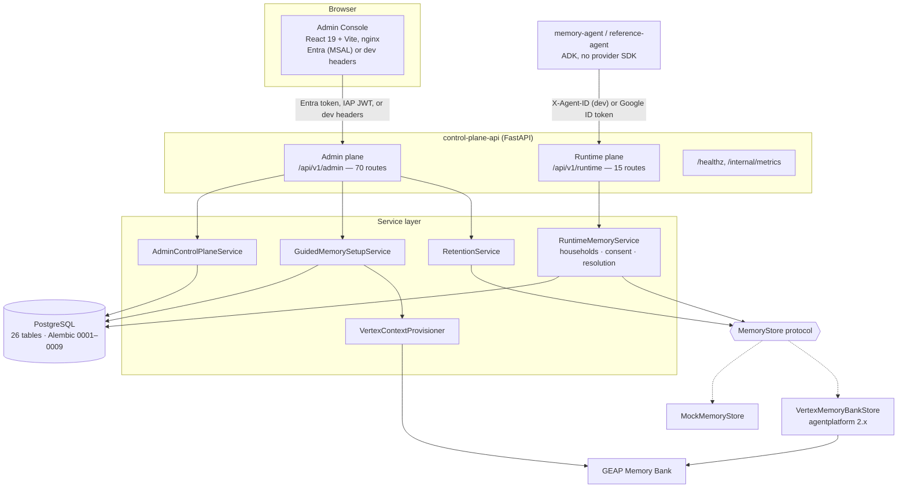
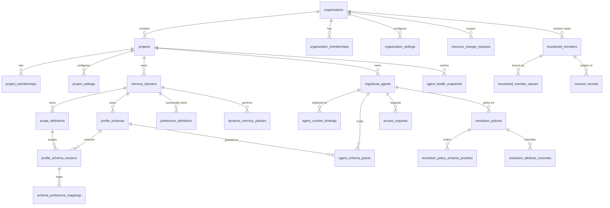
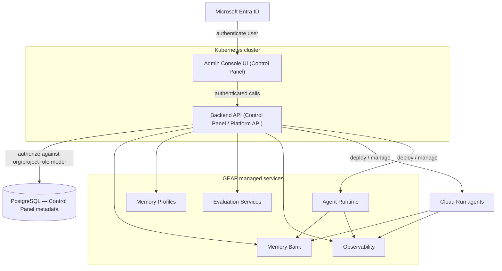

# GEAP Platform — Reference Architecture and Gap Analysis

**Document status:** Draft for review
**Scope:** Architectural baseline for the GEAP Control Panel roadmap
**Method:** Derived by reading the code on branch `feature/dynamic-household-members` on 2026-09-23
(first edition: commit `adea777`, `codex/org-project-governance`). Every CURRENT statement is
verifiable in the repository; nothing is assumed to exist because the target calls for it.
**Companion document:** [GEAP Control Panel Roadmap](GEAP_Control_Panel_Roadmap.md) describes the
product vision; this document describes what the code does today, where it diverges, and the smallest
incremental path between them.

---

## 1. How to read this document

| Label | Meaning |
|---|---|
| **CURRENT** | Implemented in this repository and verifiable in code. |
| **TARGET** | Stated in the roadmap brief. Not implemented unless separately labelled CURRENT. |
| **PROPOSED** | This document's recommendation for getting from CURRENT to TARGET. |

Sections 2–4 are CURRENT. Section 5 is TARGET. Sections 6–11 are gap analysis and PROPOSED.

---

## 2. Executive summary

### 2.1 What exists today

A **governed preference-memory control plane** for ADK agents on Google Cloud:

- **`apps/admin-console`** — React 19 + Vite admin UI (~2,660 lines of non-test source) with Entra sign-in
  (MSAL), organization/project workspace, guided setup, domain detail, households, approvals.
- **`apps/control-plane-api`** — FastAPI service with an **admin plane** (`/api/v1/admin`, 70 routes) and
  an **agent runtime plane** (`/api/v1/runtime`, 15 routes).
- **`apps/memory-agent`** and **`apps/reference-agent`** — ADK consumers that call only the runtime API.

PostgreSQL (26 tables, Alembic `0001`–`0009`) is the system of record for control-plane metadata, the
household roster, and the consent ledger. Vertex Memory Bank is the system of record for stored memory
values. The separation the target architecture asks for exists and is enforced.

### 2.2 Material divergences from the target

| # | Divergence | Change since first edition | Severity |
|---|---|---|---|
| 1 | **Deployment is Cloud Run, not Kubernetes.** No manifests, Helm, or GKE resources. | Unchanged | High — needs an explicit decision |
| 2 | **Authentication.** Google IAP / ID token for admins and agents; **Microsoft Entra ID now implemented** for the console and admin API. The Entra-vs-IAP front-door decision is still open. | Mostly closed | Medium |
| 3 | **Authorization partly derived from persisted membership.** Organization/project settings, members, approvals, and runtime bindings check membership; generic resource lists, the hierarchy, and domain-scoped roles still don't. | Partly closed | High — security |
| 4 | **Memory-shaped module structure.** No deployment, evaluation, observability, or FinOps modules; `runtime_type` is free text. Runtime bindings, agent health, and budget settings were added. | Slightly reduced | Medium |
| 5 | **No agent deployment or lifecycle capability.** Agents are registered metadata with an optional runtime binding; the platform never deploys or updates them. | Unchanged | Medium |

### 2.3 Headline recommendation

Keep evolving the Control Plane API; don't rewrite it. It already has the seams the target needs — a
provider protocol, a resource registry, pluggable authenticators, an audit spine — and roughly 7,700 lines
of tested authorization, household, consent, and resolution logic the target still requires. The
highest-value next step remains **membership-derived authorization for every admin read** (§9, Phase 1).

---

## 3. Current architecture

### 3.1 Component and responsibility map — CURRENT

| Component | Responsibility in code | Source |
|---|---|---|
| Admin Console | Organization directory and context navigation; project, domain-detail, and household views; guided setup; generic resource tables and detail panels (including schema versions); approvals table. No business rules. | `apps/admin-console/src/` |
| Admin plane | CRUD and lifecycle for 9 resource types, memberships, settings, runtime bindings and health, access-request and resource-change approvals, households and consents, retention sweep, audit, guided setup. | `api/admin/routes.py`, `services/admin_service.py`, `services/guided_setup.py`, `services/retention_service.py` |
| Runtime plane | Agent authentication, capability and purpose checks, grant-based schema authorization, household context and member resolution, sensitivity and consent gates, write routing, deterministic resolution, deletion. | `api/runtime/routes.py`, `services/runtime_service.py`, `domain/household_identity.py` |
| PostgreSQL | Organizations, projects, memberships, settings, runtime bindings, health, domains, scopes, schemas and versions, catalog, agents, grants, requests, policies, household roster and aliases, consent ledger, audit. | `persistence/models.py` |

### 3.2 Admin Console — CURRENT

- **Stack:** React 19.2, Vite, TypeScript, Vitest; runtime dependencies are React and MSAL only.
- **Navigation:** in-memory section state; no URL routing, so views aren't linkable.
- **Identity:** Entra sign-in (MSAL, bearer token) when `VITE_ENTRA_AUTH_ENABLED=true`; otherwise
  development headers built from `VITE_LOCAL_ADMIN_*`. The old on-screen persona switcher is gone.
- **Editing model:** purpose-built UIs for organizations, the wizard, domain detail, households, schema
  versions, and approvals; JSON-template create forms remain for other advanced resources.

### 3.3 Control Plane API — CURRENT

**Composition root:** `application.py` wires request-scoped services, both routers, and exception
handlers that map domain errors to a stable `ApiError` envelope (`UNAUTHENTICATED` 401,
`PERMISSION_DENIED` 403, `INVALID_ARGUMENT` 400, `NOT_FOUND` 404, `CONFLICT` 409) with a correlation ID.

**Runtime plane:** resolve/refresh, raw profiles, canonical write, single-value forget and move, dynamic
memory, events, forget (user / member / household), purge, conversational household member
add/update/merge, and the administrative roster upsert/deactivate. See the
[Control Plane API README](../apps/control-plane-api/README.md).

**Operational endpoints:** `/healthz` and `/internal/metrics`, excluded from OpenAPI. There is no
readiness endpoint; readiness is a startup script (`persistence/readiness.py` via
`scripts/wait_for_database.py`).

**Seams:**

| Seam | What it abstracts | Relevance to the target |
|---|---|---|
| `MemoryStore` protocol (`repositories/memory_store.py`) | Provider-neutral memory persistence | Pattern for `RuntimeAdapter`, `EvaluationAdapter`, `ObservabilityAdapter` |
| Resource registries in `admin_service.py` | Declarative CRUD, field allow-lists, camelCase mapping | New resource types are table entries |
| Authenticators (`security/`) | `LocalAgentAuthenticator`, `GoogleIdTokenAuthenticator`, `IapJwtAuthenticator`, `EntraAccessTokenAuthenticator` | Identity providers are pluggable |
| `AuditEventRecord` + `_audit()` | Actor, action, target, correlation, before/after | Meets the immutable-audit requirement for admin actions |
| `CorrelationAndMetricsMiddleware` | Correlation IDs and JSON access logs | Insertion point for OpenTelemetry |
| Lifecycle state machine | DRAFT → PENDING_APPROVAL → APPROVED → ACTIVE → DEPRECATED → RETIRED | Reusable for agent versions and deployments |

### 3.4 PostgreSQL data model — CURRENT

26 tables across migrations `0001` (control plane), `0002` (organization/project governance), `0003`
(memberships), `0004` (resource-change approvals), `0005` (settings and agent health), `0006` (topic
definitions), `0008` (household roster), and `0009` (dynamic household members, aliases, consent,
purpose, retention).

`audit_events` is append-only and unlinked.

Observations:

- The **governance backbone** (organization → project → membership → agent, grants, approvals, audit)
  exists with foreign keys and `ON DELETE RESTRICT` on ownership edges.
- **Household and consent tables** are organization-scoped runtime data, created by agents in
  conversation, not by administrators.
- **`registered_agents` is still a registration record**, not a lifecycle record: `purpose`,
  capabilities, status, and an optional runtime binding, but no version, deployment, or environment.
- **`runtime_type` is free text.** `AgentRuntimeType` lists `ADK_AGENT_RUNTIME`, `ADK_CLOUD_RUN`,
  `ADK_GKE`, `LANGGRAPH_CLOUD_RUN`, `OTHER`; the wizard default `ADK_LOCAL` isn't among them.
- **No tables** for environments, agent versions, deployments, evaluations, cost mappings, or trace
  references.

### 3.5 Authentication and authorization — CURRENT

*Agents (runtime plane):* `AUTH_ENABLED=false` trusts `X-Agent-ID`; otherwise a Google ID token is
verified and mapped to exactly one active registered agent.

*Admins (admin plane):*

| Mode | Trigger | Roles from |
|---|---|---|
| Dev headers | `AUTH_ENABLED=false` and Entra off | `X-Admin-Roles` / `X-Admin-Domains` |
| Entra ID | `ENTRA_AUTH_ENABLED=true` | Token app roles `Platform.Admin` → `PLATFORM_ADMIN`, `Platform.User` → `PLATFORM_USER` |
| IAP | `AUTH_ENABLED=true`, `ADMIN_AUTH_MODE=iap` | `ADMIN_ROLE_BINDINGS_JSON` |
| Bearer | `AUTH_ENABLED=true`, `ADMIN_AUTH_MODE=bearer` | `ADMIN_ROLE_BINDINGS_JSON` |

**Authorization.** A platform admin can do everything. Otherwise:

- organization settings, members, approvals, and child projects require an active organization
  membership (`OWNER`/`ADMIN` to manage);
- project settings, members, and runtime bindings require organization or project membership;
- domain-scoped actions (access requests, schema decisions) use `principal.domain_ids`, which come from
  the role binding or dev headers — Entra principals have none;
- `list_resources` and `organization-hierarchy` only require *a* role, so any authenticated admin can
  read every organization's resources.

**Deployment guardrail:** `scripts/validate_deployment_security.py` fails CI on `allUsers` bindings,
`AUTH_ENABLED=false` in infrastructure, private-key material, or a Dockerfile copying `.env`.

### 3.6 Google Cloud and GEAP integrations — CURRENT

| Integration | Implementation | Notes |
|---|---|---|
| Memory Bank data plane | `integrations/vertex_memory_store.py` (`client.memory_banks.memories`) | `retrieve_profiles`, `retrieve`, `create`, `list`, `delete`. Explicit values are typed exact-scope facts overlaid on profiles. **Managed generation is never triggered.** |
| Memory Bank control plane | `services/vertex_provisioning.py` (`client.runtimes.update`) | Compiles active schema versions into `context_spec`; updates an existing Agent Engine. |
| Agent health | `integrations/agent_health.py` | Cloud Monitoring time series for Agent Runtime bindings; HTTP health for Cloud Run / local endpoints. |
| Identity | `google.oauth2.id_token`, IAP JWT, Entra JWKS | See §3.5. |

**Memory scopes:** three contracts — `organization_id + user_id`, `organization_id + household_id`,
`organization_id + household_id + member_id`. Projects and domains are not partition keys.

**Not integrated:** Cloud Run Admin API, Agent Runtime lifecycle, Evaluation Service, Cloud Trace,
Cloud Logging read APIs, Cloud Billing / BigQuery export, Example Store, feedback services.

### 3.7 Observability — CURRENT

- **Correlation:** `X-Correlation-Id` accepted or generated per request, echoed, and embedded in errors
  and audit events.
- **Logging:** one JSON line per request; structured `memory_write` / `memory_deletion` events (tier,
  operation, sensitivity, source, version, correlation ID; never values); `retention.swept` audit events.
- **Metrics:** in-process `(path, status)` counters at `/internal/metrics` — not Prometheus, not
  aggregated across instances, reset on restart.
- **Infrastructure:** a log-based error metric, two alert policies, and a dashboard (`monitoring.tf`).
- **Absent:** OpenTelemetry / Cloud Trace export (the runtime service account has `roles/cloudtrace.agent`
  but nothing emits spans), `run_id` correlation, latency histograms, provider quota telemetry.

### 3.8 Deployment model — CURRENT

**Local:** `docker-compose.yml` (PostgreSQL internal only, API with the mock backend, console on :3000,
optional `reference-agent` profile); `docker-compose.devui.yml` / `docker-compose.pgadmin.yml` publish
PostgreSQL on `127.0.0.1:15432`; `docker-compose.vertex.yml` switches to Vertex and mounts ADC — it still
hard-codes fallback defaults for a real project and Agent Engine ID. The API container runs
`wait_for_database.py` → `alembic upgrade head` → `uvicorn`.

**Cloud (Terraform, one `platform` module, one `dev` environment):** Artifact Registry; VPC and private
services access; private Cloud SQL PostgreSQL; Secret Manager; per-component service accounts; Cloud Run
services for the API (min 1 instance, `MEMORY_BACKEND=vertex`, `AUTH_ENABLED=true`,
`ADMIN_AUTH_MODE=iap`), the console, and the reference agent; a migration job; serverless NEGs, an
external HTTPS load balancer with a managed certificate and IAP; monitoring resources. Not provisioned:
the GCP project, state bucket, DNS, IAP OAuth client, notification channels, the Agent Engine / Memory
Bank, and image builds.

**CI/CD:** `.github/workflows/platform-ci.yml` runs the security validator, ruff, the Python suites
(repository, reference agent, control plane), Alembic against a PostgreSQL service, a PostgreSQL
integration test, the console build/test/`npm audit`, and Terraform `fmt`/`validate`. The memory-agent
tests are not in CI. `cloudbuild.yaml` tests and builds three images; it does not deploy.

---

## 4. What the current implementation does *not* do

- Kubernetes deployment.
- Membership-filtered admin list reads; membership-derived domain roles.
- Agent deployment, lifecycle, discovery, or revision reporting.
- Evaluation definitions, datasets, or runs.
- Billing ingestion or cost allocation (budget settings are stored only).
- Distributed tracing or `run_id` correlation.
- Pagination, filtering, or sorting on admin list endpoints.
- Rate limiting, request quotas, or idempotency keys; provider `429` surfaces as HTTP 500.
- Per-attribute schema grants.
- URL routing in the console.

---

## 5. Target architecture — as stated

Everything here is TARGET. Editable source: [geap-target-architecture.drawio](geap-target-architecture.drawio)
(solid blue = implemented, dashed purple = target).

Stated principles: two application components on Kubernetes; the backend is a broad platform API with
memory as one capability; PostgreSQL holds Control Panel metadata; managed services stay authoritative
for what they manage; Cloud Run and Agent Runtime as the two agent deployment models; Entra ID for
authentication with authorization evaluated against the application's org/project role model.

---

## 6. Gap analysis — CURRENT vs TARGET

| Target element | Current state | Gap | Effort |
|---|---|---|---|
| Two components on **Kubernetes** | Cloud Run services + job, Terraformed with LB, IAP, private Cloud SQL | Deployment substrate (apps are portable) | High infra, low app |
| Console as **Control Panel** | Memory governance, households, org/project workspace, health | Inventory, deployments, evaluation, observability, FinOps views; routing | Medium–High |
| Backend as **broad platform API** | Clean two-plane split, generic registries | Capability modules; deployment/evaluation/observability/FinOps domains | Medium |
| **Entra ID** authentication | Implemented for console and admin API | Decide Entra vs IAP at the edge | Low–Medium |
| **Authorization from the role model** | Partly membership-derived | Membership filtering on lists/hierarchy; domain roles from membership; project-scoped delegation everywhere | **High — highest-value security work** |
| **PostgreSQL** system of record | True for governance, households, consent | Environments, agent versions, deployments, evaluation and cost metadata | Medium |
| **Managed services authoritative** | True for Memory Bank | Keep the discipline for evaluation, observability, billing | Low |
| **Cloud Run** model | Runtime binding + health only | Discovery, reconciliation, revisions, deploy | High |
| **Agent Runtime** model | Runtime binding + Cloud Monitoring health | Adapter behind the same interface | High |
| **Memory Bank / Profiles** | Implemented, including households, consent, purpose, retention | Per-attribute grants; schema precedence at runtime | Low–Medium |
| **Evaluation** | None | Tables, adapter, API, UI | High |
| **Observability** | Correlation IDs, structured logs, in-process counters | OpenTelemetry, identifier propagation, read adapters, deep links | High |
| **FinOps** | Budget settings stored (`PENDING_SYNC`) | Reconciler, billing export, labels, allocation | High |

---

## 7. Capability placement — PROPOSED

| Capability | Control Panel UI | Backend API | PostgreSQL | GEAP services | Cloud Run / Agent Runtime |
|---|---|---|---|---|---|
| Org / project / membership | Directory workspace **(exists)** | CRUD + authz **(exists, partial filtering)** | **(exists)** | — | — |
| Authentication | Entra sign-in **(exists)** | Token verification **(exists)** | Principal ↔ member mapping | — | — |
| Authorization | Renders permitted actions **(exists)** | Sole enforcement point — extend membership checks to all reads | Role source of truth **(exists)** | — | — |
| Agent registration | Forms **(exists)** | Registry **(exists)** | `registered_agents`, runtime bindings **(exist)** | — | — |
| Agent version / deployment / run | Inventory views *(new)* | Runtime adapters *(new)* | Deployment records *(new)* | — | Runtime truth |
| Memory configuration | Wizard, schemas, versions, approvals **(exists)** | Guided setup, provisioner **(exists)** | Schemas, versions, mappings **(exist)** | Memory system of record | Consumers |
| Households and consent | Households screen **(exists)** | Resolution, consent, retention **(exists)** | Roster, aliases, ledger **(exist)** | Values stored per scope | Agents create members in conversation |
| Evaluation | *(new)* | *(new)* | Definitions and summaries *(new)* | Runs evaluations | Subjects |
| Observability | *(new)* | Read adapters *(new)* | References only *(new)* | Authoritative telemetry | Emit |
| FinOps | Budget settings **(exists)** | Billing adapter *(new)* | Mappings *(new)* | Billing export | Cost sources |
| Audit | Audit view **(exists)** | Emission **(exists)** | `audit_events` **(exists)** | — | — |

**Invariant:** the UI never calls a Google Cloud API directly. True today; keep it a hard rule.

---

## 8. Control Plane API naming — DECIDED

"Control Plane API" is the product and technical name. The rename is complete: `apps/control-plane-api`,
package `control_plane_api`, Compose and Cloud Run service `control-plane-api`, proxy path
`/control-plane-api`, `CONTROL_PLANE_API_*` variables. The public contracts `/api/v1/admin` and
`/api/v1/runtime` are unchanged; new capabilities are new resources under them. Restructuring the
package internals into capability modules is still to do (Phase 0).

---

## 9. Incremental roadmap — PROPOSED

| Phase | Content | Status |
|---|---|---|
| 0 — Decisions and modules | Resolve §11 decisions; capability modules; constrain `runtime_type`; publish the correlation/labelling standard | Not started |
| 1 — Authorization from the role model | Membership-backed role resolution for all reads and domain roles; `ADMIN_ROLE_BINDINGS_JSON` as bootstrap only | **Partly done** (settings, members, approvals, bindings) |
| 2 — Entra ID | Entra authenticator, console sign-in, role mapping | **Done**; edge (Entra vs IAP) decision open |
| 3 — Kubernetes (if confirmed) | `/readyz`, real metrics or OpenTelemetry, manifests/Helm, migrations as a Job, ingress + Entra, remove `/internal/*` from public paths | Not started |
| 4 — Agent inventory and deployments | `environments`, `agent_versions`, `agent_deployments`; `RuntimeAdapter` protocol; Cloud Run discovery | Runtime bindings + health only |
| 5 — Observability | OpenTelemetry, identifier propagation, Trace/Logging adapters | Not started |
| 6 — Evaluation | Definitions, datasets, runs, adapter, release gates | Not started |
| 7 — FinOps | Billing export, label enforcement, allocation, budget reconciler | Budget settings stored only |
| 8 — Agent Runtime | `AgentRuntimeAdapter`, unified inventory | Health via Cloud Monitoring only |

---

## 10. Technical debt, gaps, security, and dependencies

### 10.1 Technical debt

| Item | Location | Impact |
|---|---|---|
| Unused parallel authorization (`AuthorizationService`, `AgentRegistration`) still exported and tested; the runtime implements its own checks | `services/authorization.py` | Two models to reason about. Flagged, not removed. |
| No pagination on list endpoints | `admin_service.list_resources` | Fails at inventory scale. |
| `admin_service.py` is ~2,150 lines; `runtime_service.py` ~1,740 | `services/` | Main obstacle to modularization. |
| `runtime_type` unvalidated; wizard default `ADK_LOCAL` not in the enum | `api/admin/models.py` | Blocks adapter dispatch. |
| In-process metrics | `observability/runtime.py` | Useless across replicas. |
| No `/readyz` | `application.py` | Needed for Kubernetes. |
| No console routing | `App.tsx` | No deep links. |
| Real project / Agent Engine IDs as Compose defaults | `docker-compose.vertex.yml` | Environment leakage. |
| Global schema precedence stored but not executed | `runtime_repository.get_resolution_config` | Wizard's Resolution step has no effect. |
| Wizard offers Per User + Store and Custom scopes the runtime rejects | `guided_setup.py`, `Wizard.tsx` | Activations that fail at use time. |
| Settings form overwrites unedited list fields | `OrganizationWorkspace.tsx` | Silent data loss on save. |
| Approval actions lack error handling | `ApprovalsTable.tsx` | Denials invisible to operators. |
| Memory-agent tests not in CI; one ruff error (`BLE001`) in `scripts/memory_load_test.py` | `.github/workflows/platform-ci.yml` | CI lint fails; agent regressions uncaught. |
| No automated deployment; only a `dev` environment | `cloudbuild.yaml`, Terraform | No promotion or rollback path. |

### 10.2 Architectural gaps relative to the target

1. No runtime abstraction for agent deployment targets.
2. No agent → version → deployment → run identity chain.
3. No environment concept.
4. Role model only partly connected to authorization.
5. Memory-shaped module boundaries.

### 10.3 Security considerations

| # | Finding | Assessment |
|---|---|---|
| 1 | Admin list reads and the hierarchy aren't filtered by membership | **High** — cross-organization metadata visible to any authenticated admin. |
| 2 | Domain roles come from `ADMIN_ROLE_BINDINGS_JSON` / headers; Entra principals have no domain roles | **Medium** — domain delegation requires a secret change or platform admin. |
| 3 | Header-trusting dev mode | **Mitigated but fragile** — the validator blocks `AUTH_ENABLED=false` in infrastructure; consider refusing to start with header auth without an explicit insecure flag. |
| 4 | `/internal/*` routed through the public load balancer (`services.tf` path rule) | **Medium** — remove it from the URL map. |
| 5 | Runtime plane reachable on the public host behind IAP | **Medium** — separate path matchers or services. |
| 6 | Entra and IAP are two front doors | **Blocking for an Entra production deployment** — choose one. |
| 7 | Agent principal mapping via `AGENT_PRINCIPAL_OVERRIDES_JSON` | **Medium** — identity binding lives in configuration. |
| 8 | No rate limiting or request-size limits | **Medium**. |
| 9 | Memory content | **Much improved:** sensitivity gate on every write, health consent, purpose limitation, retention. Remaining: redaction and semantic inference detection. |
| 10 | Broad `roles/aiplatform.user` on runtime service accounts | **Medium** — use Memory Bank roles and IAM Conditions. |
| 11 | Strengths | Default-deny authorization; read never implies write; writes never cross domains; no provider SDK in agents (reference agent CI-enforced); no `allUsers`; Secret Manager; private Cloud SQL; per-component service accounts; `npm audit` in CI. |

### 10.4 Dependencies and prerequisites

| Dependency | Status | Risk |
|---|---|---|
| `google-cloud-aiplatform[agent_engines]>=1.112,<3.0` (`agentplatform` 2.x) | In use, live-validated | Wide range on a fast-moving SDK; pin and add a contract test to CI. |
| Existing Agent Engine with Memory Bank | Required, not in Terraform | Manual prerequisite. |
| IAP OAuth client, DNS, state bucket, notification channels, project | Required, not provisioned | Manual prerequisites. |
| Entra tenant, app registrations, roles | Documented ([Entra setup](entra-authentication.md)) | Tenant lead time. |
| Cloud Run Admin API access | Not started | Blocks Phase 4. |
| Agent Runtime API maturity | Health only | Spike before lifecycle work. |
| Billing export to BigQuery | Not started | Blocks Phase 7. |
| Kubernetes platform | Not started | Blocks Phase 3. |
| Memory Bank quota raise | Discussed with Google (per the build-vs-buy deck) | Default quota limits concurrency. |

---

## 11. Open decisions

**11.1 Kubernetes — mandate or preference?** The Cloud Run deployment is complete and reviewed; the apps
are portable. If Kubernetes is an enterprise standard, Phase 3 stands; if a preference, finish Phase 1
first.

**11.2 Entra or IAP at the edge?** (a) Federate Entra into Google Identity and keep IAP; (b) remove IAP
and validate Entra tokens in the API (the natural fit for Kubernetes); (c) both — not recommended.

**11.3 Environment model.** One governing instance with an `environments` table, or one instance per
environment.

**11.4 `runtime_type` vocabulary.** Split into `framework` and `runtime_platform` before building adapter
dispatch.

---

## Appendix A — Endpoint inventory (CURRENT)

| Plane | Prefix | Routes | Auth |
|---|---|---|---|
| Runtime | `/api/v1/runtime` | 15 | `X-Agent-ID` (dev) / Google ID token |
| Admin | `/api/v1/admin` | 70 | Dev headers / Entra / IAP JWT / Google ID token |
| Ops | `/healthz`, `/internal/metrics` | 2 | None (excluded from OpenAPI) |

## Appendix B — Where things live

| Concern | Path |
|---|---|
| Composition, error envelope | `apps/control-plane-api/app/control_plane_api/application.py` |
| Configuration and mode switches | `…/config/settings.py` |
| Identity verification | `…/security/` |
| Admin CRUD, workflows, audit | `…/services/admin_service.py` |
| Guided setup | `…/services/guided_setup.py` |
| Runtime, households, consent, resolution | `…/services/runtime_service.py`, `…/domain/household_identity.py` |
| Governance limits | `…/domain/governance.py`, `…/services/retention_service.py` |
| Memory Bank data / control plane | `…/integrations/vertex_memory_store.py`, `…/services/vertex_provisioning.py` |
| ORM models, migrations | `…/persistence/models.py`, `apps/control-plane-api/migrations/versions/` |
| Console shell and features | `apps/admin-console/src/App.tsx`, `apps/admin-console/src/features/` |
| Cloud Run / LB / IAP / Cloud SQL | `infrastructure/terraform/modules/platform/` |
| Deployment security invariants | `scripts/validate_deployment_security.py` |
| CI | `.github/workflows/platform-ci.yml` |
