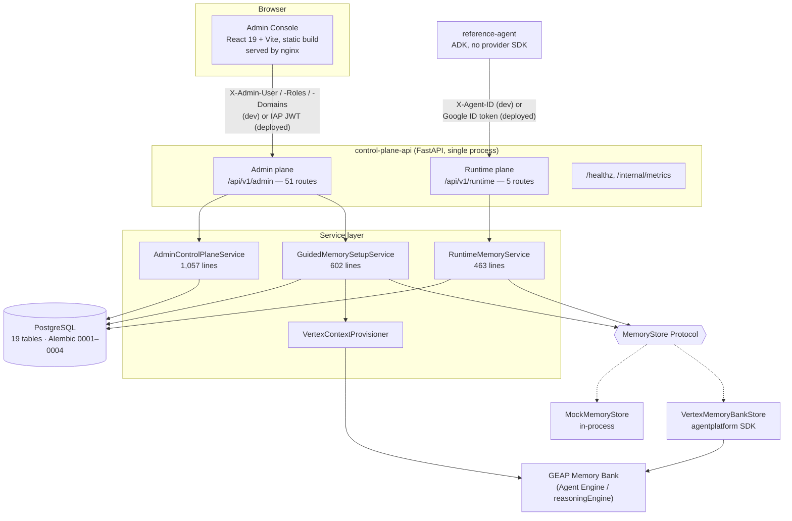
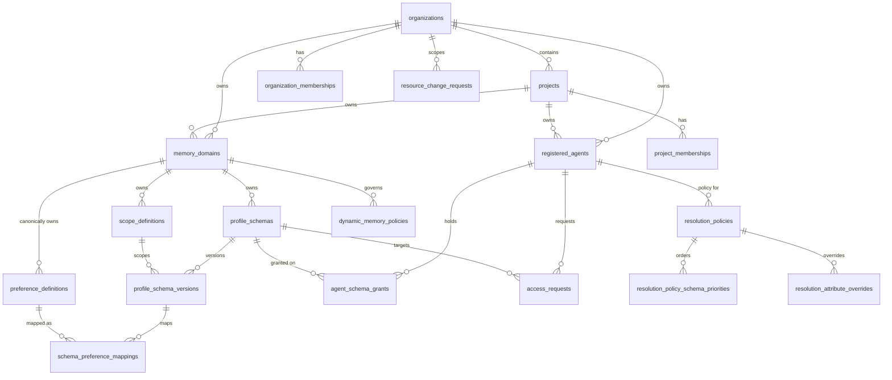
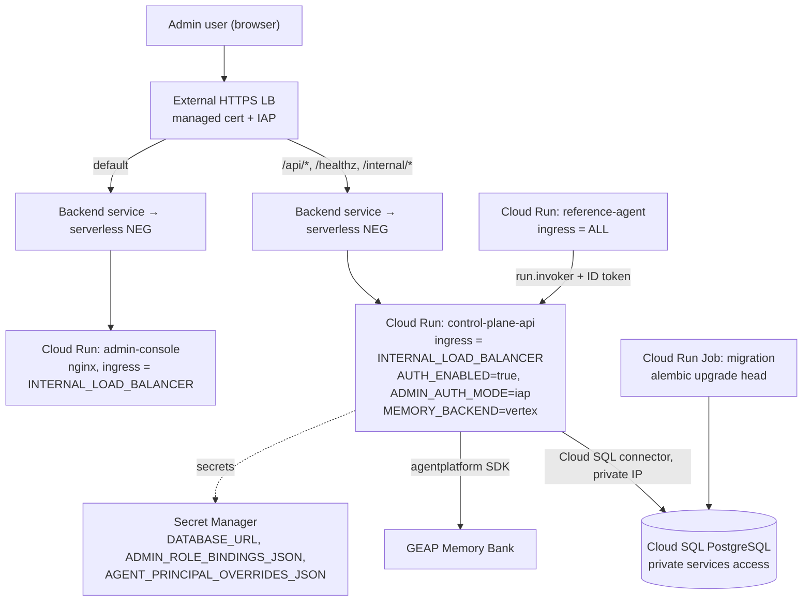
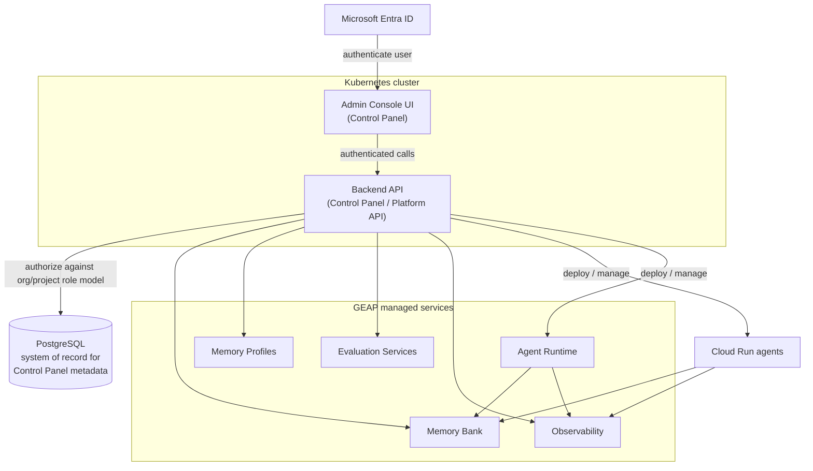

# GEAP Platform — Reference Architecture and Gap Analysis

**Document status:** Draft for review
**Scope:** Architectural baseline for the GEAP Control Panel roadmap
**Method:** Derived by reading the code in this repository at commit `adea777` (branch `codex/org-project-governance`). Every "current state" statement below cites a file. Nothing is assumed to exist because the target architecture calls for it.
**Companion document:** [GEAP Control Panel Roadmap](GEAP_Control_Panel_Roadmap.md) describes the product vision and target capabilities. This document describes what the code actually does today, where it diverges from that target, and the smallest incremental path between them.

---

## 1. How to read this document

Three labels are used throughout and never mixed:

| Label | Meaning |
|---|---|
| **CURRENT** | Implemented in this repository and verifiable in code. |
| **TARGET** | Stated in the roadmap brief. Not implemented unless separately labelled CURRENT. |
| **PROPOSED** | This document's recommendation for how to get from CURRENT to TARGET. |

Sections 2–4 are CURRENT. Section 5 is TARGET. Sections 6–11 are gap analysis and PROPOSED.

---

## 2. Executive summary

### 2.1 What exists today

The repository implements a **governed preference-memory control plane** for ADK agents on Google Cloud. It is a coherent, well-tested, three-application system:

- **`apps/admin-console`** — a React 19 + Vite single-page admin UI (~1,370 lines of source).
- **`apps/control-plane-api`** — a FastAPI service (~4,575 lines) exposing two distinct API planes: an **admin plane** (`/api/v1/admin`, ~51 routes) and an **agent runtime plane** (`/api/v1/runtime`, 5 routes).
- **`apps/reference-agent`** — a thin ADK demonstration consumer that deliberately contains no Memory Bank SDK imports (enforced by [`tests/test_application_boundaries.py`](../tests/test_application_boundaries.py)).

PostgreSQL (19 tables, 4 Alembic migrations) is the system of record for control-plane metadata. Vertex/GEAP Memory Bank is the system of record for user memory. The separation the target architecture asks for **already exists and is enforced**.

### 2.2 The five material divergences from the target

| # | Divergence | Severity |
|---|---|---|
| 1 | **Deployment is Cloud Run, not Kubernetes.** There is no Kubernetes manifest, Helm chart, Kustomize overlay, or GKE resource anywhere in the repository. The Terraform module provisions three Cloud Run services, a Cloud Run job, an external HTTPS load balancer, and IAP. | **High — requires an explicit decision** |
| 2 | **Authentication is Google-identity-only.** Admin identity comes from Google IAP JWT assertions or Google ID tokens ([`security/authentication.py`](../apps/control-plane-api/app/control_plane_api/security/authentication.py)). There is no Entra ID, OIDC, MSAL, or generic JWT validation code, and the UI has no login flow at all. | **High** |
| 3 | **Authorization is not derived from the persisted role model.** Admin roles and domain ownership come from a static `ADMIN_ROLE_BINDINGS_JSON` secret, not from the `organization_memberships` / `project_memberships` tables that already exist. The two role models are disconnected. | **High — security** |
| 4 | **The backend is memory-scoped in its module structure, not just its name.** There is no deployment, evaluation, observability, or FinOps entity, module, or integration. `registered_agents.runtime_type` is a free-text string with no behaviour attached. | **Medium** |
| 5 | **No agent deployment or lifecycle capability.** The platform registers agents as metadata; it never creates, deploys, updates, or inspects a Cloud Run service or an Agent Runtime instance. The only GEAP write path is updating an *existing* Agent Engine's `context_spec`. | **Medium** |

### 2.3 Headline recommendation

**The service is now product-named the Control Plane API; do not rewrite it, and do not rename the deployable yet.** The codebase already contains the four seams the target architecture needs — a provider Protocol, a resource registry, a pluggable authenticator, and an audit spine. Section 9 maps each target capability onto one of those seams. A rewrite would discard roughly 4,600 lines of tested authorization and resolution logic that the target architecture still requires.

---

## 3. Current architecture

### 3.1 Component and responsibility map — CURRENT

| Component | Actual responsibility in code | Source |
|---|---|---|
| Admin Console | Renders 13 navigation sections; organization/project directory workspace; guided memory-setup wizard; generic JSON-form CRUD over admin resources; approval queues. Holds no business rules — [`governance.ts`](../apps/admin-console/src/governance.ts) is 43 lines of client-side affordance logic only. | `apps/admin-console/src/` |
| Control Plane API — admin plane | Full CRUD + lifecycle transitions over 9 resource types, membership management, access-request and resource-change approval workflows, audit query, guided setup preview/activate. | [`api/admin/routes.py`](../apps/control-plane-api/app/control_plane_api/api/admin/routes.py), [`services/admin_service.py`](../apps/control-plane-api/app/control_plane_api/services/admin_service.py) |
| Control Plane API — runtime plane | Agent authentication, capability checks, grant-based schema authorization, automatic write-schema resolution, deterministic preference resolution, provider read/write. | [`api/runtime/routes.py`](../apps/control-plane-api/app/control_plane_api/api/runtime/routes.py), [`services/runtime_service.py`](../apps/control-plane-api/app/control_plane_api/services/runtime_service.py) |
| PostgreSQL | Organizations, projects, memberships, domains, scopes, schemas + versions, preference catalog, agents, grants, access requests, change requests, resolution and dynamic-memory policies, audit events. | [`persistence/models.py`](../apps/control-plane-api/app/control_plane_api/persistence/models.py) |
| Reference agent | Demonstration ADK consumer. Calls only the runtime API. | `apps/reference-agent/` |

**Note:** the Admin Console and the Control Plane API are the two application components the target architecture names. The console is served as a static bundle by nginx, which in local Compose continues to reverse-proxy the compatibility path `/control-plane-api/` to the API ([`nginx.conf`](../apps/admin-console/nginx.conf)); in Cloud Run the load-balancer URL map performs that routing instead.

### 3.2 Admin Console — CURRENT detail

- **Stack:** React 19.2, Vite 6.4, TypeScript 5.7, Vitest. Only two runtime dependencies (`react`, `react-dom`) — no router, no state library, no UI framework, no auth library.
- **Navigation:** section state held in `useState`; no URL routing, so views are not linkable or bookmarkable ([`App.tsx:452`](../apps/admin-console/src/App.tsx#L452)).
- **Identity:** a **persona switcher** — free-text user field, a role `<select>`, and a comma-separated domains field ([`App.tsx:471-476`](../apps/admin-console/src/App.tsx#L471)). These become the `X-Admin-User`, `X-Admin-Roles`, and `X-Admin-Domains` request headers ([`api.ts`](../apps/admin-console/src/api.ts)). **There is no sign-in, no session, and no token handling anywhere in the UI.**
- **API base URL:** `VITE_CONTROL_PLANE_API_URL`, defaulting to `/control-plane-api/api/v1/admin`; the Cloud Build image overrides it to `/api/v1/admin` ([`cloudbuild.yaml`](../cloudbuild.yaml)).
- **Editing model:** most advanced sections render a JSON textarea seeded from a hard-coded template map ([`App.tsx:30-110`](../apps/admin-console/src/App.tsx#L30)). Only the organizations workspace and the setup wizard are purpose-built UIs.

### 3.3 Control Plane API — CURRENT detail

**Composition root:** [`application.py`](../apps/control-plane-api/app/control_plane_api/application.py) builds the app, wires three request-scoped service dependencies (each opening its own DB session), registers both routers, and installs six exception handlers that map domain errors to a stable `ApiError` envelope (`UNAUTHENTICATED` 401, `PERMISSION_DENIED` 403, `INVALID_ARGUMENT` 400, `NOT_FOUND` 404, `CONFLICT` 409), each carrying the correlation ID.

**Runtime plane endpoints** (prefix `/api/v1/runtime`):

| Method | Path | Purpose |
|---|---|---|
| POST | `/preferences/resolve` | Return the authorized effective preference snapshot incl. `writablePreferences` |
| POST | `/preferences/refresh` | Same handler as resolve |
| POST | `/profiles` | Raw provider profiles (requires `inspect_provenance`) |
| POST | `/memory/events` | Ingest an interaction event with candidate preferences |
| PUT | `/preferences/{attribute}` | Explicit preference write; schema chosen server-side |

**Admin plane endpoints** (prefix `/api/v1/admin`): 51 routes covering `organizations`, `projects`, `domains`, `scopes`, `schemas`, `preference-catalog`, `agents`, `resolution-policies`, `dynamic-memory-policies`, plus `organization-hierarchy`, membership creation, `access-requests` (+ approve/reject/revoke/expire), `resource-change-requests` (+ approve/reject), `audit`, and `memory-setups/preview|activate`.

**Operational endpoints:** `/healthz` and `/internal/metrics`. Both are excluded from the OpenAPI schema. There is **no readiness endpoint** — readiness logic exists only as a startup script ([`persistence/readiness.py`](../apps/control-plane-api/app/control_plane_api/persistence/readiness.py), invoked by `scripts/wait_for_database.py` in the Compose command).

**Key architectural seams already present:**

| Seam | What it abstracts | Why it matters for the target |
|---|---|---|
| `MemoryStore` Protocol ([`repositories/memory_store.py`](../apps/control-plane-api/app/control_plane_api/repositories/memory_store.py)) | Provider-neutral memory persistence; two implementations (mock, Vertex) selected by `MEMORY_BACKEND` | The exact pattern to reuse for `RuntimeAdapter`, `EvaluationAdapter`, `ObservabilityAdapter` |
| `RESOURCE_MODELS` / `RESOURCE_IDS` / `UPDATABLE_FIELDS` / `CHANGE_ALIASES` registries ([`admin_service.py:58-146`](../apps/control-plane-api/app/control_plane_api/services/admin_service.py#L58)) | Declarative generic CRUD, field allow-listing, and camelCase↔snake_case mapping | New resource types (deployments, evaluations, cost mappings) are additive table entries, not new endpoint code |
| `AdminAuthenticator` / `AgentAuthenticator` Protocols ([`security/`](../apps/control-plane-api/app/control_plane_api/security/)) selected by `ADMIN_AUTH_MODE` in [`config/settings.py`](../apps/control-plane-api/app/control_plane_api/config/settings.py) | Pluggable identity verification | An `EntraIdAuthenticator` is an additive third mode, not a refactor |
| `AuditEventRecord` + `AdminControlPlaneService._audit()` | Actor / action / target / correlation / before / after | Already satisfies the target's immutable-audit requirement |
| `CorrelationAndMetricsMiddleware` ([`observability/runtime.py`](../apps/control-plane-api/app/control_plane_api/observability/runtime.py)) | Correlation ID propagation + structured JSON access logs | The insertion point for OpenTelemetry and the `run_id` correlation standard |
| `LIFECYCLE_TRANSITIONS` state machine | DRAFT → PENDING_APPROVAL → APPROVED → ACTIVE → DEPRECATED → RETIRED | Reusable for agent versions and deployments |

### 3.4 PostgreSQL data model — CURRENT

19 tables across 4 migrations: `0001_control_plane`, `0002_organization_project_governance`, `0003_membership_governance`, `0004_resource_change_approvals`.

`audit_events` is intentionally unlinked (append-only, actor/action/target/correlation, with `before_metadata` and `after_metadata` JSON).

**Observations on the model:**

- The **governance backbone** the target architecture needs — organization → project → membership → agent, with grants, approvals, and audit — **already exists** and is enforced with real foreign keys and `ON DELETE RESTRICT` on the ownership edges.
- The **memory-specific** tables (domains, scopes, schemas, versions, mappings, preference catalog, resolution and dynamic-memory policies) are 11 of the 19. They sit *below* the org/project layer rather than defining it, so the hierarchy is not memory-shaped.
- **`registered_agents` is a registration record, not a lifecycle record.** It has `runtime_type`, `identity_type`, `principal`, `capabilities`, `status` — but no version, no deployment, no environment, no cloud resource reference, no revision, no URL. The target's Agent → Agent Version → Deployment → Execution Run chain does not exist.
- `registered_agents.runtime_type` is `String(64)` with **no database or Pydantic validation against `AgentRuntimeType`**. The enum ([`domain/control_plane.py:31`](../apps/control-plane-api/app/control_plane_api/domain/control_plane.py#L31)) defines `ADK_AGENT_RUNTIME`, `ADK_CLOUD_RUN`, `ADK_GKE`, `LANGGRAPH_CLOUD_RUN`, `OTHER`, but the guided-setup model defaults to the literal `"ADK_LOCAL"` ([`api/admin/models.py:203`](../apps/control-plane-api/app/control_plane_api/api/admin/models.py#L203)), which is not a member of the enum. **The enum is documentation, not a constraint.**
- **No table exists** for: deployments, environments, agent versions, evaluations, datasets, evaluation runs, cost mappings, billing labels, trace references, or execution runs.

### 3.5 Authentication and authorization — CURRENT

**Two independent identity paths.**

*Agent (runtime plane)* — [`security/authentication.py`](../apps/control-plane-api/app/control_plane_api/security/authentication.py):

| Mode | Trigger | Mechanism |
|---|---|---|
| `LocalAgentAuthenticator` | `AUTH_ENABLED=false` | Trusts the `X-Agent-ID` header outright |
| `GoogleIdTokenAuthenticator` | `AUTH_ENABLED=true` | Verifies a Google-signed ID token, pins issuer to `accounts.google.com`, maps the verified service-account email to exactly one active `registered_agents.principal` |

*Admin (admin plane)* — [`security/admin.py`](../apps/control-plane-api/app/control_plane_api/security/admin.py):

| Mode | Trigger | Mechanism |
|---|---|---|
| Header personas | `AUTH_ENABLED=false` | Trusts `X-Admin-User` / `X-Admin-Roles` / `X-Admin-Domains` outright |
| `bearer` | `AUTH_ENABLED=true`, `ADMIN_AUTH_MODE=bearer` | Google ID token, then role lookup |
| `iap` | `AUTH_ENABLED=true`, `ADMIN_AUTH_MODE=iap` | Verifies the `x-goog-iap-jwt-assertion` header against Google's IAP keys, pins issuer to `https://cloud.google.com/iap`, then role lookup |

**Roles:** `PLATFORM_ADMIN`, `DOMAIN_ADMIN`, `SCHEMA_OWNER`, `AGENT_OWNER`, `VIEWER`. Enforcement is `AdminAuthorizer.require_read` / `require_platform` / `require_domain`, called explicitly at the top of each service method.

**The critical finding.** In every authenticated mode, roles and owned domains are read from **`ADMIN_ROLE_BINDINGS_JSON`** — a JSON object (`verified-email → {"roles": [...], "domains": [...]}`) supplied as an environment variable backed by a Secret Manager secret ([`settings.py:52`](../apps/control-plane-api/app/control_plane_api/config/settings.py#L52), [`security/admin.py:76-88`](../apps/control-plane-api/app/control_plane_api/security/admin.py#L76), [`infrastructure/terraform/modules/platform/main.tf:139`](../infrastructure/terraform/modules/platform/main.tf#L139)).

The `organization_memberships` and `project_memberships` tables — with their `OWNER` / `ADMIN` / `VIEWER` roles — are **written and displayed but never consulted for an authorization decision.** Two role models coexist and do not intersect. The repository README states this openly: *"deriving every admin request from persisted membership is the next security slice."*

Consequences today:
- Granting someone access requires a secret rotation and a Cloud Run revision, not a UI action.
- `require_domain` checks `principal.domain_ids` from the binding JSON, so domain ownership is likewise not database-derived.
- All mutating organization/project/membership operations require `PLATFORM_ADMIN` ([`admin_service.py:378,419,506`](../apps/control-plane-api/app/control_plane_api/services/admin_service.py#L378)) — project-scoped delegation is not possible.

**Deployment-time guardrail:** [`scripts/validate_deployment_security.py`](../scripts/validate_deployment_security.py) fails CI if any file under `infrastructure/` contains an `allUsers` IAM binding, sets `AUTH_ENABLED` to false/0, or embeds private-key material, or if any app Dockerfile copies a `.env` file. This is a genuinely good control and should be extended, not replaced.

### 3.6 Google Cloud and GEAP integrations — CURRENT

Exactly **three** integration points exist. There are no others.

| Integration | Implementation | Notes |
|---|---|---|
| **Memory Bank — data plane** | [`integrations/vertex_memory_store.py`](../apps/control-plane-api/app/control_plane_api/integrations/vertex_memory_store.py) (332 lines) via the `agentplatform` SDK against `projects/{p}/locations/{l}/reasoningEngines/{id}` | Uses `retrieve_profiles`, `retrieve`, `create`, `ingest_events`. Because the provider exposes no field-level structured-profile update, explicit writes are stored as typed exact-scope memory facts and **overlaid** on retrieved profiles at read time. Synchronous SDK calls are moved off the event loop with `asyncio.to_thread`. |
| **Memory Bank — control plane** | [`services/vertex_provisioning.py`](../apps/control-plane-api/app/control_plane_api/services/vertex_provisioning.py) (94 lines) | Compiles all ACTIVE schema versions into `context_spec.memory_bank_config.structured_memory_configs` and calls `agent_engines.update()` on an **existing** Agent Engine. It does not create Agent Engines. Profile instances remain lazy. |
| **Google identity** | `google.oauth2.id_token` for ID-token and IAP-JWT verification | See §3.5. |

**Memory scope:** the provider is always addressed at the exact scope `organization_id + user_id`, validated by a `ScopeRegistry` contract ([`services/scope_registry.py`](../apps/control-plane-api/app/control_plane_api/services/scope_registry.py)). Projects and domains are authorization metadata in PostgreSQL and are deliberately **not** Memory Bank partition keys.

**Not integrated, at all:** Cloud Run Admin API, GEAP Agent Runtime provisioning or lifecycle, Vertex/GEAP Evaluation Service, Cloud Trace, Cloud Logging read APIs, Cloud Monitoring read APIs, Cloud Billing, BigQuery billing export, Sessions, Example Store, feedback services.

### 3.7 Observability — CURRENT

- **Correlation:** `X-Correlation-Id` accepted or generated per request, propagated via a `ContextVar`, echoed on the response, and embedded in every `ApiError` and every audit event.
- **Logging:** one structured JSON line per request (`event`, `correlation_id`, `method`, `path`, `status`, `duration_ms`) on the `control_plane_api.runtime` logger — Cloud Logging picks this up as structured payload on Cloud Run.
- **Metrics:** `RuntimeMetrics` is an **in-process, lock-guarded `Counter` of `(path, status)`**, exposed at `/internal/metrics` in a bespoke `"path|status": count` format. It is **not Prometheus**, is **not aggregated across instances**, and **resets on every cold start** — which on Cloud Run with `min_instance_count = 0` is frequent. It is a debugging aid, not a metrics system.
- **Infrastructure monitoring:** [`monitoring.tf`](../infrastructure/terraform/modules/platform/monitoring.tf) defines a log-based error metric, two alert policies (application errors, 5xx rate), and a dashboard.
- **Absent:** OpenTelemetry, distributed tracing, trace/span propagation to Memory Bank calls, `agent_id`/`deployment_id`/`run_id` correlation identifiers, and any latency histogram.

### 3.8 Deployment model — CURRENT

**There is no Kubernetes in this repository.** No manifests, no Helm chart, no Kustomize, no GKE Terraform resource, no `kubectl` in any script. The only occurrence of the string "GKE" is the unused `AgentRuntimeType.ADK_GKE` enum member.

**Local development** — Docker Compose:
- [`docker-compose.yml`](../docker-compose.yml): `postgres:16-alpine` (internal `expose` only), `control-plane-api` (mock backend, `AUTH_ENABLED=false`), `admin-console` (nginx :3000), optional `reference-agent` under the `agent` profile.
- [`docker-compose.vertex.yml`](../docker-compose.vertex.yml): overrides to `MEMORY_BACKEND=vertex`, mounting host ADC read-only. **Note:** this file hard-codes fallback defaults `GOOGLE_CLOUD_PROJECT=e2eml-222003` and `AGENT_PLATFORM_MEMORY_BANK_ID=5362284673558904832` — real-looking identifiers checked into the repository.
- The API container's start command chains `wait_for_database.py` → `alembic upgrade head` → `uvicorn`.

**Cloud deployment** — Terraform (`infrastructure/terraform/`, one `platform` module, one `dev` environment):

Provisioned by the module: Artifact Registry repo; VPC + subnet + private services access; Cloud SQL PostgreSQL with a random password; three Secret Manager secrets; four dedicated service accounts (control-plane-api, reference-agent, admin-console, migration) with per-account project IAM; three Cloud Run v2 services; one Cloud Run v2 job for migrations; two serverless NEGs and backend services; IAP web IAM members; global IP, managed certificate, URL map, HTTPS proxy, forwarding rule; and the monitoring resources in §3.7.

**Explicitly out of scope for Terraform** (per [`infrastructure/README.md`](../infrastructure/README.md)): the GCP project, the Terraform state bucket, DNS records, the IAP OAuth client, notification channels, the Agent Engine / Memory Bank resource, and container image builds.

**CI/CD:**
- [`.github/workflows/platform-ci.yml`](../.github/workflows/platform-ci.yml) — deployment-security validation, ruff, three pytest suites, live Alembic migration against a PostgreSQL service container, a PostgreSQL integration test, admin-console build/test/`npm audit`, and `terraform fmt`/`init`/`validate`.
- [`cloudbuild.yaml`](../cloudbuild.yaml) — tests then builds and pushes three images to Artifact Registry. **It does not deploy.** Deployment is a manual `terraform apply` plus the shell helpers in `infrastructure/cloud-run/`. There is no automated promotion, no staging or prod environment directory, and no rollback procedure in code.

---

## 4. What the current implementation does *not* do

Stated plainly, so that nothing in §5 is mistaken for existing behaviour. None of the following exists in the codebase:

- Kubernetes deployment of any component.
- Microsoft Entra ID, OIDC, MSAL, or any non-Google identity provider.
- Any sign-in flow, session, or token handling in the Admin Console.
- Authorization decisions derived from `organization_memberships` or `project_memberships`.
- Agent deployment, redeployment, scaling, traffic-splitting, or lifecycle operations.
- Cloud Run discovery, registration-by-reconciliation, or revision/status reporting.
- GEAP Agent Runtime integration of any kind.
- Evaluation definitions, datasets, runs, metrics, thresholds, or results.
- Cost, billing, budget, or FinOps data.
- Distributed tracing, trace links, or `run_id` correlation across agent executions.
- Pagination, filtering, or sorting on any admin list endpoint (`list_resources` returns every row, ordered by ID — [`admin_service.py:232`](../apps/control-plane-api/app/control_plane_api/services/admin_service.py#L232)).
- Rate limiting, quotas, or idempotency keys.
- CORS configuration (the deployed topology is same-origin behind one load balancer, so this is currently by design).

---

## 5. Target architecture — as stated

Restated from the roadmap brief for gap-analysis purposes. Everything here is TARGET.

Editable draw.io source, in the Google Cloud reference-architecture format used elsewhere in `docs/`: [geap-target-architecture.drawio](geap-target-architecture.drawio). It carries the same CURRENT/TARGET distinction as this document — solid blue borders are implemented today, dashed purple borders are target capabilities.

**Stated principles:**
1. Two application components on Kubernetes: Admin Console UI (Control Panel) and Backend API.
2. The Backend API is the broader platform API; memory management is one capability among many, not the architectural boundary.
3. PostgreSQL is the system of record for Control Panel metadata (organizations, projects, users, agents, resource configuration, access relationships, governance).
4. Google-managed services remain the system of record for the resources they manage; no unnecessary duplication of their operational data.
5. Two supported agent deployment models — Cloud Run and GEAP Agent Runtime — with as consistent a governance experience as practical.
6. Entra ID for authentication; authorization remains separate and evaluates against the org/project role model in the application.

---

## 6. Gap analysis — CURRENT vs TARGET

| Target element | Current state | Gap | Effort |
|---|---|---|---|
| Two components on **Kubernetes** | Three Cloud Run services + a job, fully Terraformed with LB, IAP, private Cloud SQL | **Entire deployment substrate.** Both apps are already stateless 12-factor containers with health probes, so the *applications* are portable; the *platform plumbing* (IAP, serverless NEGs, Cloud SQL connector, LB) is not | High (infra), Low (app) |
| Admin Console as **Control Panel** | Console exists; 13 sections, all memory-governance-oriented | Additive: inventory, deployments, evaluation, observability, FinOps views. Also needs routing and a real auth shell | Medium–High |
| Backend API as **broad platform API** | FastAPI with a clean two-plane split and generic resource registries | Module structure is memory-shaped (`memory`, `guided_setup`, `runtime`); no `deployments`, `evaluations`, `observability`, `finops` modules. Package is named `control_plane_api` | Medium |
| **Entra ID** authentication | Google IAP JWT / Google ID token only; no login in UI | New `EntraIdAuthenticator` (JWKS, issuer, audience, tenant), MSAL or equivalent in the UI, and a decision about IAP's future (IAP is Google-identity-bound) | High |
| **Authorization from org/project role model** | Roles from a static `ADMIN_ROLE_BINDINGS_JSON` secret; membership tables unused for decisions | Repoint `AdminAuthenticator` at the membership tables; map Entra `oid`/`upn` to `member_principal`; add project-scoped role checks | **High — highest-value security work** |
| **PostgreSQL as system of record** for governance metadata | Already true for org/project/agent/grant/policy/audit | Extend the schema: environments, agent versions, deployments, runtime references, evaluation metadata, cost mappings, trace references | Medium |
| **Managed services stay authoritative** | Already true and enforced for Memory Bank | Preserve the same discipline for evaluation, observability, and billing — store references and summaries, never raw telemetry | Low (discipline) |
| **Cloud Run** deployment model | `runtime_type` string label only; no Cloud Run API calls | Cloud Run Admin API adapter: discovery, registration reconciliation, revision/status/URL, deploy | High |
| **Agent Runtime** deployment model | `ADK_AGENT_RUNTIME` enum member only; the only Agent Engine call is `update(context_spec)` | Agent Runtime adapter behind the same interface as Cloud Run | High |
| **Memory Bank / Memory Profiles** | Fully implemented | Only cosmetic: expose Memory Profile configuration as first-class Control Panel views | Low |
| **Evaluation services** | Nothing | New tables, adapter, API module, UI | High |
| **Observability / traceability** | Correlation IDs + structured logs + in-process counters | OpenTelemetry, `agent_id`/`deployment_id`/`run_id` propagation, Cloud Trace/Logging read adapters, deep links | High |
| **Usage and cost / FinOps** | Nothing | Billing export → BigQuery, label standard, resource→agent mapping table, allocation queries | High |

---

## 7. Capability placement — PROPOSED

Where each capability should live, and what already exists there.

| Capability | Control Panel UI | Backend API | PostgreSQL | GEAP managed services | Cloud Run | Agent Runtime |
|---|---|---|---|---|---|---|
| Org / project / membership | Directory workspace **(exists)** | CRUD + authz **(exists)** | System of record **(exists)** | — | — | — |
| Authentication | Entra sign-in *(new)* | Token verification *(new mode)* | Principal ↔ member mapping *(new column/index)* | — | — | — |
| Authorization | Renders permitted actions only **(partially exists)** | **Sole enforcement point** — must move to DB-derived roles | Role source of truth **(tables exist, unused)** | — | — | — |
| Agent registration | Forms **(exists)** | Registry + validation **(exists)** | `registered_agents` **(exists)** | — | — | — |
| Agent version / deployment / run | Inventory views *(new)* | Runtime adapters *(new)* | Deployment records *(new tables)* | — | Runtime truth | Runtime truth |
| Agent deploy / lifecycle | Guided actions + approvals *(new)* | Adapter + workflow *(new)* | Workflow state, audit *(extend)* | — | Executes | Executes |
| Memory Bank config | Wizard + advanced screens **(exists)** | Provisioner + guided setup **(exists)** | Schemas, versions, mappings **(exists)** | **Memory system of record (exists)** | Consumer | Consumer |
| Memory Profiles | Config views *(new UI, existing data)* | Compiled into `context_spec` **(exists)** | Schema versions **(exists)** | **Profile generation (exists)** | — | — |
| Control Plane / preferences | Catalog, grants, approvals **(exists)** | Resolution + grant enforcement **(exists)** | Catalog, grants, policies **(exists)** | Storage **(exists)** | Reads via runtime API | Reads via runtime API |
| Evaluation | Definitions, runs, scorecards *(new)* | Evaluation adapter *(new)* | Definitions, run refs, summaries *(new)* | **Runs evaluations** | Subject | Subject |
| Observability / traceability | Timelines, deep links *(new)* | Read adapters + correlation *(new)* | Trace/log **references only** *(new)* | **Authoritative telemetry** | Emits | Emits |
| Usage / cost / FinOps | Dashboards, budgets *(new)* | Billing/BigQuery adapter *(new)* | Resource↔agent mappings *(new)* | Billing export authoritative | Cost source | Cost source |
| Audit | Audit view **(exists)** | Audit emission **(exists)** | `audit_events` **(exists)** | — | — | — |

**Invariant to preserve:** the UI never calls a Google Cloud API directly. This is currently true and is worth stating as a hard architectural rule, because every new capability creates pressure to break it.

---

## 8. Control Plane API naming — DECIDED

**Decision: use “Control Plane API” consistently for both the product-facing identity and technical deployable identifiers. The full rename is complete.**

The evidence for evolving rather than replacing:

- The API surface is **already generic**. The admin prefix is `/api/v1/admin`, not `/api/v1/memory`. The FastAPI title is `"Control Plane API"`. Of the 51 admin routes, 13 (organizations, projects, memberships, hierarchy, access requests, change requests, audit) are platform-governance routes with no memory semantics.
- The resource registry pattern makes new domains additive. Adding `deployments` or `evaluations` means adding a model, three registry entries, and a service method — not new routing code.
- The two-plane split (admin vs runtime) is exactly the split the target needs between Control Panel operations and agent-facing operations.

**Naming boundary:**

| Step | Action | When |
|---|---|---|
| 1 | Adopt **"Control Plane API"** as the product name in API metadata, health output, documentation, UI copy, and operational display names. | Completed |
| 2 | Restructure `control_plane_api` internals into capability modules — `identity`, `organizations`, `projects`, `agents`, `memory`, `approvals`, `audit`, and later `deployments`, `evaluations`, `observability`, `finops`. Keep the top-level package name. Pure file moves plus import updates; the existing test suites protect the refactor. | Phase 0 |
| 3 | Keep `/api/v1/admin` and `/api/v1/runtime` as the stable public contract. New capabilities are new resources under `/api/v1/admin`, not a new prefix. | Ongoing |
| 4 | Rename the Python package, source directory, image, Compose/Cloud Run service, proxy path, and environment variables to their `control-plane-api` / `control_plane_api` / `CONTROL_PLANE_API_*` forms. | Completed |

The stable identifiers are now `apps/control-plane-api`, the `control_plane_api` import package, the Compose and Cloud Run service `control-plane-api`, the local proxy path `/control-plane-api`, and `CONTROL_PLANE_API_*` environment variables. The public route contracts `/api/v1/admin` and `/api/v1/runtime` are unchanged.

---

## 9. Incremental roadmap — PROPOSED

Each phase is anchored on an existing code seam so that work extends the current implementation rather than replacing it. Phases are capability-ordered; sequencing assumes the Kubernetes decision (§11) is resolved before Phase 3.

### Phase 0 — Decisions and module structure

*Extends: package layout; no behaviour change.*

- Resolve the four open decisions in §11 (Kubernetes, Entra + IAP, environment model, `runtime_type` vocabulary).
- Restructure into capability modules (§8 step 2).
- Constrain `registered_agents.runtime_type` to `AgentRuntimeType` in the Pydantic models, and reconcile the `ADK_LOCAL` default — either add it to the enum or change the default.
- Publish the correlation and labelling standard: `agent_id`, `agent_version`, `deployment_id`, `run_id`, `environment`.
- **Exit:** approved decision record; module boundaries merged; full CI green.

### Phase 1 — Authorization from the persisted role model

*Extends: `AdminAuthenticator`, `AdminAuthorizer`, `organization_memberships`, `project_memberships`. This is the highest-value work in the roadmap and it is mostly deletion of a workaround.*

- Add a membership-backed role resolver: given a verified principal, load organization and project memberships and derive the effective role set. Keep `ADMIN_ROLE_BINDINGS_JSON` as a narrow **bootstrap-only** path for the initial platform administrator, behind an explicit flag.
- Add project-scoped authorization so `require_platform` is no longer the answer for every mutation.
- Replace `principal.domain_ids` with domain ownership derived from project membership.
- **Exit:** granting access is a UI action, not a secret rotation; `test_admin_authentication.py` and `test_authorization.py` extended to cover membership-derived decisions.

### Phase 2 — Entra ID authentication

*Extends: the `ADMIN_AUTH_MODE` switch in `settings.py` — an additive third mode.*

- Add `EntraIdAuthenticator`: JWKS fetch and cache, issuer/tenant/audience validation, clock-skew tolerance, and claim extraction (`oid` as stable subject, `preferred_username`/`upn` as principal).
- Add `ADMIN_AUTH_MODE=entra`. Leave `iap` and `bearer` intact so the current environment keeps working through the transition.
- Add the sign-in shell to the Admin Console (MSAL browser, PKCE), attach the bearer token, handle refresh and 401. **Delete the persona switcher** in the same change.
- Map Entra `oid` to `member_principal`; decide and document the canonical form (recommend: store `oid` in a new indexed column and keep `member_principal` as the human-readable UPN for display).
- Resolve the IAP question (§11.2) — Entra tokens and IAP's Google-identity gate are two different front doors and need one answer.
- **Exit:** a user signs in with Entra, and their permissions come from PostgreSQL membership.

### Phase 3 — Kubernetes deployment (if confirmed)

*Extends: existing Dockerfiles and health endpoints; replaces the Cloud Run Terraform layer.*

- Add `/readyz` to the API using the existing `probe_database` helper — Kubernetes needs liveness and readiness as separate signals.
- Convert `RuntimeMetrics` to a real Prometheus endpoint, or drop `/internal/metrics` in favour of OpenTelemetry. In-process counters are meaningless behind more than one replica.
- Manifests/Helm for both apps; migrations become a Kubernetes Job or an init container, replacing the Cloud Run job.
- Replace the Cloud SQL connector sidecar pattern with Workload Identity + the Cloud SQL Auth Proxy, or with private IP from the cluster's VPC.
- Replace the IAP-fronted LB with an Ingress/Gateway plus the Phase 2 Entra authentication.
- Remove `/internal/*` from any public path matcher (§10.3).
- **Exit:** both components run on Kubernetes with equivalent security posture; the deployment-security validator is extended to cover manifests.

### Phase 4 — Agent inventory, versions, and deployments

*Extends: `registered_agents`, `LIFECYCLE_TRANSITIONS`, the resource registry, and the `MemoryStore` Protocol pattern.*

- New tables: `environments`, `agent_versions`, `agent_deployments` (agent, version, environment, runtime type, cloud resource reference, revision, status, URL, service account).
- Define `RuntimeAdapter` as a Protocol mirroring `MemoryStore`, with `CloudRunRuntimeAdapter` first.
- Discovery and reconciliation against the Cloud Run Admin API; surface drift rather than silently overwriting.
- Inventory and detail views in the console.
- **Exit:** every onboarded Cloud Run agent has an owner, an environment, and a live deployment record.

### Phase 5 — Observability and traceability

*Extends: `CorrelationAndMetricsMiddleware`.*

- OpenTelemetry instrumentation; propagate the standard identifiers from Phase 0 through API, agents, and Memory Bank calls.
- `ObservabilityAdapter` over Cloud Trace and Cloud Logging returning references and summaries; store references only.
- Agent → deployment → request-trace navigation in the console.

### Phase 6 — Evaluation services

*Extends: the resource registry and approval workflow.*

- Tables for evaluation definitions, datasets, runs, metrics, thresholds, result summaries.
- `EvaluationAdapter` over the GEAP/Vertex evaluation service.
- Associate results with agent versions; reuse `ResourceChangeRequestRecord` for release-gate approvals.

### Phase 7 — FinOps

- Billing export to BigQuery; mandatory label enforcement at deployment time (Phase 4 is the enforcement point).
- `cloud_resource_mappings` table for resources that cannot carry labels at the needed granularity.
- Allocation by organization/project/agent/version/environment, with an explicit, owned unallocated bucket.

### Phase 8 — Agent Runtime

- `AgentRuntimeAdapter` behind the Phase 4 Protocol.
- Unified inventory across both runtimes; migration-readiness and cost/latency comparison reporting.

---

## 10. Technical debt, gaps, security, and dependencies

### 10.1 Technical debt (current, pre-existing)

| Item | Location | Impact |
|---|---|---|
| **Dead parallel authorization implementation.** `AuthorizationService` / `AgentRegistration` are exported from `services/__init__.py` and covered by `test_authorization.py`, but no production code path uses them — `RuntimeMemoryService` implements its own capability, scope, and grant checks inline. | [`services/authorization.py`](../apps/control-plane-api/app/control_plane_api/services/authorization.py) | Two authorization models to read and reason about; a reviewer may patch the wrong one. *Flagging only — not removing, per the repository's surgical-change guidance.* |
| **No pagination on any list endpoint.** `list_resources` selects every row. | [`admin_service.py:232`](../apps/control-plane-api/app/control_plane_api/services/admin_service.py#L232) | Fails at inventory scale — precisely the scale the target architecture implies. |
| **`admin_service.py` is 1,057 lines** spanning CRUD, memberships, lifecycle, two approval workflows, grants, and audit. | `services/admin_service.py` | The main obstacle to Phase 0 modularization. |
| **`runtime_type` is unvalidated free text**, and the guided-setup default `ADK_LOCAL` is not an enum member. | [`api/admin/models.py:203`](../apps/control-plane-api/app/control_plane_api/api/admin/models.py#L203) | Runtime-adapter dispatch cannot be built on this field until it is constrained. |
| **In-process metrics** that reset per instance and per cold start. | [`observability/runtime.py`](../apps/control-plane-api/app/control_plane_api/observability/runtime.py) | Unusable for multi-replica deployment. |
| **No `/readyz`.** | `application.py` | Kubernetes needs it. |
| **JSON-textarea CRUD** for most admin resources, driven by hard-coded templates. | [`App.tsx:30-110`](../apps/admin-console/src/App.tsx#L30) | Not viable for non-engineer platform administrators. |
| **No client-side routing.** | `App.tsx` | No deep links to an agent, project, or trace — a hard requirement for a single-pane-of-glass tool. |
| **Real-looking project and Agent Engine IDs committed** as Compose defaults. | [`docker-compose.vertex.yml`](../docker-compose.vertex.yml) | Not a credential, but it is environment leakage and a footgun for someone running the vertex profile unconfigured. |
| **No automated deployment.** Cloud Build builds images; `terraform apply` is manual; only a `dev` environment exists. | `cloudbuild.yaml`, `infrastructure/terraform/environments/` | No promotion path, no rollback procedure, no staging. |
| **`packages/contracts` is a README with no code**, describing a compiler that the README says is no longer used. | `packages/contracts/` | Stale scaffolding. |

### 10.2 Architectural gaps relative to the target

1. **No runtime abstraction.** `MemoryStore` proves the team knows how to build one; the equivalent for agent runtimes does not exist yet. Building Cloud Run support without this Protocol would bake Cloud Run assumptions into the domain model and block Agent Runtime later.
2. **No agent/version/deployment/run identity chain.** Cost attribution, evaluation comparison, and trace correlation are all downstream of this model. It is the single highest-leverage schema addition.
3. **No environment concept.** Nothing in the data model distinguishes dev from prod. Terraform has exactly one environment directory.
4. **Two disconnected role models** (§3.5) — architectural, not merely a bug.
5. **Memory-shaped module boundaries** in an application that must become capability-shaped.

### 10.3 Security considerations

| # | Finding | Assessment |
|---|---|---|
| 1 | **Roles live in a secret, not the database.** Access changes require a secret version and a new revision; there is no audit trail for a role grant; the persisted membership model is decorative. | **High.** Phase 1 addresses it. |
| 2 | **Header-trusting dev mode.** With `AUTH_ENABLED=false`, `X-Admin-User` / `X-Admin-Roles` and `X-Agent-ID` are trusted verbatim — full admin by header. | **Mitigated but fragile.** `validate_deployment_security.py` blocks `AUTH_ENABLED=false` in `infrastructure/`, and the Terraform service sets it to `true`. The control is a regex over infrastructure files; it would not catch the flag being set through another path. Consider failing closed in code — refuse to start with header auth unless an explicit `ALLOW_INSECURE_LOCAL_AUTH` is also set. |
| 3 | **`/internal/*` is routed through the public load balancer** ([`services.tf:398`](../infrastructure/terraform/modules/platform/services.tf#L398) path rule `["/api/*", "/healthz", "/internal/*"]`). IAP sits in front, so it is not anonymous — but an internal debugging endpoint should not be on a public path matcher at all. | **Medium.** Remove `/internal/*` from the URL map. |
| 4 | **Runtime plane is reachable through the same public host.** `/api/*` routes both `/api/v1/admin` and `/api/v1/runtime` to the same backend behind IAP. Agents call the service directly with `run.invoker` + ID token, so the LB path is not their route — but the runtime plane is nonetheless publicly addressable and gated only by IAP. | **Medium.** Separate the path matchers, or split the planes into two services when moving to Kubernetes. |
| 5 | **Entra ID and IAP are two different front doors.** IAP authenticates Google identities. If Entra becomes the IdP, either Entra is federated into Google Identity Platform, or IAP is removed and the API validates Entra tokens itself. Running both without a decision produces either a double sign-in or a bypass. | **Blocking for Phase 2.** |
| 6 | **Agent principal mapping via `AGENT_PRINCIPAL_OVERRIDES_JSON`.** A deployment-time JSON map rewrites `registered_agents.principal` at startup ([`services/principal_overrides.py`](../apps/control-plane-api/app/control_plane_api/services/principal_overrides.py)). Same class of problem as finding 1: identity binding lives in configuration rather than in governed data. | **Medium.** |
| 7 | **No rate limiting, quota, or request-size limit** on either plane. | **Medium**, rising with exposure. |
| 8 | **Memory content sensitivity.** Explicit preferences are written as memory facts and overlaid at read time; no redaction, classification enforcement, or retention policy is applied at the API boundary, though `preference_definitions.sensitivity_classification` exists as a field. | **Medium** — the field exists; nothing reads it. |
| 9 | **Positive controls worth preserving:** default-deny authorization; read never implies write; automatic writes never cross domains; agents never hold provider SDKs (CI-enforced); no `allUsers` bindings; secrets in Secret Manager; private Cloud SQL; per-component service accounts; `npm audit` in CI. | **Strengths.** Extend these to new capabilities rather than re-deriving them. |

### 10.4 Dependencies and external prerequisites

| Dependency | Status | Risk |
|---|---|---|
| `agentplatform` SDK (via `google-cloud-aiplatform[agent_engines]>=1.112,<3.0`) | In use | Wide version range on a fast-moving SDK; the code already documents SDK-behaviour assumptions (`generation_trigger_config={}` force-flush, absent field-level profile update). Pin more tightly and add a contract test. |
| Pre-existing Agent Engine with Memory Bank enabled | Required, not provisioned by Terraform | Manual prerequisite outside IaC. |
| IAP OAuth client, DNS record, TF state bucket, notification channels, GCP project | Required, not provisioned | Manual prerequisites; document as a checklist owner. |
| Entra ID tenant, app registration, redirect URIs, group/role claims | **Not started** | Blocks Phase 2; typically has organizational lead time. |
| Cloud Run Admin API access + IAM for discovery/deploy | **Not started** | Blocks Phase 4. |
| GEAP Agent Runtime API maturity | **Not started** | Blocks Phase 8; warrants a spike before commitment. |
| Billing export to BigQuery | **Not started** | Blocks Phase 7; often needs finance/org-level approval. |
| Kubernetes cluster, ingress, cert management, secrets strategy | **Not started** | Blocks Phase 3. |

---

## 11. Open decisions

These change the work materially and are not mine to make.

**11.1 Kubernetes — is it a mandate?**
The repository has a complete, working, security-reviewed Cloud Run deployment. Moving to Kubernetes buys portability and (if it is an existing enterprise platform) alignment with standard tooling; it costs the IAP integration, the serverless NEG topology, the Cloud SQL connector pattern, scale-to-zero, and a Terraform module that currently works. The applications themselves are already portable. **If Kubernetes is an enterprise-standard requirement, Phase 3 stands as written. If it is a preference, sequencing it after Phases 1–2 (authorization and Entra) delivers far more value per unit of effort.**

**11.2 Entra ID and IAP — which front door?**
Options: (a) federate Entra into Google Identity Platform and keep IAP; (b) remove IAP and validate Entra tokens in the API — the natural fit for Kubernetes, since IAP does not follow you there; (c) keep IAP for the console and use Entra tokens for the API — not recommended, two identity systems on one request path.

**11.3 Environment model.**
One `environments` table row per deployment target, or separate database instances per environment? This determines whether the Control Panel is one instance governing all environments or one instance per environment — and it changes the deployment, data, and authorization models.

**11.4 `runtime_type` vocabulary.**
The enum currently mixes framework and platform (`ADK_CLOUD_RUN`, `LANGGRAPH_CLOUD_RUN`, `ADK_GKE`). The target treats deployment model (Cloud Run vs Agent Runtime) as the governing axis. Recommend splitting into two fields — `framework` and `runtime_platform` — before building adapter dispatch on it.

---

## Appendix A — Endpoint inventory (CURRENT)

| Plane | Prefix | Count | Auth |
|---|---|---|---|
| Runtime | `/api/v1/runtime` | 5 | Agent: `X-Agent-ID` (dev) / Google ID token (deployed) |
| Admin | `/api/v1/admin` | 51 | Admin: headers (dev) / IAP JWT or Google ID token (deployed) |
| Ops | `/healthz`, `/internal/metrics` | 2 | None (excluded from OpenAPI; `/internal/*` currently reachable via the LB behind IAP) |

## Appendix B — Where things live

| Concern | Path |
|---|---|
| App composition, exception envelope | `apps/control-plane-api/app/control_plane_api/application.py` |
| Configuration and mode switches | `apps/control-plane-api/app/control_plane_api/config/settings.py` |
| Identity verification | `apps/control-plane-api/app/control_plane_api/security/` |
| Admin CRUD, workflows, audit | `apps/control-plane-api/app/control_plane_api/services/admin_service.py` |
| Guided memory setup | `apps/control-plane-api/app/control_plane_api/services/guided_setup.py` |
| Runtime resolution and write routing | `apps/control-plane-api/app/control_plane_api/services/runtime_service.py` |
| Memory Bank data plane | `apps/control-plane-api/app/control_plane_api/integrations/vertex_memory_store.py` |
| Memory Bank control plane | `apps/control-plane-api/app/control_plane_api/services/vertex_provisioning.py` |
| ORM models | `apps/control-plane-api/app/control_plane_api/persistence/models.py` |
| Migrations | `apps/control-plane-api/migrations/versions/` |
| Console shell, sections, persona switcher | `apps/admin-console/src/App.tsx` |
| Console API client | `apps/admin-console/src/api.ts` |
| Cloud Run / LB / IAP / Cloud SQL | `infrastructure/terraform/modules/platform/` |
| Deployment security invariants | `scripts/validate_deployment_security.py` |
| CI | `.github/workflows/platform-ci.yml` |
