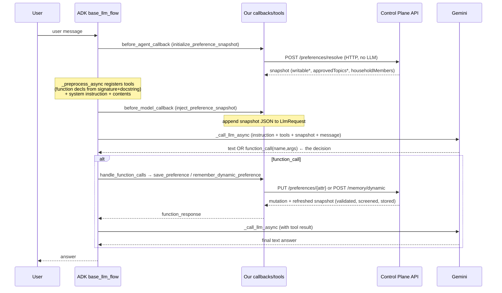

# Agent Turn Flow — how the model decides to answer or save (code perspective)

How one user message flows through the agent: instruction + snapshot + message → the model decides a
plain answer or a tool call → the tool writes to the Control Plane. **Our repo does not implement the
loop** — Google ADK's `flows/llm_flows/base_llm_flow.py` does. We only wire four seams into the
`Agent`; the "decide" happens inside Gemini.

## The four seams we provide

All in [`apps/memory-agent/app/memory_agent/agent.py`](../../apps/memory-agent/app/memory_agent/agent.py):

```python
root_agent = Agent(
    instruction=INSTRUCTION,                               # → the system instruction
    tools=[get_preferences, save_preference,              # → function declarations (name+docstring+params)
           remember_dynamic_preference],
    before_agent_callback=initialize_preference_snapshot, # → resolve + cache the snapshot (no LLM)
    before_model_callback=inject_preference_snapshot,     # → append the snapshot to the request
)
```

| Seam | Our function | What it does |
|---|---|---|
| `instruction` | `INSTRUCTION` | the decision order (map → `save_preference`; else topic → `remember_dynamic_preference`; else decline) |
| `tools` | `get_preferences`, `save_preference`, `remember_dynamic_preference` | ADK turns each into a **function declaration** from its **signature + docstring** — that's what the model reads to decide when to call it |
| `before_agent_callback` | `initialize_preference_snapshot` | resolves the snapshot once per session via `POST /preferences/resolve` and caches it in `state[SNAPSHOT_STATE_KEY]` — **an HTTP call, not an LLM call** |
| `before_model_callback` | `inject_preference_snapshot` | `llm_request.append_instructions([... snapshot JSON ...])` — puts `writablePreferences` / `writablePreferenceDetails` / `approvedTopics` / `approvedTopicDetails` / `householdMembers` in front of the model |

Everything else below is **ADK calling back into these four things**.

## Step-by-step (ADK `flows/llm_flows/base_llm_flow.py`)

The driver is `_run_one_step_async` (~line 1286 in this ADK version). One "step" = one model call plus
any tool execution; it loops until the model answers with no tool call.

1. **`_preprocess_async` (~1385) — build the `LlmRequest`.**
   - Runs `before_agent_callback` → our `initialize_preference_snapshot`: if the snapshot isn't
     cached, `_resolve_snapshot` calls the Control Plane and stores the payload in session state.
     **No LLM here** — just an HTTP resolve (`memories.retrieve` / `list_memories` behind it).
   - Registers tools: for each function in `tools=[…]`, ADK calls `tool.process_llm_request(...)`
     (~537/543), which builds a **function declaration from the Python signature + docstring** and
     adds it to the request. This is why the tool **docstrings matter** — they are the descriptions
     the model uses to pick a tool.
   - Adds the system `instruction` and the session `contents` (history + the new user message).

2. **`_handle_before_model_callback` (~246, invoked ~994) — inject the snapshot.**
   - Runs `before_model_callback` → our `inject_preference_snapshot(cb, llm_request)`, which appends
     the snapshot JSON to the request instructions.

3. **`_call_llm_async` (~1355) — the decision.**
   - ADK sends the assembled `LlmRequest` to the `Gemini(...)` model. **This is where "plain answer
     vs tool call" is decided — inside Gemini's function-calling**, using the system instruction, the
     tool declarations (docstrings), and the appended snapshot JSON.
   - Gemini returns a response whose parts are **either text** (a plain answer) **or a `function_call`**
     (a tool name + args).

4. **If there is a function call → execute the tool.**
   - ADK checks `model_response_event.get_function_calls()` (~1492) → `_postprocess_handle_function_calls_async`
     (~1645) → `functions.handle_function_calls_async` matches `function_call.name` to our Python
     function and calls it, e.g.
     `save_preference("grocery.member_allergies", "peanut", member_id="kid1", tool_context=…)`.
   - Our tool hits the Control Plane runtime API; the platform validates + screens + stores; the tool
     returns a dict, which ADK appends as a `function_response` to the contents.

5. **Loop.**
   - `_run_one_step_async` runs again with the tool result now in context → another `_call_llm_async`
     → Gemini produces the **final text answer** (no function call) → done.

## Sequence



## Where the decision lives

- The model **never sees our schema** — it sees the **snapshot JSON** (appended at step 2) and the
  **tool declarations** (built at step 1 from the tool docstrings).
- The **decision** — plain answer vs which tool — is Gemini's, at step 3 (`_call_llm_async`). There is
  no separate classifier and no rules engine on the agent side.
- There can be **2+ model calls per user turn** (one to decide/emit the tool call, one to summarize
  after the tool result), but none is a dedicated "should-I-save" call — it is the agent's own loop.
- **The Control Plane runs no LLM for this.** Managed generation is off: writes are `memories.create`,
  reads are `memories.retrieve`. The platform's screening (restricted/sensitive) is deterministic
  regex, not a model. So: **agent LLM decides (judgment); platform enforces (rules).**

## Consequence for design

Because the decision is the model's, "did we capture the right memory?" is a **model-behavior**
question, not a platform guarantee. The platform guarantees *governance* (nothing out-of-policy is
stored), not *recall completeness* — the memory-quality/evaluability gap noted in the build-vs-buy
assessment. Making the snapshot descriptive (topic `description`, and now
`writablePreferenceDetails.description`) is what improves the model's mapping accuracy.

## Pointers
- Our seams: [`agent.py`](../../apps/memory-agent/app/memory_agent/agent.py) — `initialize_preference_snapshot`,
  `inject_preference_snapshot`, `get_preferences`, `save_preference`, `remember_dynamic_preference`.
- ADK loop: `google/adk/flows/llm_flows/base_llm_flow.py` (`_run_one_step_async`, `_preprocess_async`,
  `_handle_before_model_callback`, `_call_llm_async`, `_postprocess_handle_function_calls_async`) and
  `functions.py` (`handle_function_calls_async`).
- Onboarding a new agent: [new-agent-onboarding.md](../new-agent-onboarding.md).
