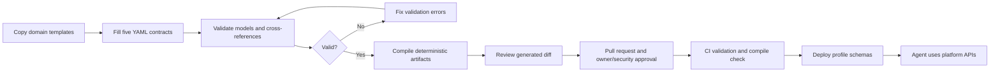
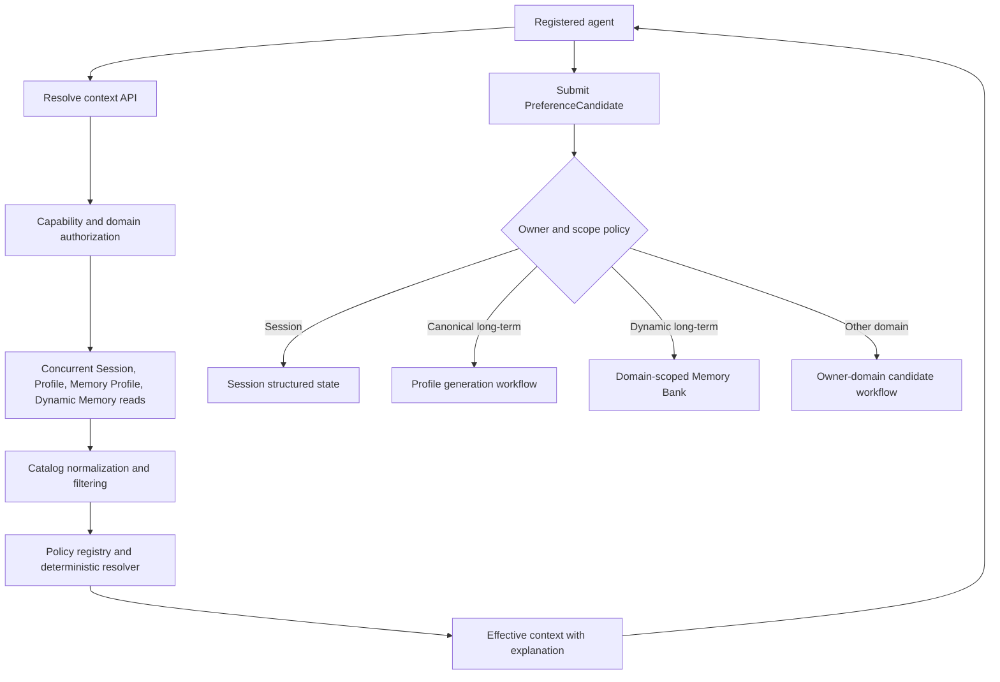

# Shared Memory Platform domain onboarding

## Audience and outcome

This runbook is for business-domain owners and platform administrators onboarding an agent to the
Shared Memory Platform. Domain teams declare business meaning, ownership, access, resolution, and
profile fields in YAML. The platform validates and compiles those contracts into runtime JSON and
Google Memory Profile configuration. Agents use the platform API and never call Memory Bank
directly.

## What the domain team supplies

| File | Owner decision | Does not contain |
|---|---|---|
| `domain.yaml` | Domain owner, isolation, readable/writable domains, dynamic-memory policy | Google resource IDs |
| `preferences.yaml` | Canonical keys, types, sensitivity, scopes, readers/writers, lifecycle | Resolver code |
| `resolution-policies.yaml` | Ordered strategies, source authority, domain authority, confidence | Model prompts |
| `memory-profiles.yaml` | Canonical fields and generation/confirmation intent | Handwritten Google SDK config |
| `consumers.yaml` | Agent identity, required preferences, allowed operations | Direct Memory Bank grants |

The complete Grocery example is in `config/contracts/grocery`. Blank annotated templates are in
`config/templates/domain-onboarding`.

## What the platform generates

```text
app/shared_memory/catalog/catalog.json
app/shared_memory/policies/domain_policy.json
app/shared_memory/policies/resolution_policy.json
app/shared_memory/profiles/memory_profiles.json
app/shared_memory/contracts/consumers.json
config/generated/profile_manifest.json
config/schemas/*.schema.json
```

Generated files are reviewed in pull requests but must not be edited directly.

## Onboarding workflow



## 1. Create the domain folder

```bash
cp -R config/templates/domain-onboarding config/contracts/loyalty
```

Replace every `replace_me` value. Keep one owner domain per folder. The compiler loads all domain
folders together so cross-domain readers and resolution references can be verified.

## 2. Define the domain boundary

In `domain.yaml`, choose explicit allowlists. A domain must read and write itself. `strict`
isolation permits only the domain itself. `profileScopeKeys` must be supplied identically during
profile generation and retrieval; the current platform standard is:

```yaml
profileScopeKeys: [user_id, app_name, domain]
```

## 3. Define canonical preferences

Use namespaced keys such as `loyalty.preferred_reward`. `ownerDomain` must match the key prefix and
catalog domain. Choose `canonical: true` only for stable, governed attributes. Open-ended
attributes remain dynamic memories and do not require catalog or profile schema changes.

Both authorization levels must allow access:

```text
domain permissions AND preference allowedReaders/allowedWriters
```

## 4. Define conflict resolution

Strategy order is lexicographic: the first strategy decides first, and later strategies break ties.
For the common order, source authority is considered before domain authority, confirmation,
recency, and confidence. Each preference's `resolutionPolicy` must reference one declared policy.

## 5. Define Memory Profiles

Only canonical preferences owned by the profile domain may become profile fields. The compiler
generates one Google schema per profile ID and groups schemas sharing scope keys into a
`structured_memory_configs` entry. Dynamic preferences remain natural-language Memory Bank
memories.

Enabling a schema does not populate it. A separately authorized generation process must submit
confirmed candidates or session events using the same scope keys.

## 6. Register consumers

`requiredPreferences` is validated against domain and catalog read permissions.

| Capability | Meaning |
|---|---|
| `resolveContext` | Request an authorized effective context |
| `submitCandidates` | Propose a value for evaluation; not a direct write grant |
| `inspectProvenance` | Receive safe source, owner, policy, and resolution explanation |
| `administerMemory` | Lifecycle operations such as raw inspection/deletion; normally false |

Capabilities are operation-level permissions. Domain and catalog policies remain data-level
permissions. `resolveContext` and `submitCandidates` are enforced by the current service. Without
`inspectProvenance`, detailed provenance is redacted and cached separately by agent identity.
`administerMemory` is reserved for future lifecycle endpoints. Production identity binding should
map `agentId` to a verified service account.

## 7. Validate and preview

```bash
python scripts/validate_memory_contract.py
python scripts/demo_memory_contract.py --domain grocery
```

These commands do not modify cloud resources. Validation rejects duplicate keys, unknown domains,
invalid profile fields, unresolved policies, unauthorized required preferences, strict-isolation
violations, and schema errors.

## 8. Compile and review

```bash
python scripts/compile_memory_contract.py
git diff -- app/shared_memory config/generated config/schemas
python scripts/compile_memory_contract.py --check
```

`--check` performs no writes and fails when checked-in generated files are absent or stale. CI runs
validation, `compile --check`, and the full test suite.

## 9. Deploy after approval

```bash
set -a
source .env
set +a
python scripts/deploy.py
```

Deployment is the first cloud-mutating step. When `ENABLE_MEMORY_PROFILES=true`, it loads the
compiled per-domain schemas and creates or updates the configured Agent Platform resource. Ensure
the existing resource ID is set before deployment to avoid creating an unintended new resource.

## 10. Runtime flow



## Grocery demonstration

```bash
python scripts/validate_memory_contract.py
python scripts/demo_memory_contract.py --domain grocery
python scripts/compile_memory_contract.py --check
python scripts/validate_platform.py
```

The first three commands prove the administration/configuration plane. The last command proves the
runtime resolution plane. Use `docs/adk-web-demo.md` for the interactive agent demonstration.

After the profile schemas are deployed, a platform administrator can submit an explicit demo event
to the configured Memory Bank without embedding project or resource IDs in code:

```bash
python scripts/generate_profile.py \
  --user-id demo-user-123 \
  --domain grocery \
  --text "I prefer organic groceries and I usually allow substitutions."

python scripts/inspect_memory.py \
  --user-id demo-user-123 \
  --domains grocery
```

`generate_profile.py` is cloud-mutating. It validates that the domain has an enabled profile
contract, loads project/location/resource identifiers from `.env`, and submits the event with the
standard `user_id`, `app_name`, and `domain` scope.
