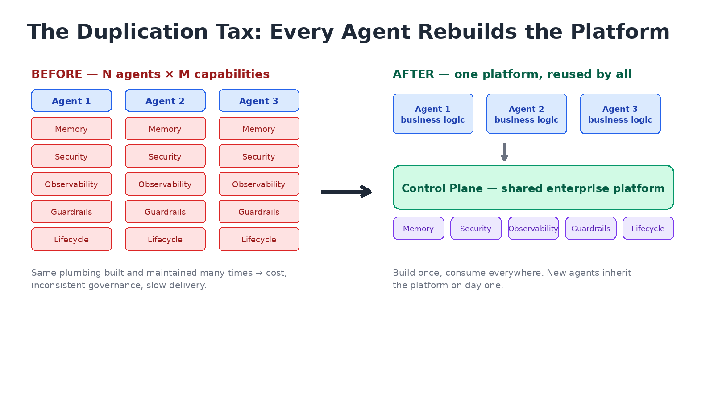
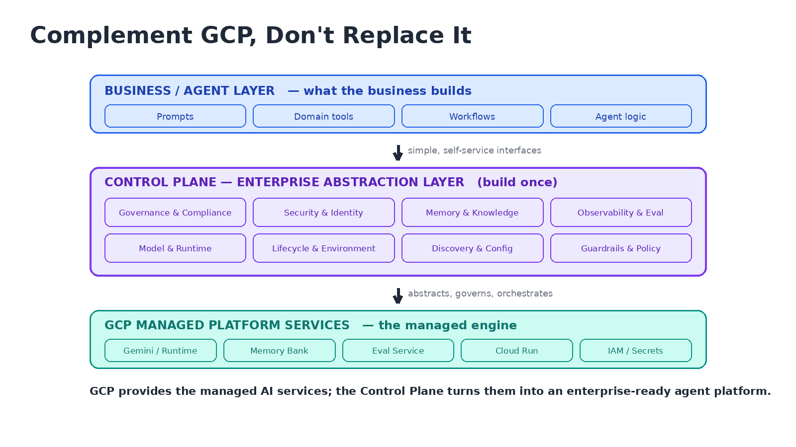
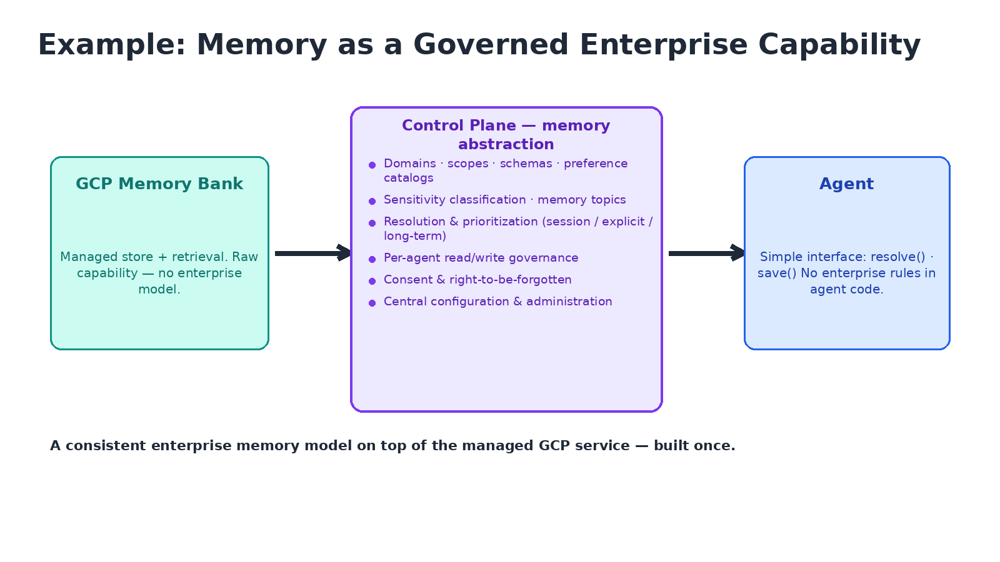
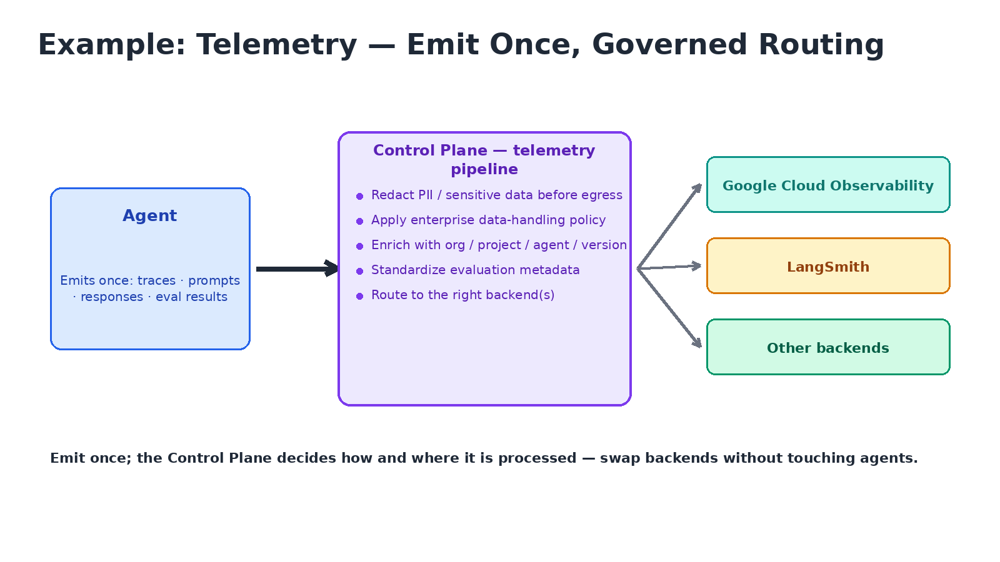
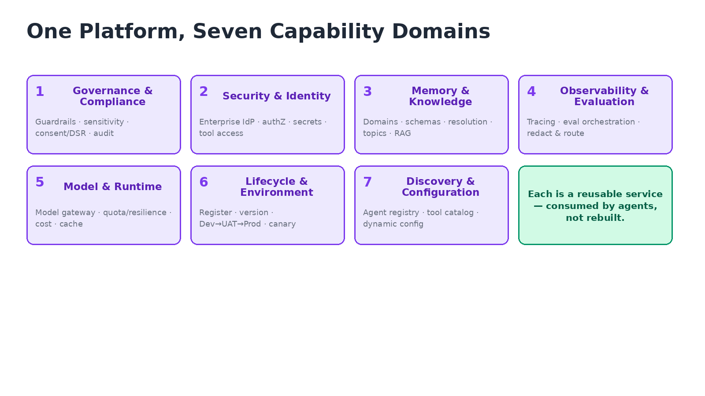
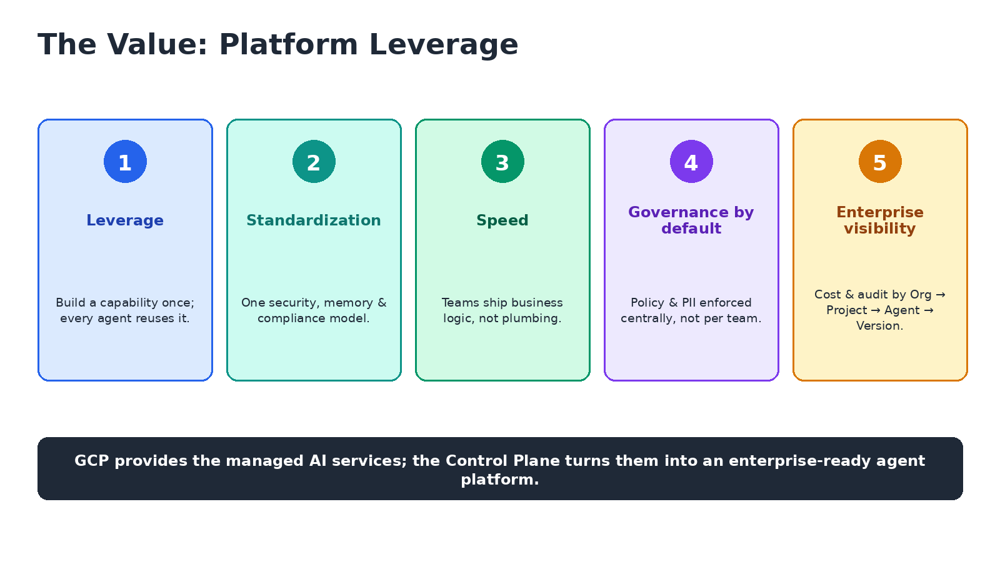

# Control Plane: The Enterprise Agent Platform

**Audience:** Technical management  ·  **Theme:** platform leverage, standardization, governance, reduced duplication, faster agent delivery

> **Anchor message:** *GCP provides the managed AI services; the Control Plane turns them into an enterprise-ready agent platform.*

> **Importing to Confluence:** import this file via **Confluence → Import → Markdown** (or paste with the Markdown macro). Each slide is a section separated by a divider. Upload the six images in `img/` as page attachments; the `` references then resolve. PNGs are used for maximum Confluence compatibility.

---

## Slide 1 — The Duplication Tax: Every Agent Rebuilds the Platform

> **Key message:** Without a shared layer, each agent team re-implements the same cross-cutting concerns. Move them into one enterprise layer and agents focus on business logic.

**Talking points**
- The same plumbing — memory, security, observability, guardrails, lifecycle — is built and maintained **N times**.
- Governance becomes **inconsistent**: it depends on each team's discipline rather than a platform standard.
- Teams burn weeks on platform plumbing before delivering business value.
- The shift: from **N × M** independent implementations to **1 × M** built once and consumed by all.
- New agents inherit the platform on day one.

---

## Slide 2 — Complement GCP, Don't Replace It

> **Key message:** GCP provides managed AI services; the Control Plane adds the enterprise abstraction, governance, and orchestration on top. Agents consume simple interfaces, never raw services.

**Talking points**
- **GCP = the engine:** Gemini / Agent Runtime, Memory Bank, Eval Service, Cloud Run, IAM / Secret Manager.
- **Control Plane = the enterprise layer:** governance, security, memory, observability, model & runtime, lifecycle, config.
- **Agents = business only:** prompts, domain tools, workflows, agent logic — consuming self-service interfaces.
- Principle: **leverage** the managed services; **add** the enterprise-specific policy, context, and integration.
- Anchor: *GCP provides the managed AI services; the Control Plane turns them into an enterprise-ready agent platform.*

---

## Slide 3 — Example: Memory as a Governed Enterprise Capability

> **Key message:** Raw Memory Bank is not an enterprise memory model. The Control Plane supplies the missing domains, schemas, sensitivity, resolution, and governance centrally — agents just call `resolve` / `save`.

**Talking points**
- Enterprise memory needs **domains, scopes, schemas, preference catalogs, resolution policies**.
- It needs **sensitivity classification, memory topics, and per-agent read/write governance**.
- It needs **consent and right-to-be-forgotten** — a platform service, not per-agent code.
- Agents call a **simple interface**; the platform enforces the rules behind it.
- A consistent enterprise memory model **on top of** the managed GCP service — built once.

---

## Slide 4 — Example: Telemetry — Emit Once, Governed Routing

> **Key message:** Agents emit telemetry once; the Control Plane redacts, enriches, standardizes, and routes it to the right backends — swap backends without touching agents.

**Talking points**
- **Redact PII / sensitive data** before anything leaves the platform.
- **Enrich** with org / project / agent / version; **standardize** evaluation metadata.
- **Route** to multiple observability backends (Google Cloud Observability, LangSmith, others).
- Add or swap a backend **without changing a single agent**.
- The agent generates telemetry once; the platform decides how and where it's processed.

---

## Slide 5 — One Platform, Seven Capability Domains

> **Key message:** Memory and telemetry are just two examples. The Control Plane spans the whole platform surface — each capability a reusable service, consumed rather than rebuilt.

**Talking points**
- **Governance & Compliance** · **Security & Identity** · **Memory & Knowledge**.
- **Observability & Evaluation** · **Model & Runtime** · **Lifecycle & Environment** · **Discovery & Configuration**.
- New capabilities (e.g., **model routing, quota & rate-limit resilience**) benefit every agent at once.
- Includes enterprise data rights: **consent / right-to-be-forgotten**, data residency, audit.
- Each domain is a **reusable service** — consumed by agents, not re-implemented per team.

---

## Slide 6 — The Value and the Ask

> **Key message:** Platform leverage delivers faster agents, a consistent governance posture, and enterprise-scale cost and audit visibility.

**Talking points**
- **Eliminate the duplication tax** — redirect that effort to business value.
- **Consistent security and compliance by default**, not by each team's discipline.
- **Faster delivery** — teams build business logic, not platform plumbing.
- **Enterprise visibility** — cost, audit, and inventory across Org → Project → Agent → Version.
- **The ask:** adopt the Control Plane as the standard enterprise agent platform for Guardian.

---

### Appendix — Speaker notes

- Lead with **Slide 1's pain** (the duplication tax) before any architecture — managers buy the *why* first.
- Use **memory as proof, not theory** — the governed memory layer (sensitivity classification, right-to-be-forgotten, per-agent rules) is already built.
- **Repeat the anchor line** on Slides 2 and 6 so it's the thing they remember.
- Frame it as **build-vs-duplicate, not build-vs-buy** — we *leverage* GCP and *avoid* N teams rebuilding the same layer.
