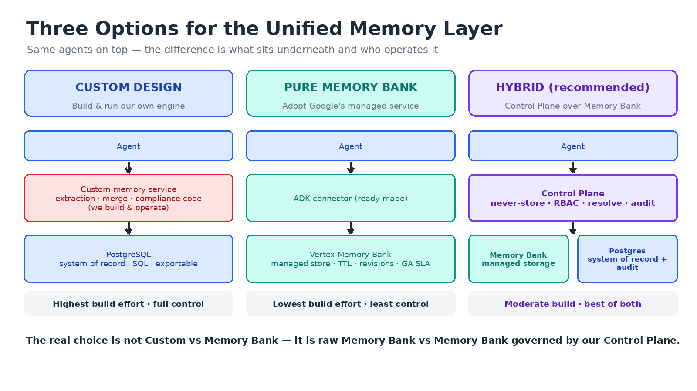
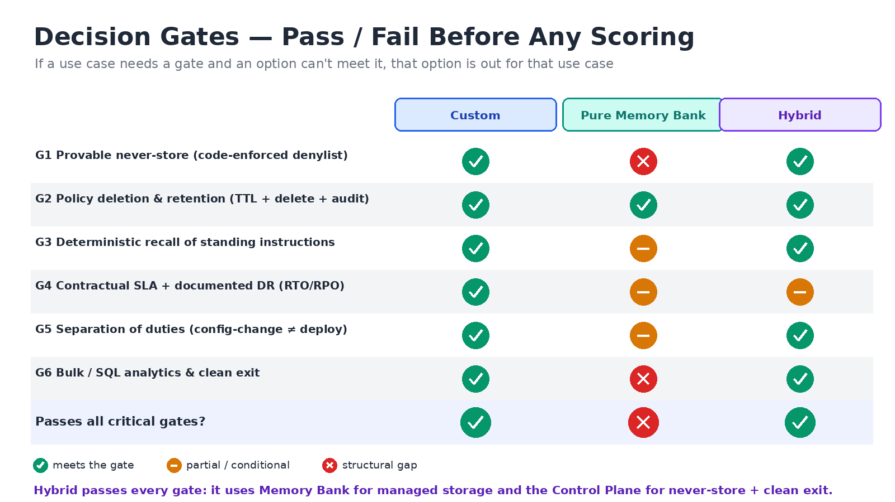
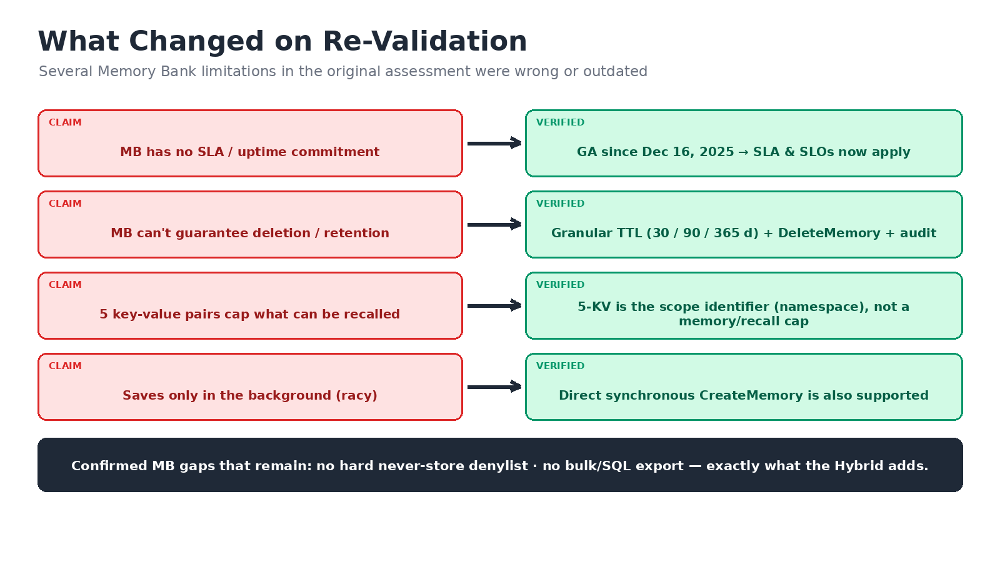
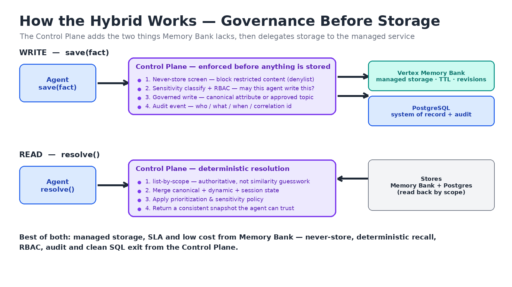
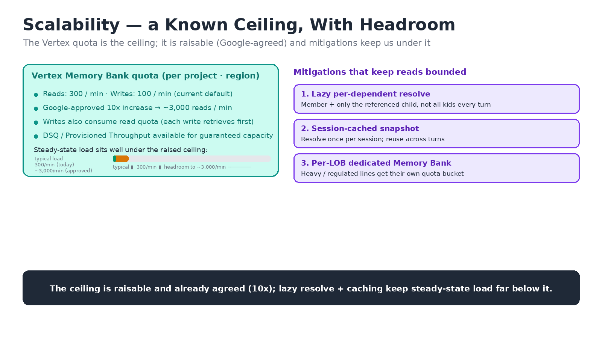
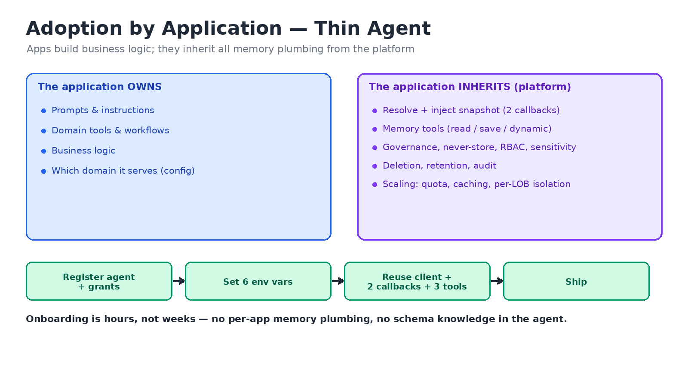
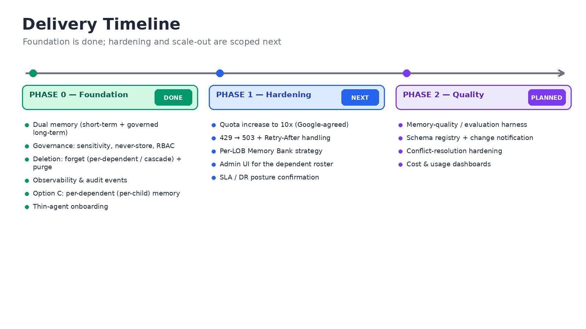

# Unified Memory Layer — Custom vs. Memory Bank vs. Hybrid

**A three-way assessment for the team.** Status: for review.

> **Importing to Confluence:** import this file via **Confluence → Import → Markdown**, then attach the four images in `img/` to the page so the `` references resolve. PNGs are used for maximum compatibility.

> **What's new vs. the original assessment:** (1) a **third option** — Hybrid (our Control Plane over Memory Bank) — which the original compared out of existence; (2) a **re-validation** of the Memory Bank claims, several of which were wrong or outdated; (3) a **gate-first framework** so the decision is made on what's decisive, not on a near-tie scorecard.

---

## 1. The headline: it's a three-way choice, not two

The original document framed this as **Custom (build our own)** vs. **Pure Memory Bank (adopt Google's)**. But what our team has actually built is a **third option**: a governed **Control Plane *over* Memory Bank** — Google runs the managed storage; our layer adds the governance Memory Bank lacks.

**Key message:** the real decision is **raw Memory Bank vs. Memory Bank governed by our Control Plane** — and the Hybrid keeps Google's managed storage/SLA/cost while adding enterprise control.

**Talking points**
- **Custom:** full control, but 35–45 person-weeks to build plus 1–1.5 ongoing FTE — we own extraction, merge, and compliance code forever.
- **Pure Memory Bank:** ready-made connector, lowest effort — but no hard "never-store," no bulk export, instance-wide config.
- **Hybrid:** moderate effort — agents call a simple interface; the Control Plane enforces governance, then delegates storage to Memory Bank with Postgres as system-of-record.

---

## 2. Decision gates — decide on what's decisive

A weighted scorecard produced a 3.45-vs-3.40 near-tie and then had to be overridden per use case. That's the sign the weights were wrong. Instead, check **non-negotiable gates first** (pass/fail); only score the survivors.

**Key message:** the **Hybrid passes every critical gate**; pure Memory Bank fails on never-store and clean exit.

**Talking points**
- **G1 never-store** and **G6 bulk/SQL exit** are Memory Bank's two genuine, confirmed gaps.
- **G2 deletion/retention, G3 recall, G4 SLA** substantially close for Memory Bank once the facts are corrected (next section).
- Gates make the client decision almost mechanical: **a use case that needs a gate rules out any option that can't meet it.**
- Example — a **pharmacy / Health & Wellness agent** (prescriptions, DEA/HIPAA) needs G1 + G6 → pure Memory Bank is out; **Custom or Hybrid** qualify.

---

## 3. Re-validation — correcting the Memory Bank claims

The original assessment was authored by the owner of the Custom solution; several Memory Bank limitations did not survive fact-checking against Google's current documentation.

**Key message:** Memory Bank is **stronger than the original doc claims** — but its two real gaps are **exactly what the Hybrid's Control Plane adds**.

**Talking points**
- **SLA:** Memory Bank reached **GA on Dec 16, 2025** → SLA/SLOs now apply. The original "no SLA → 2/5 resiliency" is stale.
- **Deletion/retention:** **granular TTL (30/90/365 days) + `DeleteMemory` + audit/revisions** — retention is supported, not absent.
- **5-KV "cap":** that's the **scope *identifier*** (namespace dimensions), **not** a limit on how many memories you store or recall.
- **Writes:** **direct synchronous `CreateMemory`** exists — you're not forced into the racy background path.
- **Quota (corrected):** **300 reads/min, 100 writes/min per project per region** (raisable via GCP). *(This also corrects the earlier ~10/min figure — our 429s at ~490/min and clean runs at ~60/min both fit a 300/min cap.)*
- **Still true:** no hard **never-store denylist**, no **bulk/SQL export** — both provided by the Hybrid.

---

## 4. How the Hybrid works — the flow

The Control Plane sits in the write and read paths, enforces governance, then hands storage to the managed service.

**Key message:** governance is enforced **before anything is stored**; storage stays managed.

**Talking points**
- **Write:** never-store screen → sensitivity + RBAC → governed write → audit → Memory Bank (storage) + Postgres (system-of-record).
- **Read:** deterministic **list-by-scope** (not similarity guesswork) → merge canonical + dynamic + session → prioritize → return a trustworthy snapshot.
- Agents see a **simple `save()` / `resolve()`** interface; all enterprise rules live in the platform, not agent code.
- **Best of both:** managed storage, SLA, low cost from Memory Bank; never-store, deterministic recall, RBAC, audit, clean exit from the Control Plane.

---

## 5. Finalized criteria to propose to the client

**Tier 1 — Decision Gates (pass/fail, per use case).** Checked first; disqualify any option that can't meet a required gate.

| Gate | Custom | Pure Memory Bank | Hybrid |
|---|---|---|---|
| G1 Provable never-store (code-enforced denylist) | ✅ | ❌ | ✅ |
| G2 Policy deletion & retention (TTL + delete + audit) | ✅ | ✅ | ✅ |
| G3 Deterministic recall of standing instructions | ✅ | ◐ | ✅ |
| G4 Contractual SLA + documented DR (RTO/RPO) | ✅ | ◐ | ◐ |
| G5 Separation of duties (config-change ≠ deploy) | ✅ | ◐ | ✅ |
| G6 Bulk / SQL analytics & clean exit | ✅ | ❌ | ✅ |

*(✅ meets · ◐ partial/conditional · ❌ structural gap)*

**Tier 2 — Weighted trade-offs (only for use cases that trigger no gate).** Re-weighted so importance isn't inverted:

| Criterion | Weight |
|---|---|
| Data Governance & Compliance (residency, audit depth, consent) | 18% |
| Security & Multi-tenant Isolation (RBAC, per-LOB, quota blast radius) | 12% |
| Cost & TCO (incl. per-LOB instances, generation-model & write-cadence traps) | 18% |
| Operability, Maintainability & Delivery Velocity | 15% |
| Reliability, DR & Service Maturity | 12% |
| Performance, Scalability & Quota Headroom | 10% |
| Data Modeling & Feature Fit | 8% |
| Memory Quality & Evaluability | 7% |

Gates capture the binary must-haves; Tier 2 grades the rest — so nothing is double-counted.

---

## 6. Recommendation

- **Default to the Hybrid** (Control Plane over Memory Bank): it passes every gate and inherits Google's managed storage, SLA, and low per-op cost.
- **Reserve pure Custom** for use cases that need direct SQL/bulk analytics as a first-class, high-volume path.
- **Pure Memory Bank alone** is viable only for use cases that trigger **none** of G1/G3/G5/G6.
- **Per line of business,** run the Tier-1 gate checklist first; only reach for the Tier-2 scorecard when no gate decides it.

### Still to confirm with our GCP contact
- Exact **SLA %** and documented **RTO/RPO** for Memory Bank (GA).
- **Multimodal** handling (text-only vs. images/attachments).
- **Per-project resource cap** for reasoning-engine instances.
- **Separation-of-duties** granularity in current IAM roles.

---

# Part II — Operational Readiness

Addressing the review feedback: **scalability, operations, adoption**, the **Control-Plane dependency
delineated**, and a **timeline**.

## 7. Scalability — a known ceiling, with headroom

> **Key message:** the Vertex quota is the one ceiling; it is **raisable (already agreed with Google
> — Kapil, ~10×)** and our access patterns keep steady-state load far below it.

**Talking points**
- The scaling constraint is the **Vertex Memory Bank read/write quota** (300 reads/min, 100 writes/min
  per project·region), **not** token cost — managed generation is off.
- **The ceiling is not a blocker:** Google (Kapil) sees no issue raising it **~10×** (→ ~3,000
  reads/min); DSQ / Provisioned Throughput are available for guaranteed capacity.
- Access patterns keep us well under it: **lazy per-dependent resolve** (member + only the referenced
  child), **session-cached snapshot** (resolve once per session), and **per-LOB dedicated Memory
  Banks** (heavy/regulated lines get their own quota bucket).
- Context stays bounded: the injected snapshot is a fixed set of attributes + topics (~hundreds of
  tokens/turn), not an unbounded memory dump — see §A3.

## 8. Operational (Day-2) — governed, observable, recoverable

> **Key message:** running it is a known quantity — every write/delete is audited, deletion and
> retention are first-class, and the failure modes have defined mitigations.

**Talking points**
- **Observability:** structured `memory_write` / `memory_deletion` audit events (tier, op, sensitivity,
  source, version, correlation id); values are never logged.
- **Deletion & retention:** governed `forget` (per-dependent or member-cascade) and `purge`
  (by tier/attribute/topic, with `dryRun`); TTL-based expiry supported.
- **Resilience:** provider `429` is being mapped to **`503 + Retry-After`** (Phase 1) so consumers back
  off cleanly; the 10× quota raise removes the common trip.
- **Schema evolution:** versioned schemas (`…-v1`) and a `policyVersion` in every snapshot; a schema
  **registry + change notification** is scoped for Phase 2.
- **Deployment:** stateless control-plane API + Postgres system-of-record + Vertex Memory Bank;
  scales horizontally behind the quota.

## 9. Adoption by Application — thin agent

> **Key message:** applications build business logic and **inherit** all memory plumbing; onboarding
> is hours, not weeks.

**Talking points**
- The app **owns** prompts, domain tools, workflows, and which domain it serves. It **inherits**
  memory read/write, governance, RBAC, deletion, audit, and scaling from the platform.
- Onboarding = **register the agent + grants → set 6 env vars → reuse the client + 2 callbacks + 3
  tools → ship**. No per-app memory plumbing, no schema knowledge in the agent.
- The agent learns what it may read/write, the approved topics, and the member's dependents **from the
  resolve snapshot at runtime** — so new capabilities (e.g. per-child memory) reach every app with no
  agent change. Full steps: `docs/new-agent-onboarding.md`.

## 10. The Control-Plane dependency, delineated

> **Key message:** this is not "buy the whole Control Plane to get memory." Memory Bank does the
> storage; the Control Plane adds the enterprise governance; the app is coupled to a **thin standard
> API**, not locked in.

**Talking points**
- **What the Control Plane provides** (and Memory Bank alone cannot): never-store enforcement, RBAC,
  deterministic resolution, sensitivity screening, governed deletion, audit, and per-dependent scope.
- **What it delegates to Memory Bank:** durable storage, retrieval, DR, and low per-op cost — GCP's
  managed engine, unchanged.
- **Coupling is bounded:** the agent talks to a **small HTTP contract** (`resolve` / `save` /
  `dynamic` / `forget`) via a self-contained client — no SDK lock-in, no schema baked into the agent.
- **Failure modes:** if the Control Plane is unavailable, agents fall back to the **cached session
  snapshot** (reads continue for the session) and **writes are deferred/retried**; the API is
  stateless and scales horizontally, and Postgres is the durable system-of-record. Storage itself
  (Memory Bank) is independent of Control-Plane uptime.
- **Portability:** because Postgres is the system-of-record, data is **SQL-exportable** — no bulk-export
  dependency on the provider.

## 11. Timeline

> **Key message:** the foundation is delivered; hardening and scale-out are scoped and sequenced.

**Talking points**
- **Phase 0 (done):** dual memory, governance (sensitivity/never-store/RBAC), deletion, observability,
  **Option C per-child memory**, thin-agent onboarding.
- **Phase 1 (next):** quota **10×** increase (Google-agreed), `429→503` handling, per-LOB Memory Bank
  strategy, admin UI for the dependent roster, SLA/DR confirmation.
- **Phase 2 (planned):** memory-quality/evaluation harness, schema registry + change notification,
  conflict-resolution hardening, cost & usage dashboards.

---

## Appendix — Technical Q&A

**A1. Partial memory deletion — "when I have 2–3 kids, how does it look?"**
Deletion is scope-precise. `POST /memory/forget` with a `dependentId` deletes **only that child's**
partition; without a `dependentId` it **cascades** to the member and every dependent. `POST
/memory/purge` deletes by **tier / attribute / topic** with a `dryRun` preview (e.g. purge just
`grocery.allergies`). So "forget Timmy's data" removes Timmy's scope and leaves Sara and the member
intact.

**A2. Conflict resolution when multiple agents use this**
- **Ownership:** each schema has an owner; agents get **WRITE only on schemas they own**, `READ`
  elsewhere (per-schema RBAC grants) — so two agents don't both author the same attribute by accident.
- **Deterministic resolution:** the snapshot is computed by a **resolution policy** — source priority
  (session > explicit > memory > dynamic) and **schema precedence** for the same logical attribute —
  not by "last reader wins."
- **Versioning & isolation:** every write is versioned; scopes isolate users/dependents; reads use
  authoritative `list_memories`, not similarity — so results are reproducible across agents.

**A3. A long prompt with memories about many things**
- The injected context is a **bounded snapshot** (the domain's canonical attributes + approved topics
  + the roster), not an open-ended memory dump — typically a few hundred tokens/turn.
- It is **resolved once per session and cached**; per-dependent detail is **lazy** (only the child a
  turn references). Sensitive values are screened/redacted per policy.
- Result: prompt size stays bounded and predictable regardless of how much long-term memory a user has
  accumulated.
