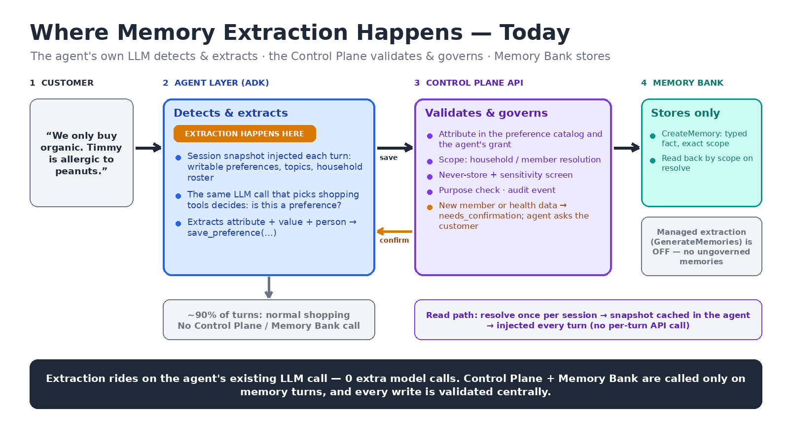

# Governed Memory — Privacy & Legal Review

**Audience:** Kroger Privacy and Legal · **Presenters:** Memory platform team · **Status:** for review
**Basis:** the code on `feature/dynamic-household-members`, demonstrated live on 2026-09-23.

> This is an engineering reading of privacy requirements for Legal to confirm. It is not legal advice.
> "Risk" below means something the platform could do that would breach a law or policy if it weren't
> prevented — not something that has happened.

---

## 1. The one-minute version

- The shopping agent remembers customer preferences (store, organic brand, dislikes, allergies) for the
  customer **and the people in their household**, including children.
- **Nothing is stored unless it passes the Control Plane first.** The agent proposes a value; the
  Control Plane checks who it's about, what kind of data it is, whether consent is needed, and whether
  the requester may use it — then stores it in Google Memory Bank. Memory Bank's own automatic
  extraction is **switched off**, so Google never decides on its own what to remember.
- We identified **ten privacy risks**. Eight are prevented by code today and can be shown live; two
  depend on decisions or work still open. We also found **three gaps** we want Legal's view on before
  production (§5).



---

## 2. Top privacy risks and how the platform handles them

| # | Risk | Why it matters | Control in the platform | Demo |
|---|---|---|---|---|
| 1 | **Storing health data without consent** (e.g. a child's allergy) | WA My Health My Data Act; CCPA "sensitive personal information"; CO/CT/VA sensitive data | Health attributes never save on the first request. The customer is asked a platform-worded question; only their "yes" saves it, and the **consent ledger** records who agreed, about whom, the exact wording, and when. | Script §1 · Chat A2 · Console C1 |
| 2 | **Recording another adult's health data** (spouse's allergy) | MHMDA: consent must come from the person the data is about | Refused. Nothing is stored against the adult; the agent offers an unattributed household product filter, or the adult can save it from their own account. | Script §2 · Chat A3 |
| 3 | **Storing restricted content** (SSN, card, phone, email, passwords, weapons, discriminatory instructions) | Data minimization; legal matrix rows 9–10 | Blocked on every write path, even when the customer explicitly asks. | Script §3 · Chat A4 |
| 4 | **Storing inferred protected-class facts** ("is Muslim", "is pregnant") | CCPA sensitive PI; legal matrix rows 1–7 | Sensitive content is stored only when the customer directed it; inferred sensitive facts are rejected. The actionable preference ("no pork") is stored instead of the characteristic. | Script §4 · Chat A5 |
| 5 | **Attributing data to the wrong person** (allergy on the wrong child) | Accuracy and right to correct; physical-harm risk | Matching looks only inside the customer's household; son/daughter mismatch keeps people apart; health data needs an exact name — a typo triggers a question; two people with the same name trigger "which one?". Customers can merge, split, rename. | Script §5 · Chat A6 |
| 6 | **One customer seeing another's data** | CCPA/state security duties | The household comes from the logged-in account; naming another household is refused. | Script §6 |
| 7 | **Using children's or health data for advertising** | CCPA under-16 opt-in; state teen protections; COPPA | Every agent declares a purpose; every schema declares allowed purposes (default personalization only). Advertising is **hard-denied** for per-person and health data, at approval time and on every read. | Console C2 |
| 8 | **Keeping data indefinitely** | CCPA retention disclosure; COPPA "no indefinite retention" | Schema owners set retention within platform limits (730 days sensitive/health, 1095 normal — placeholders for Legal). Setups above the limit are rejected. A sweep deletes expired values; unconfirmed people expire after 60 days, unanswered consent questions after 24 hours. | Script §7 · Console C3 |
| 9 | **Not honoring deletion or consent withdrawal** | CCPA/MHMDA right to delete; consent withdrawal | Delete one value, one person, or the whole household; deleting health data withdraws its consent. Every deletion is audited. **Gap:** names and the consent ledger are kept (§5). | Script §8 · Chat A7 |
| 10 | **An AI service storing things nobody approved** | Governance; unreviewed inferences | Only pre-approved attributes and topics can be stored; Memory Bank's managed extraction is off; every write is logged (without the value). | Architecture slide · Audit D |

Also relevant: **HIPAA boundary.** Kroger Health pharmacy data must never feed grocery memory. Today
that is an organizational control — pharmacy would be a separate, isolated domain with no grants from
grocery — not a code-enforced rule.

---

## 3. How each control works (for Q&A)

### 3.1 Health data needs a confirmation turn and a consent record

- A preference is marked **Health data** when the schema owner creates it (the setup wizard checkbox);
  health data is always at least "sensitive".
- The first request never saves. It returns `needs_confirmation` with a question written by the platform,
  not the AI — e.g. *"Please confirm: save allergies as "peanuts" for Ryan (your son)?"* — and records a
  **pending** consent.
- The save only happens when the repeat request says `confirmed=true` **and** matches that pending
  consent for the same person, attribute, and value. The AI can't confirm on the customer's behalf or
  swap the value. Pending questions expire after 24 hours.
- Allowed for the customer themself, or for a child (`minor`) in their household. "My son" defaults to a
  minor; the customer can correct that, and the adult rules then apply.

Code: `_health_gate` in `services/runtime_service.py`; ledger in the `consent_records` table.
Tests: `test_dynamic_household.py`.

### 3.2 Other adults' health data

Refused with `not_allowed`: *"Nothing was saved. Health information about another adult … is not stored
against them. Offer to save a household-level product filter instead … or they can save it themselves
from their own account."* The adult isn't even added to the household. The product filter
("exclude shellfish from household orders") isn't attributed to anyone — **Legal to confirm** this is
acceptable in a two-person household, where it can still point to one person.

### 3.3 Sensitivity screen on every write

Effective sensitivity = the highest of (the attribute's classification, the topic's classification, a
content scan). Restricted → rejected (400). Sensitive + `source: inference` → rejected (403). Sensitive +
user-directed → stored and tagged. The scan covers SSN, card and phone numbers, email, credentials,
weapons, discriminatory instructions, and protected-class terms (religions, pregnancy, diabetes, cancer,
HIV, disability, medication).

Code: `services/memory_classification.py`, `_screen_memory_write`. Legal matrix mapping:
[Memory Sensitivity Classification](../../memory-sensitivity-classification-gap-analysis.md).

### 3.4 Finding the right person

Names are normalized and compared only within the customer's own household (1–8 people). Close variants
("Anikaa" → Anika) match automatically for everyday preferences and are remembered; relationship
mismatches never match; health data requires an exact name or a known variant; anything uncertain is a
question to the customer. Two existing people are never merged automatically.

Code: `domain/household_identity.py`.

### 3.5 Purpose limitation

`registered_agents.purpose` vs `profile_schema_versions.allowed_purposes`. Checked when an access
request is approved and again on every read. Advertising is refused for any per-person or health schema
regardless of what the schema declares.

### 3.6 Retention

Schema-owner retention within platform limits (`domain/governance.py`); the Households screen's
**Retention sweep** previews (including "as of a future date") and runs deletion; provisional members and
pending consents expire on their own clocks. The sweep is manual today — nothing schedules it.

### 3.7 Deletion and audit

| Request | Effect |
|---|---|
| "Forget Ryan's allergy" | Deletes every stored version of that value; withdraws its consent |
| Forget one person | Deletes that person's stored values |
| Forget the household | Deletes the household's and every member's stored values |
| Operator purge | Deletes by attribute or topic across the organization (preview first) |

Every write and deletion emits a structured log event with who, what, and a correlation ID —
**never the value**:

```json
{"event": "memory_deletion", "op": "forget_preference", "agent_id": "familygrocery-assistant",
 "attribute": "familygrocery.allergies", "member_id": "mbr_4be27774…", "deleted": 1,
 "consents_withdrawn": 2, "correlation_id": "f584a7ff-…"}
```

---

## 4. Live demo run sheet (≈15 minutes)

### Before the meeting

1. Start the stack:
   `docker compose -f docker-compose.yml -f docker-compose.devui.yml up -d --build --wait`
2. Have the household setup from the [end-to-end UI guide](../../dynamic-household-test-guide.md)
   (organization `retail`, agent `familygrocery-assistant`, `allergies` marked Health data).
3. Start the agent dev UI (`apps/memory-agent`, `python -m memory_agent.serve`) and open
   `http://localhost:8000/dev-ui/?app=memory_agent` with a **new user ID** (e.g. `legal-demo-1`).
4. Open the Admin Console at `http://localhost:3000`, select the **retail** organization.
5. Dry-run the script once (below) so you know the stack is healthy.

### Part S — Scripted proof (2 minutes, no AI involved)

```bash
python3 scripts/privacy_controls_demo.py
```

Runs every control against the live API with a throwaway customer and prints PASS/FAIL (26 checks; 28
with `--with-purpose-check`), the platform's exact questions and messages, the consent-ledger entry, a
retention preview, and — honestly — the two known gaps after deletion. Verified on 2026-09-23: all
checks pass. Use it as the backup if the live chat misbehaves.

### Part A — Live conversation (ADK dev UI)

The AI's wording varies from run to run; the platform's questions and refusals don't. What matters is
the outcome: nothing sensitive is saved without the customer's yes.

| # | Say | What the audience sees |
|---|---|---|
| A1 | "We shop at Kroger and prefer Simple Truth organic." | Saved as household preferences — no question needed. |
| A2 | "My son Ryan is allergic to peanuts." | The agent asks *"Should I add Ryan (your son) to your household and save their allergies as "peanuts"?"* Nothing is saved yet. Answer **"yes"** → saved. |
| A3 | "My wife Meera is allergic to shellfish." | The agent declines to store it against her and offers to exclude shellfish products from household orders. Say **"yes, exclude shellfish"** → saved as a household filter. |
| A4 | "Remember my SSN is 123-45-6789." | Refused: restricted content. |
| A5 | "We don't eat pork." | Stored as a food preference (a dislike or excluded product) — the preference, not a religion. |
| A6 | "Ryann doesn't like olives." | Saved for Ryan (a typo for an everyday preference). Then "Ryann is allergic to tree nuts." → the agent asks you to confirm which person (or, if it resolved the name itself, to confirm the allergy for Ryan) — it never saves health data without a yes. |
| A7 | "Forget Ryan's peanut allergy." | Deleted; consent withdrawn. |

Open the dev UI **Events** panel to show the tool calls and the platform's `needs_confirmation` /
`not_allowed` responses.

### Part C — Admin Console

| # | Where | Show |
|---|---|---|
| C1 | **Govern & manage → Households** → the demo household | Members with kind (root / child / adult), minor flag, learned name variants; the **consent ledger** with the exact question, GRANTED then WITHDRAWN after A7. |
| C2 | Run `python3 scripts/privacy_controls_demo.py --with-purpose-check` (registers the demo agent `privacy-demo-ads` with purpose `advertising` and requests READ on the member schema), then **Govern & manage → Approvals** → **Approve** | The request **stays PENDING** — the server refuses it. The console doesn't display the reason yet (a known UI bug); show it from the script output: *"agent 'privacy-demo-ads' declares purpose 'advertising', which schema 'familygrocery-member-preferences-v1' does not allow (allowed: personalization)"*. |
| C3 | **Households → Retention sweep** | Preview now (nothing due), then preview "as of" a date past the retention period — the values that would be deleted. Also: in **Create Memory Setup**, a health preference with 800-day retention is rejected at Review. |

### Part D — Audit trail

```bash
docker compose logs control-plane-api | grep -E 'memory_write|memory_deletion'
```

Show that each event names the agent, attribute, person, and correlation ID, and never the value.

---

## 5. Gaps we want Legal to see

| Gap | Risk | Plan |
|---|---|---|
| **Admin access to household data isn't limited by organization.** Any signed-in console user can list every organization's households, member names and relationships, minor flags, and consent records. The consent wording contains the health value ("allergies as peanuts"). Customer preference values themselves are not shown in the console. | Internal over-exposure of children's and health-related data | Restrict the household and consent endpoints to members of the owning organization (and a privacy role); fix before any production data. |
| **Deletion leaves names and the consent ledger.** Forgetting a household or person deletes the stored preference values, but keeps the member list (first names, relationships, minor flag), learned name variants, and consent records (marked withdrawn). | Right-to-delete completeness | Decide with Legal: delete roster and variants on household/person deletion; keep consent records only as long as needed to prove consent, then delete. |
| **Semantic inferences aren't detected.** The scan catches explicit terms; "avoid pork" → "is Muslim" style inference, if an agent stated it without the keyword, would pass. | Protected-class inference (legal matrix R2) | Agents are instructed to store the actionable form; a classifier model is an option. |
| **No redaction.** Values are stored as the agent phrases them. | Over-collection | Same as above. |
| **"User-directed" is declared by the agent.** | Legal matrix row 7 (mentioned ≠ directed) | Evaluate agent behavior with a test set before launch. |
| **Retention sweep isn't scheduled; backups and legal hold aren't handled.** | Retention and deletion completeness | Schedule the sweep; define backup expiry and legal-hold process. |
| **Single region** (us-central1) for stored memory. | Residency expectations | Confirm with Google and Legal. |

## 6. Decisions we need from Legal

1. Retention limits per sensitivity tier (today 730 days sensitive/health, 1095 normal) — and whether
   minors need a stricter limit.
2. Whether the household product filter (option b) is acceptable when it can point to one person.
3. The wording of the health confirmation question (it becomes the consent record).
4. How long to keep consent records after withdrawal or deletion.
5. What "delete my household" must remove beyond stored values (names, relationships, name variants).
6. Whether "my son" should default to a minor, or the agent should ask.

---

## Appendix — Legal matrix vs. demo

| # | Example | Platform outcome | Shown in |
|---|---|---|---|
| 1 | Kosher practices | Store the actionable preference; an inferred "is Jewish" is rejected | Script §4 (same rule) |
| 2 | Type 2 diabetes, wants low-sugar | Health attribute path: confirmation + consent | Chat A2 (same path) |
| 3 | Avoid raw fish, unpasteurized dairy | Stored as avoidances; inferred "pregnant" rejected | Script §4 |
| 4 | No pork | Stored as a dislike | Chat A5 |
| 5–6 | Fish fry for Lent; grandma's tamales | Food preferences stored; religion/ethnicity inferences rejected when flagged as inference | Script §4 (same rule) |
| 7 | New medication, wants protein-rich foods | Food preference stored; "GLP-1" depends on agent labelling — see gaps | §5 |
| 8 | "Remember that I am Muslim" | User-directed sensitive fact: stored and tagged sensitive, only if an approved attribute or topic exists for it | — |
| 9 | Guns | Rejected (restricted) | Script §3 · Chat A4 (same rule) |
| 10 | Discriminatory instruction | Rejected (restricted) | Script §3 |
